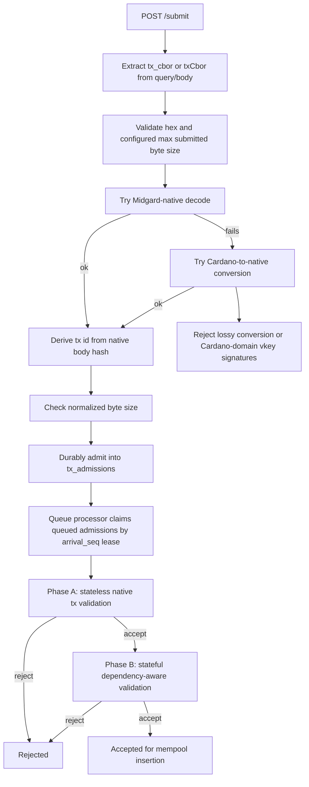

# Midgard L2 Transaction Evaluation Specification

This specification describes the current Midgard L2 transaction validity
evaluation path in `demo/midgard-node`. It is descriptive current-state
documentation, not a target design.

Existing Markdown and TeX documents are not used as authority for this
specification. The source of truth is the implementation and the focused tests
named in `L2_TX_EVALUATION_SPEC_PLAN.md`.

## Scope

Covered:

- `POST /submit` ingress checks, normalization, and durable admission.
- Midgard-native transaction v1 structure that affects validity evaluation.
- Queue selection and configuration for Phase A and Phase B.
- Phase A stateless per-transaction validation.
- Phase B stateful and dependency-aware validation.
- Local native, PlutusV3, and MidgardV1 script evaluation.
- Redeemer purpose and index semantics.
- The final validation output: accepted for mempool insertion or rejected.

Out of scope:

- Block inclusion.
- Merge replay.
- Post-acceptance persistence details that do not affect validity.
- Status endpoints.
- Readiness.
- Metrics.
- Future protocol design.
- Backward-compatibility promises.

## Source Evidence

Primary implementation evidence:

- `demo/midgard-node/src/commands/listen-router.ts`
- `demo/midgard-node/src/commands/listen-utils.ts`
- `demo/midgard-node/src/database/txAdmissions.ts`
- `demo/midgard-node/src/database/mempoolLedger.ts`
- `demo/midgard-node/src/fibers/tx-queue-processor.ts`
- `demo/midgard-node/src/midgard-tx-codec/cbor.ts`
- `demo/midgard-node/src/midgard-tx-codec/hash.ts`
- `demo/midgard-node/src/midgard-tx-codec/native.ts`
- `demo/midgard-node/src/midgard-tx-codec/output.ts`
- `demo/midgard-node/src/validation/local-script-eval.ts`
- `demo/midgard-node/src/validation/midgard-output.ts`
- `demo/midgard-node/src/validation/midgard-redeemers.ts`
- `demo/midgard-node/src/validation/phase-a.ts`
- `demo/midgard-node/src/validation/phase-b.ts`
- `demo/midgard-node/src/validation/script-context.ts`
- `demo/midgard-node/src/validation/script-source.ts`
- `demo/midgard-node/src/validation/types.ts`

Focused test cross-checks:

- `demo/midgard-node/tests/listen-admission-auth.test.ts`
- `demo/midgard-node/tests/midgard-local-script-eval.test.ts`
- `demo/midgard-node/tests/midgard-native-tx-codec.test.ts`
- `demo/midgard-node/tests/native-transaction-integration.test.ts`
- `demo/midgard-node/tests/validation-parallelization.test.ts`

## End-to-End Flow



1. `POST /submit` accepts a transaction payload and extracts a hex string from
   query parameters or a JSON body (`listen-router.ts:977-1038`,
   `listen-utils.ts:86-164`).
2. The handler validates hex format and submitted byte size, then normalizes the
   bytes into Midgard-native form (`listen-utils.ts:137-260`).
3. Durable admission begins when normalized bytes and their derived tx id are
   inserted or matched in `tx_admissions` (`txAdmissions.ts:127-216`).
   Admission is not full validity evaluation.
4. Validation begins when the queue processor claims durable admissions under a
   validation lease and converts admitted rows into `QueuedTx` values
   (`tx-queue-processor.ts:347-451`).
5. Phase A rejects malformed or unsupported per-transaction structure and
   witnesses, or returns a `PhaseAAccepted` candidate
   (`phase-a.ts:346-736`).
6. Phase B evaluates accepted Phase A candidates against current and in-batch
   UTxO state, then emits accepted candidates plus a state patch or rejected
   transactions (`phase-b.ts:1225-1408`).

## Midgard-Native Transaction Format

### Version and Top-Level Shape

The implemented native transaction version is `1`
(`native.ts:19`). A full native transaction is a strict CBOR array with exactly
four elements (`native.ts:920-955`):

```text
[
  version,
  transaction_compact,
  transaction_body_full,
  transaction_witness_set_full
]
```

`transaction_compact` has exactly four elements (`native.ts:233-262`):

```text
[
  version,
  transaction_body_hash,
  transaction_witness_set_hash,
  validity_code
]
```

The implemented validity codes are:

| Name                   | Code |
| ---------------------- | ---: |
| `TxIsValid`            |  `0` |
| `NonExistentInputUtxo` |  `1` |
| `InvalidSignature`     |  `2` |
| `FailedScript`         |  `3` |
| `FeeTooLow`            |  `4` |
| `UnbalancedTx`         |  `5` |

Only `TxIsValid` is accepted by Phase A.

`transaction_body_full` has exactly 18 elements (`native.ts:401-507`):

```text
[
  spend_inputs_root,
  spend_inputs_preimage_cbor,
  reference_inputs_root,
  reference_inputs_preimage_cbor,
  outputs_root,
  outputs_preimage_cbor,
  fee,
  validity_interval_start,
  validity_interval_end,
  required_observers_root,
  required_observers_preimage_cbor,
  required_signers_root,
  required_signers_preimage_cbor,
  mint_root,
  mint_preimage_cbor,
  script_integrity_hash,
  auxiliary_data_hash,
  network_id
]
```

`transaction_witness_set_full` has exactly six elements
(`native.ts:509-562`):

```text
[
  addr_tx_wits_root,
  addr_tx_wits_preimage_cbor,
  script_tx_wits_root,
  script_tx_wits_preimage_cbor,
  redeemer_tx_wits_root,
  redeemer_tx_wits_preimage_cbor
]
```

### Root and Hash Commitments

The following body fields are root/preimage pairs:

| Root field                | Preimage field                     |
| ------------------------- | ---------------------------------- |
| `spend_inputs_root`       | `spend_inputs_preimage_cbor`       |
| `reference_inputs_root`   | `reference_inputs_preimage_cbor`   |
| `outputs_root`            | `outputs_preimage_cbor`            |
| `required_observers_root` | `required_observers_preimage_cbor` |
| `required_signers_root`   | `required_signers_preimage_cbor`   |
| `mint_root`               | `mint_preimage_cbor`               |

The following witness fields are root/preimage pairs:

| Root field              | Preimage field                   |
| ----------------------- | -------------------------------- |
| `addr_tx_wits_root`     | `addr_tx_wits_preimage_cbor`     |
| `script_tx_wits_root`   | `script_tx_wits_preimage_cbor`   |
| `redeemer_tx_wits_root` | `redeemer_tx_wits_preimage_cbor` |

Decoding verifies each root as Blake2b-256 of its preimage, verifies the
compact body hash against the encoded compact body, verifies the compact
witness hash against the encoded compact witness set, and verifies the outer
version equals the compact version (`native.ts:746-841`,
`hash.ts:27-52`).

The canonical transaction id is the compact `transaction_body_hash`
(`native.ts:957-963`). Phase A recomputes this id from the decoded native
transaction and requires it to match the durable admission `tx_id`
(`phase-a.ts:368-375`).

### Strict CBOR

Native decoding uses strict `cborg` options: indefinite values are rejected,
`undefined` is rejected, duplicate map keys are rejected, and trailing bytes
after the single top-level CBOR value are rejected (`cbor.ts:4-42`). Encoding
uses RFC 8949 canonical options (`cbor.ts:44-57`).

Byte-list preimages decode as strict CBOR arrays whose items are byte strings
(`native.ts:965-974`).

### Output Decoding and Protected Addresses

Outputs in native preimages are byte strings that must decode as Babbage
map-form Cardano transaction outputs. The output byte scanner requires:

- CBOR map major type at the top level.
- Definite-length CBOR items.
- Address key `0`.
- A non-empty address byte string.
- No duplicate address key.
- No trailing bytes after the map.

These checks are implemented before CML output decoding
(`output.ts:149-188`, `midgard-output.ts:31-40`). Decoded outputs must have a
Shelley payment credential (`midgard-output.ts:31-40`).

Midgard output datums are either absent or inline. `DatumOption.hash` is invalid
for all Midgard L2 outputs, including produced outputs, spent outputs, reference
inputs, and outputs converted from Cardano transaction CBOR. Because datum hashes
are not supported, the Midgard native witness set has no datum-witness bucket and
script context construction uses an empty Cardano `txInfoData` datum map.

Midgard uses bit `0x80` on the first address byte as a protected-address
marker. `normalizeMidgardOutputAddressBytes` clears that bit before ordinary
CML decoding and returns `protectedAddress: true` when the bit was set
(`output.ts:190-203`). Protected outputs affect Phase B:

- Protected pubkey outputs require a matching vkey witness
  (`phase-b.ts:572-604`).
- Protected script outputs require a receive script execution using the
  Midgard receiving redeemer tag (`phase-b.ts:606-616`).

## Admission and Ingress

`POST /submit` accepts the submitted transaction hex in these forms:

- Query parameter `tx_cbor`.
- Query parameter `txCbor`.
- JSON body field `tx_cbor`.
- JSON body field `txCbor`.

The query parameter takes precedence over the body (`listen-router.ts:997-1005`,
`listen-utils.ts:86-117`). Missing transaction hex is a `400` response
(`listen-router.ts:1007-1014`).

Before decoding, the handler rejects empty, odd-length, or non-hex strings with
`400`, and rejects submitted bytes larger than
`MAX_SUBMIT_TX_CBOR_BYTES` with `413` (`listen-utils.ts:137-164`,
`listen-router.ts:1016-1027`). After Cardano-to-native conversion, it checks
the normalized native byte size again against the same limit
(`listen-router.ts:1046-1054`).

Normalization first attempts Midgard-native decode. If native decode succeeds,
the original submitted bytes are retained and the source is `native`
(`listen-utils.ts:217-230`). If native decode fails, the node attempts a
Cardano-to-native conversion (`listen-utils.ts:231-260`).

The Cardano conversion rejects fields that cannot be represented without
dropping semantics: auxiliary data, certificates, non-zero withdrawals,
collateral inputs, collateral return, total collateral, voting procedures,
proposal procedures, current treasury value, donations, and bootstrap
witnesses (`native.ts:1260-1304`). Zero withdrawals are converted into required
script observers when the reward account uses a script credential
(`native.ts:1179-1208`, `native.ts:1326-1328`).

Converted transactions may carry vkey witnesses only when those witnesses
verify the Midgard-native body hash. Ordinary Cardano-domain vkey signatures
are rejected as unsupported ingress (`listen-utils.ts:184-210`). The focused
ingress tests cross-check this behavior (`listen-admission-auth.test.ts:162-170`).

Durable admission stores the normalized native bytes, the tx id, a SHA-256 of
the normalized bytes, and admission metadata (`txAdmissions.ts:127-216`).
Same-byte duplicate submissions update `last_seen_at`, `updated_at`, and
`request_count`, and the HTTP response reports `duplicate: true` with status
`200` (`txAdmissions.ts:152-175`, `listen-router.ts:1063-1074`). A new
admission returns status `202`. If the same tx id already exists with different
normalized bytes, admission fails with `E_TX_ID_BYTES_CONFLICT` and HTTP `409`
(`txAdmissions.ts:152-163`, `listen-router.ts:1076-1085`). If the durable
admission backlog is full, the handler returns `503` (`txAdmissions.ts:178-194`,
`listen-router.ts:1089-1100`).

Durable admission is not full transaction validation. It only normalizes
eligible bytes, derives the native tx id, deduplicates them, and makes the row
available for later queue evaluation.

## Queue Evaluation

Each queue-processing tick first requeues expired validation leases:
`validating` rows whose lease expired become `queued`, lose their lease owner,
and become immediately eligible for another attempt (`txAdmissions.ts:218-239`,
`tx-queue-processor.ts:365`). Rows are claimed with:

- `status = 'queued'`
- `next_attempt_at <= NOW()`
- `ORDER BY arrival_seq ASC`
- `FOR UPDATE SKIP LOCKED`
- `LIMIT max(1, selected_batch_size)`

Claiming marks rows `validating`, assigns the lease owner, sets the lease
expiry from `VALIDATION_LEASE_MS`, initializes `validation_started_at`, and
increments `attempt_count` (`txAdmissions.ts:255-291`,
`tx-queue-processor.ts:408-413`).

Claimed rows whose `tx_id` or `tx_cbor` fields are not binary buffers are
converted into immediate `E_CBOR_DESERIALIZATION` rejections instead of being
retried (`tx-queue-processor.ts:227-252`, `tx-queue-processor.ts:427-438`).

The selected batch size is derived from `VALIDATION_BATCH_SIZE`, the backlog
depth, a hard cap of `1600`, and a minimum target of `128`
(`tx-queue-processor.ts:113-115`, `tx-queue-processor.ts:294-314`). Phase A
effective concurrency is capped at `8`; batches smaller than `256` run with
concurrency `1`, smaller than `512` run with at most `2`, smaller than `1024`
run with at most `4`, and larger batches use the configured value up to the cap
(`tx-queue-processor.ts:316-341`).

Phase A receives:

- `expectedNetworkId`: `1` on mainnet, otherwise `0`.
- `minFeeA`: `MIN_FEE_A`.
- `minFeeB`: `MIN_FEE_B`.
- `concurrency`: selected effective Phase A concurrency.
- `strictnessProfile`: `VALIDATION_STRICTNESS_PROFILE`.

The current Phase A implementation accepts `strictnessProfile` in config but
does not branch on it (`types.ts:101-109`, `phase-a.ts:707-736`).

Phase B receives:

- `nowCardanoSlotNo`: `lucid.currentSlot()`.
- `bucketConcurrency`: `VALIDATION_G4_BUCKET_CONCURRENCY`.
- `enforceScriptBudget: true`.
- The current pre-state as a map keyed by output-reference hex.

The pre-state comes from `MempoolLedgerDB.retrieve` and is cached until the
`MEMPOOL_LEDGER_VERSION` ref changes (`tx-queue-processor.ts:254-282`,
`tx-queue-processor.ts:462-472`).

If validation returns ordinary rejected transactions, those are terminal
validation results. If the queue-processing action throws after rows are
claimed, the processor releases the entire claimed set for retry, resets them
to `queued`, clears the lease, and delays the next attempt by
`VALIDATION_RETRY_BACKOFF_BASE_MS` (`txAdmissions.ts:293-323`,
`tx-queue-processor.ts:529-535`).

## Phase A Validation

Phase A is stateless and validates one transaction at a time. It decodes the
native transaction, checks structural consistency and the tx id, rejects
unsupported native body state, decodes inputs, reference inputs, outputs, and
witness bundles, verifies signatures over the Midgard-native body hash, and
classifies script material for Phase B.

Phase A accepts by producing `PhaseAAccepted`, which includes:

- tx id and native CBOR.
- arrival sequence.
- fee and optional validity interval bounds.
- reference inputs.
- summed outputs.
- witness key hashes.
- required observer hashes.
- mint policy hashes.
- minted and burned value.
- native and non-native script hashes.
- `requiresPlutusEvaluation`.
- `ProcessedTx` with spent inputs and produced outputs.

Phase A rejects when any per-transaction condition below fails.

| Check                                     | Source location                                      | Accepted condition                                                                                                                                                               | Reject code                          | Notes                                                             |
| ----------------------------------------- | ---------------------------------------------------- | -------------------------------------------------------------------------------------------------------------------------------------------------------------------------------- | ------------------------------------ | ----------------------------------------------------------------- |
| Native tx decode                          | `phase-a.ts:350-366`; `native.ts:935-953`            | Strict native full tx v1 decode succeeds with consistency verification.                                                                                                          | `E_CBOR_DESERIALIZATION`             | Codec errors include schema, CBOR, and hash mismatch detail.      |
| Tx id/body hash match                     | `phase-a.ts:368-375`                                 | Durable `queuedTx.txId` equals native tx id, which is the body hash.                                                                                                             | `E_TX_HASH_MISMATCH`                 | Prevents admitting bytes under a mismatched key.                  |
| `TxIsValid`                               | `phase-a.ts:377-379`                                 | Compact validity is exactly `TxIsValid`.                                                                                                                                         | `E_IS_VALID_FALSE_FORBIDDEN`         | Other native validity variants are not accepted.                  |
| Auxiliary data forbidden                  | `phase-a.ts:381-387`                                 | `auxiliary_data_hash` equals Blake2b-256 of CBOR null.                                                                                                                           | `E_AUX_DATA_FORBIDDEN`               | Phase A expects no auxiliary data.                                |
| Network id                                | `phase-a.ts:389-398`                                 | Network id is `255` (`none`) or equals the configured expected network id.                                                                                                       | `E_NETWORK_ID_MISMATCH`              | Expected id is `1` on mainnet, else `0`.                          |
| Minimum fee formula                       | `phase-a.ts:400-405`                                 | `fee >= minFeeA * native_cbor_length + minFeeB`.                                                                                                                                 | `E_MIN_FEE`                          | Uses normalized native byte length.                               |
| Spend input decode                        | `phase-a.ts:45-62`; `phase-a.ts:407-415`             | Spend preimage is a byte list of CML transaction inputs.                                                                                                                         | `E_INVALID_FIELD_TYPE`               | Inputs are normalized through CML CBOR.                           |
| Empty spends                              | `phase-a.ts:416-418`                                 | At least one spend input exists.                                                                                                                                                 | `E_EMPTY_INPUTS`                     | Empty-spend txs do not enter Phase B.                             |
| Duplicate spends                          | `phase-a.ts:419-426`                                 | No spend input appears twice.                                                                                                                                                    | `E_DUPLICATE_INPUT_IN_TX`            | Duplicate key is the input CBOR hex.                              |
| Reference input decode                    | `phase-a.ts:428-455`                                 | Reference preimage is a byte list of CML transaction inputs.                                                                                                                     | `E_INVALID_FIELD_TYPE`               | Duplicate reference inputs are rejected.                          |
| Reference/spend overlap                   | `phase-a.ts:437-455`                                 | No outref appears as both spend and reference input.                                                                                                                             | `E_DUPLICATE_INPUT_IN_TX`            | Phase B repeats a defensive same-tx check.                        |
| Output decode                             | `phase-a.ts:457-509`; `midgard-output.ts:31-40`      | Output preimage is a byte list of valid Midgard map-form outputs with non-negative coin and no datum hashes.                                                                      | `E_INVALID_OUTPUT`                   | Produced outrefs use authored output order.                       |
| Validity interval format                  | `phase-a.ts:511-537`                                 | Bounds are non-negative unless equal to the unbounded sentinel, and start is not after end.                                                                                      | `E_INVALID_VALIDITY_INTERVAL_FORMAT` | Sentinel is `MIDGARD_POSIX_TIME_NONE = -1`.                       |
| VKey witness decode                       | `phase-a.ts:76-115`                                  | Address witnesses decode as CML vkey witnesses.                                                                                                                                  | `E_INVALID_FIELD_TYPE`               | Duplicate witness key hashes are collapsed for signer sets.       |
| Required signer decode                    | `phase-a.ts:239-268`                                 | Required signers decode as 28-byte hashes.                                                                                                                                       | `E_INVALID_FIELD_TYPE`               | Signer values are stored as hex hashes.                           |
| Required observer decode                  | `phase-a.ts:270-344`                                 | Observers are unique 28-byte script hashes or CBOR script credentials.                                                                                                           | `E_INVALID_FIELD_TYPE`               | Pubkey observer credentials are rejected.                         |
| Required signer satisfaction              | `phase-a.ts:585-601`                                 | Every required signer appears in the vkey witness set.                                                                                                                           | `E_MISSING_REQUIRED_WITNESS`         | Empty vkey witness set is rejected when signers are required.     |
| Signature over Midgard body hash          | `phase-a.ts:117-134`; `phase-a.ts:603-612`           | Every vkey witness verifies `nativeTx.compact.transactionBodyHash`.                                                                                                              | `E_INVALID_SIGNATURE`                | Cardano-domain signatures are not enough.                         |
| Script witness classification             | `phase-a.ts:136-196`; `script-source.ts:38-97`       | Script witnesses decode as native, typed PlutusV3, raw native, or raw UPLC bytes.                                                                                                | `E_INVALID_FIELD_TYPE`               | Non-native witnesses contribute PlutusV3 and/or MidgardV1 hashes. |
| Native script validity                    | `phase-a.ts:163-175`                                 | Inline native scripts verify against interval and vkey signers.                                                                                                                  | `E_NATIVE_SCRIPT_INVALID`            | Reference native scripts are checked in Phase B.                  |
| Mint decode                               | `phase-a.ts:567-583`; `native.ts:1622-1691`          | Mint preimage is empty list or non-empty policy map with 28-byte policy ids and non-zero quantities.                                                                             | `E_INVALID_FIELD_TYPE`               | Produces sorted policy ids plus minted and burned values.         |
| Redeemer decode                           | `phase-a.ts:198-215`; `midgard-redeemers.ts:101-119` | Empty list or supported array/map redeemer encoding decodes.                                                                                                                     | `E_INVALID_FIELD_TYPE`               | Duplicate pointers are checked in Phase B.                        |
| Plutus marker/script integrity conditions | `phase-a.ts:652-679`                                 | If non-native scripts, redeemers, or non-empty script integrity exist, script integrity hash must be non-empty; observer-bearing Plutus bundles must specify network id.          | `E_INVALID_FIELD_TYPE`               | Sets `requiresPlutusEvaluation`.                                  |

## Phase B Validation

Phase B validates Phase A candidates against UTxO state and against other
candidates in the same batch. The pre-state is a map from output-reference hex
to output bytes. A mutable patch overlays the base state so accepted in-batch
outputs become visible to dependent children, and spent outputs disappear
(`phase-b.ts:45-129`, `phase-b.ts:1269-1272`, `phase-b.ts:1349-1363`).

Phase B builds a dependency graph by mapping produced outrefs to producing
candidate indexes. A candidate depends on another candidate if it spends or
references an outref produced by that other candidate (`phase-b.ts:842-904`).
Cycles are rejected before state validation (`phase-b.ts:906-943`,
`phase-b.ts:1243-1260`). Ready candidates are processed in topological waves.
Within a wave, candidates are grouped into conflict buckets. A conflict exists
when two candidates spend the same outref, one spends an outref the other
references, or the reverse (`phase-b.ts:240-244`, `phase-b.ts:810-840`).
Candidates in one bucket have no such conflicts and may be evaluated with
configured bucket concurrency (`phase-b.ts:1291-1316`).

Phase B resolves reference inputs, verifies current-slot validity intervals,
checks pubkey and script authorization for spent outputs, evaluates observer,
mint, spend, and receive scripts, enforces value preservation, and on accept
adds deletions and insertions to the patch. Children of a rejected parent are
cascade-rejected with `E_DEPENDS_ON_REJECTED_TX` (`phase-b.ts:1194-1223`).

| Check                                     | State dependency                           | Accepted condition                                                                                       | Reject code                                                                           | Side effect on accept                            |
| ----------------------------------------- | ------------------------------------------ | -------------------------------------------------------------------------------------------------------- | ------------------------------------------------------------------------------------- | ------------------------------------------------ |
| Dependency cycle                          | In-batch produced outrefs                  | Candidate is not part of a dependency cycle.                                                             | `E_DEPENDENCY_CYCLE`                                                                  | None.                                            |
| Depends on rejected parent                | In-batch dependency graph                  | All ancestors needed for spent/reference inputs are accepted.                                            | `E_DEPENDS_ON_REJECTED_TX`                                                            | None.                                            |
| Validity interval vs current slot         | `nowCardanoSlotNo`                         | Current slot is within optional start/end bounds.                                                        | `E_VALIDITY_INTERVAL_MISMATCH`                                                        | None.                                            |
| Reference input exists                    | Base state plus accepted patch             | Each reference input is present in current state view.                                                   | `E_INPUT_NOT_FOUND`                                                                   | None.                                            |
| Reference input not spent by same tx      | Candidate input sets                       | Reference input is not also in the same tx spend set.                                                    | `E_INPUT_NOT_FOUND`                                                                   | None.                                            |
| Reference output decode                   | Referenced output bytes                    | Referenced outputs decode as Midgard outputs.                                                            | `E_INVALID_OUTPUT`                                                                    | Reference scripts may be read.                   |
| Reference script extraction               | Referenced output script refs              | Script refs decode into native or non-native script sources.                                             | `E_INVALID_FIELD_TYPE` or `E_INVALID_OUTPUT`                                          | Adds script sources for satisfaction/evaluation. |
| Required observer material                | Inline/reference script sources            | Every required observer hash is satisfied by inline, reference-native, or non-native script material.    | `E_MISSING_REQUIRED_WITNESS` or `E_NATIVE_SCRIPT_INVALID`                             | Observer script execution may be required.       |
| Mint policy script material               | Inline/reference script sources            | Every mint policy hash is satisfied by script material.                                                  | `E_MISSING_REQUIRED_WITNESS` or `E_NATIVE_SCRIPT_INVALID`                             | Mint script execution may be required.           |
| Spent input not already spent             | Accepted candidates in batch               | No accepted earlier candidate already spent the outref.                                                  | `E_DOUBLE_SPEND`                                                                      | Spent outref is recorded.                        |
| Spent input exists                        | Base state plus accepted patch             | Every spent outref resolves to an output.                                                                | `E_INPUT_NOT_FOUND`                                                                   | Input value is included in input sum.            |
| Spent output decode                       | Spent output bytes                         | Spent outputs decode as Midgard outputs with payment credentials.                                        | `E_INVALID_OUTPUT`                                                                    | Input amount is accumulated.                     |
| Pubkey spend witness                      | Witness key hashes                         | Pubkey payment credential has a matching vkey witness hash.                                              | `E_MISSING_REQUIRED_WITNESS`                                                          | Spend is authorized.                             |
| Script spend material                     | Inline/reference script sources            | Script payment credential has matching script material.                                                  | `E_MISSING_REQUIRED_WITNESS` or `E_NATIVE_SCRIPT_INVALID`                             | Script spend execution may be required.          |
| Extraneous redeemers                      | Expected purpose pointers                  | Every redeemer pointer corresponds to an expected spend, mint, observe, or receive purpose.              | `E_INVALID_FIELD_TYPE`                                                                | None.                                            |
| Extraneous script witnesses               | Used script sources                        | Inline non-native script witnesses and inline native script witnesses are consumed by required purposes. | `E_INVALID_FIELD_TYPE`                                                                | None.                                            |
| Protected pubkey output witness           | Protected output marker and witnesses      | Protected pubkey output has matching vkey witness.                                                       | `E_MISSING_REQUIRED_WITNESS`                                                          | Output may be produced.                          |
| Protected script output receive execution | Protected output marker and script sources | Protected script output has receive script material and a matching receive redeemer.                     | `E_MISSING_REQUIRED_WITNESS`, `E_PLUTUS_SCRIPT_INVALID`, or `E_INVALID_OUTPUT`        | Receive purpose is evaluated.                    |
| Local script evaluation                   | Script sources, contexts, redeemers        | Native scripts verify; non-native Harmonic evaluation returns a CEK constant.                            | `E_NATIVE_SCRIPT_INVALID`, `E_PLUTUS_SCRIPT_INVALID`, or `E_MISSING_REQUIRED_WITNESS` | Script purposes are authorized.                  |
| Ex-unit budget                            | Redeemer ex-units                          | When budget enforcement is enabled, spent memory and CPU do not exceed declared memory and steps.        | `E_PLUTUS_SCRIPT_INVALID`                                                             | None.                                            |
| Value preservation                        | Input values, output sum, fee, mint, burn  | `(inputs - fee + minted - burned) - outputs` is zero.                                                    | `E_VALUE_NOT_PRESERVED`                                                               | Value balance is accepted.                       |
| State patch insert/delete                 | Accepted candidate                         | Every spent outref is deleted and every produced outref is upserted.                                     | Not a rejection check.                                                                | Patch mutates the in-batch state view.           |

Relevant source locations: reference and script-source handling
(`phase-b.ts:162-228`, `phase-b.ts:394-417`), local execution discovery
(`phase-b.ts:419-651`), script evaluation and budget enforcement
(`phase-b.ts:653-807`), stateful candidate checks (`phase-b.ts:945-1192`), and
patch production (`phase-b.ts:1349-1363`).

## Script Evaluation

### Script Source Forms

`decodeScriptSource` accepts:

- A typed CML `Script` containing a native script.
- A typed CML `Script` containing a PlutusV3 script.
- Raw CML native script bytes.
- Raw UPLC bytes.

Native script sources have a `NativeCardano` hash and keep the native script
body for verification. PlutusV3 typed scripts and raw UPLC bytes expose both a
`PlutusV3` hash and a `MidgardV1` hash (`script-source.ts:38-97`).

The PlutusV3 hash is the CML PlutusV3 script hash. The MidgardV1 hash is
Blake2b-224 over byte `0x80` followed by the serialized script bytes
(`script-source.ts:4-36`). Tests cross-check that the domains are distinct
(`midgard-local-script-eval.test.ts:25-56`).

### Native Scripts

Inline native scripts are classified and verified in Phase A against the
transaction validity interval and vkey witness signers (`phase-a.ts:136-196`).
Reference native scripts are extracted from reference inputs and verified in
Phase B when they satisfy a required observer, mint policy, or script spend
(`phase-b.ts:162-228`, `phase-b.ts:1022-1068`).

### Non-Native Source Resolution

Phase B collects inline script witnesses and reference scripts into one source
list (`phase-b.ts:653-663`). Each required script purpose resolves by script
hash across those sources (`script-source.ts:99-111`, `phase-b.ts:468-499`).
If a non-native purpose resolves but has no matching redeemer pointer, Phase B
rejects with `E_MISSING_REQUIRED_WITNESS` (`phase-b.ts:486-495`).

### PlutusV3 Context

PlutusV3 can be used for spend, mint, and observe purposes. It cannot be used
for receive purposes; Phase B rejects a receive purpose resolved as PlutusV3
with `E_PLUTUS_SCRIPT_INVALID` (`phase-b.ts:743-752`).

The PlutusV3 context contains Cardano-style tx info, redeemer data, and
Cardano `ScriptInfo` (`script-context.ts:217-300`). Inputs and reference
inputs in the context are sorted lexicographically by `TxOutRef`, while outputs
remain in authored order (`phase-b.ts:453-456`, `phase-b.ts:572-576`,
`script-context.ts:217-238`).

### MidgardV1 Context

Receive purposes require MidgardV1 context. MidgardV1 can also be used for
mint, observe, and spend purposes. The MidgardV1 context contains a
Midgard-specific tx info shape with inputs, reference inputs, outputs, fee,
validity range, observers, signatories, mint, redeemers, and tx id, followed by
redeemer data and a Midgard script purpose (`script-context.ts:302-322`).

### Harmonic Execution and Budgets

Non-native script execution parses the script bytes as UPLC CBOR, converts the
script context to Plutus data, applies the script to that context, and runs the
Harmonic CEK machine (`local-script-eval.ts:16-47`). Execution succeeds only
when the machine result is a CEK constant. Parser, conversion, CEK, or
non-constant results become `script_invalid` details, which Phase B persists as
`E_PLUTUS_SCRIPT_INVALID` (`phase-b.ts:783-793`).

When `enforceScriptBudget` is true, Phase B rejects if actual CPU exceeds the
redeemer `steps` budget or actual memory exceeds the redeemer `memory` budget
(`phase-b.ts:794-803`). The queue processor sets `enforceScriptBudget: true`
for normal queue validation (`tx-queue-processor.ts:464-472`). Tests
cross-check acceptance with sufficient ex-units and rejection with too-low
ex-units (`native-transaction-integration.test.ts:1671-1750`).

## Redeemer and Purpose Indexing

Redeemers support array and map encodings (`midgard-redeemers.ts:60-119`).

Array form:

```text
[tag, index, data, [memory, steps]]
```

Map form:

```text
{ [tag, index] => [data, [memory, steps]] }
```

Supported tags are:

- `Spend`: `CML.RedeemerTag.Spend`
- `Mint`: `CML.RedeemerTag.Mint`
- `Reward`: `CML.RedeemerTag.Reward`
- `Receiving`: `6`

Duplicate redeemer pointers are rejected in Phase B before local evaluation
(`phase-b.ts:440-451`). Tests cross-check duplicate pointer rejection
(`native-transaction-integration.test.ts:1999-2029`).

| Purpose | Trigger                                          | Redeemer tag | Index source                                                                      | Ordering rule                                                                                                                 | Supported script context                                               |
| ------- | ------------------------------------------------ | ------------ | --------------------------------------------------------------------------------- | ----------------------------------------------------------------------------------------------------------------------------- | ---------------------------------------------------------------------- |
| Spend   | Spent output has script payment credential.      | `Spend`      | Position of the spent outref in the sorted spent-input list.                      | Spent inputs are sorted lexicographically by `TxOutRef` (`txHash`, then `outputIndex`).                                       | NativeCardano, PlutusV3, MidgardV1.                                   |
| Mint    | Native mint policy id appears in non-empty mint. | `Mint`       | Position of policy id in sorted mint policy list.                                 | Policy ids are sorted lexicographically.                                                                                      | NativeCardano, PlutusV3, MidgardV1.                                    |
| Observe | Required observer hash appears in the tx body.   | `Reward`     | Position of observer hash in sorted observer list.                                | Observer hashes are sorted lexicographically.                                                                                 | NativeCardano, PlutusV3, MidgardV1.                                    |
| Receive | Protected script output is produced.             | `Receiving`  | Position of protected receiving script hash in sorted unique receiving hash list. | Protected receiving script hashes are deduplicated and sorted lexicographically; outputs themselves remain in authored order. | MidgardV1 only.                                                        |

For script contexts, spent and reference inputs are sorted lexicographically by
`TxOutRef` (`phase-b.ts:245-259`, `phase-b.ts:453-456`). Outputs are decoded
from `outputsPreimageCbor` in authored order and preserved in that order in the
context (`phase-b.ts:572-576`, `script-context.ts:217-238`).

## Final Validation Output

At the boundary of this specification, each admitted transaction reaches one of
two terminal validity-evaluation outcomes:

- Rejected: a `RejectedTx` with `txId`, stable reject code, and optional detail.
- Accepted for mempool insertion: the `PhaseAAccepted` candidate survives
  Phase B and contributes its spent/deleted and produced/upserted entries to
  the Phase B state patch.

Accepted candidates are sorted by `arrivalSeq` before Phase B returns
(`phase-b.ts:1395-1407`). This specification intentionally stops at that
validation result and does not describe later block inclusion, merge replay,
status reporting, readiness, or metrics.
