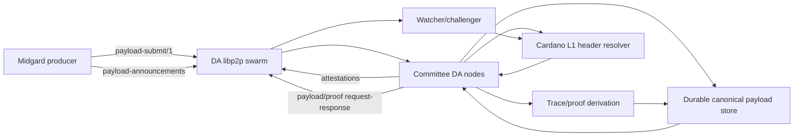

# Libp2p DA Transport Migration Plan

Generated: 2026-06-19
Status: implementation plan
Scope: DA protocol transport only

## Decision

Midgard DA protocol data must move to libp2p-only transport.

No DA payload, DA metadata, proof bundle, root summary, chunk, attestation,
attestation set, conflict evidence, watcher retrieval, challenger retrieval,
committee replication, producer publication, debug fallback, local development
fallback, gateway fallback, or object-store fallback may use HTTP.

HTTP may remain for unrelated process surfaces:

- User transaction submission APIs.
- Health checks.
- Metrics endpoints.
- Operator dashboards.
- Non-DA admin endpoints that do not carry DA protocol data.

This is a protocol migration, not a cosmetic transport refactor. The output must
be fail-closed, auditable, and testable as a production L2 data path.

## Why HTTP Is Being Removed

The current HTTP shape makes Midgard nodes responsible for serving DA payloads
through open URL endpoints such as:

```text
GET /da/payload?header_hash=...
GET /da/payload/metadata?header_hash=...
```

That is not the right long-term node-to-node DA interface because:

- It makes operator HTTP servers part of the DA data plane.
- It has no native peer identity, stream authorization, or deployment-scoped peer
  registry.
- It encourages URL-based configuration instead of manifest-bound peers.
- It makes watcher/challenger retrieval look like reading operator-local API
  state, even when the bytes are verified later.
- It complicates rate limits and abuse control because callers are HTTP clients,
  not protocol peers.

Libp2p gives the DA plane persistent peer identities, encrypted streams,
manifest-bound dialing, GossipSub, request-response protocols, connection
gating, peer scoring, and bounded binary streams. Cardano L1 and the configured
DA committee remain the trust roots; libp2p is the authenticated transport.

## Non-Goals

- Do not remove non-DA HTTP APIs.
- Do not change on-chain DA attestation semantics in this migration.
- Do not introduce Rust, Go, custom TCP, custom QUIC, NATS, Kafka, S3, HTTP
  gateways, IPFS HTTP gateways, or Ethereum devp2p.
- Do not use JSON as the DA wire encoding.
- Do not add DHT discovery by default for the first public-testnet
  implementation.
- Do not add "temporary" HTTP compatibility for DA.

## Current State To Migrate

The codebase currently has HTTP-shaped DA surfaces. Before implementation,
classify every hit as "migrate", "delete", "non-DA keep", or "test rewrite".
Do not leave ambiguous paths unresolved.

Key current surfaces:

```text
demo/midgard-node/src/commands/listen-router.ts
  GET /da/payload
  GET /da/payload/metadata

demo/midgard-node/src/e2e/da-gates.ts
  payloadEndpointBaseUrl
  /da/payload
  /da/payload/metadata

demo/da-committee-node/src/da/client.ts
  HTTP payload and metadata fetches

demo/da-committee-node/src/domain.ts
  sourceEndpoint
  baseUrls
  peerBaseUrl

demo/da-committee-node/src/config.ts
  manifest baseUrls / base_urls parsing
  DA peer endpoint parsing

demo/da-committee-node/src/peer/poller.ts
demo/da-committee-node/src/peer/coordinator.ts
demo/da-committee-node/src/store.ts
demo/da-committee-node/src/store/postgres.ts
  peer URL based reconciliation and storage records

demo/da-committee-node/tests/*
  HTTP fixtures for watcher, peer coordinator, multi-node integration, API, and
  Postgres store tests
```

Recommended inventory commands:

```bash
rg -n "fetch\\(|axios|got\\(|undici|node:http|node:https|http://|https://|express|fastify|koa|hapi|gateway|object.?store|s3|endpoint|url" demo
rg -n "DA|da-|da_|committee|attestation|proof.?bundle|payload.?by.?header|payload.?chunk|watcher|challenger|availability|data.?availability" demo
rg -n "endpoint|baseUrl|base_url|url|httpEndpoint|committeeEndpoint|daEndpoint|gateway|objectStore|bucket|s3" demo
```

## Security Invariants

1. Cardano L1 remains authoritative for state-queue headers.
2. Producer and committee DA payloads remain keyed by `header_hash`; neither
   payload becomes the authority for the header.
3. A committee node signs only after it has durably stored the canonical payload
   bytes, made them retrievable over libp2p, reconstructed the committed roots,
   and matched the L1 state-queue header.
4. A watcher or challenger verifies retrieved bytes against L1 before treating a
   DA attestation as useful.
5. Peer identity comes from the deployment manifest, not from caller-supplied
   URLs.
6. Unknown peers cannot submit, gossip, or retrieve unbounded DA data.
7. Duplicate bytes for the same `header_hash` are idempotent; conflicting bytes
   for a signed `header_hash` are slashable/conflict evidence and must not be
   overwritten.
8. Retention fails closed: a node cannot sign if it cannot satisfy the retention
   promise.
9. When transition trace commitments are enabled, the producer-submitted payload
   does not need to contain the completed trace/proof bundle. A committee node
   may derive those artifacts independently, but it must store and serve them
   over libp2p before signing.

## Hashes And Encodings

Midgard uses a 28-byte state-queue `header_hash` today:

```text
header_hash = blake2b_224(serialise_data(header))
HeaderHash = 28 bytes
```

DA payload byte integrity uses a separate 32-byte SHA-256 digest:

```text
payload_hash = sha256(canonical_da_payload_cbor)
PayloadHash = 32 bytes
```

Do not collapse these identifiers. In schemas and tests, name them separately:

- `header_hash`: 28-byte L1 state-queue header hash.
- `payload_hash`: 32-byte digest of canonical payload bytes.
- `deployment_fingerprint`: deployment-scoped network/domain identifier.

Wire encoding requirements:

- Canonical deterministic CBOR for all DA protocol messages.
- Strict decoding: no trailing bytes, duplicate keys, unknown required fields, or
  non-canonical map ordering.
- Length-delimited binary frames on libp2p streams.
- Explicit maximum frame, payload, metadata, proof bundle, and gossip message
  sizes.
- Golden vectors for every message type and signature preimage.

## Attestation Semantics

The current on-chain V1 DA attestation signs exactly:

```text
MidgardDAAttestationV1 || header_hash
```

The witness encoding remains:

```text
signer_index_u8 || ed25519_signature
```

This migration must not claim that the on-chain V1 signature directly signs
`payload_hash`. The payload hash is still useful for routing, deduplication,
diagnostics, and conflict evidence, but the V1 on-chain verifier checks the
signature over `header_hash`.

The security meaning of a V1 signature is:

```text
For this L1 header_hash, I have verified and stored the retrievable DA payload
needed to reconstruct the committed roots, and I will keep it available for the
retention window.
```

A future V2 attestation can bind the payload digest directly:

```text
MidgardDAAttestationV2
  || deployment_fingerprint
  || header_hash
  || payload_hash
  || payload_schema_version
  || retention_until_slot
```

V2 is not required for this migration, but V1 libp2p messages should include
`payload_hash` so that a V2 upgrade is straightforward.

## Transition Trace Data

Do not require the Midgard producer's initial payload to carry completed
transition trace data. The data obtained from, or produced by, Midgard nodes is
the source block/event payload, not the enriched committee DA payload.

Use two payload layers:

```text
MidgardProducerPayload:
  canonical block/event source data
  transaction, deposit, and withdrawal bodies
  required root preimages and field-list preimages
  previous-state references needed by deterministic replay
  no transition_proof_data

CommitteeDaPayload:
  producer_payload_hash
  canonical MidgardProducerPayload bytes or chunk manifest
  optional transition_proof_data {
    transition_trace_entries
    event_to_step_entries
    transition root member counts
    opened one-step proof preimages
    proof bundle manifests and chunks
  }
```

Committee nodes must reconstruct the proof artifacts using deterministic rules
from the producer payload, Cardano L1 state, previous Midgard state, and the
frozen trace schema. Committee-to-committee propagation may include
`transition_proof_data` inside the committee DA payload for replication
efficiency. A receiving committee node must still recompute or verify that data
before signing. Midgard producer payloads must not be required to include it.

Once a state commitment includes `transition_trace_root` or
`event_to_step_root`, the derived trace/proof artifacts become part of the DA
availability promise. They do not need to live inside the Midgard producer
payload. They may live inside the committee-propagated `CommitteeDaPayload` or
behind separate proof retrieval protocols, but they must be retrievable by
watchers and challengers under the same `header_hash`.

If a committee node cannot derive and persist the trace/proof artifacts needed
to challenge the committed roots, it must not sign the DA attestation for that
header.

## Target Architecture



Responsibilities:

- Producers build canonical payload bytes and publish them to committee peers.
- Committee nodes follow L1 independently, validate payload roots against L1,
  derive trace/proof artifacts when required, store before signing, gossip
  attestations, and serve retrieval.
- Watchers and challengers follow L1 independently, retrieve payload/proof data
  from committee peers, reconstruct roots, verify signatures, and run fault
  proof workflows.
- Coordinators collect sorted witnesses and submit `AddSignatures` transactions;
  they do not need to own DA signing keys.

## Dependencies

Use the JavaScript/TypeScript libp2p stack first, matching the current demo
workspace.

Expected packages, adjusted to the exact current libp2p API at implementation
time:

```text
libp2p
@libp2p/tcp
@libp2p/bootstrap
@libp2p/identify
@libp2p/gossipsub
@chainsafe/libp2p-noise
@chainsafe/libp2p-yamux
@multiformats/multiaddr
```

Use only the packages actually needed. Prefer Yamux for new code. Do not use
mplex unless the repository already requires it.

Security floor:

- `@libp2p/gossipsub` must be a version not affected by CVE-2026-46679.
- The advisory states versions before `15.0.23` are affected, so use
  `>=15.0.23` or the repository-approved newer version.
- Run the repository's dependency audit/security tooling after dependency
  changes.

## Shared Libp2p Module

Create one shared DA libp2p module instead of letting producer, committee,
watcher, and challenger code hand-roll different stacks.

Suggested shape:

```text
demo/da-committee-node/src/da/libp2p/
  DaLibp2pNode.ts
  DaPeerIdentity.ts
  DaPeerRegistry.ts
  DaConnectionGater.ts
  DaProtocols.ts
  DaTopics.ts
  DaStreamCodec.ts
  DaGossip.ts
  DaRequestResponse.ts
```

Move shared protocol types/codecs into the existing shared SDK/core package if
both `midgard-node` and `da-committee-node` need them.

Required capabilities:

- Persistent peer identity.
- Manifest-based peer registry.
- Configured listen multiaddrs.
- Configured announce multiaddrs.
- Explicit bootstrap multiaddrs.
- Noise encrypted connections.
- Yamux stream multiplexing.
- Identify service.
- GossipSub service.
- Connection gating before DA handlers run.
- Request-response handlers.
- Graceful start/stop.
- Structured logs and metrics hooks.

## Deployment Manifest

Replace URL fields with libp2p identity and addressing.

Example:

```yaml
schema_version: 1

deployment:
  name: public-testnet
  fingerprint: "<deployment-fingerprint>"
  cardano_network: "<network-id>"
  midgard_network: "<network-id>"
  da_protocol_version: 1

da_transport:
  kind: libp2p
  no_http_da_transport: true
  listen_multiaddrs:
    - "/ip4/0.0.0.0/tcp/0"
  announce_multiaddrs:
    - "/dns4/da-a.example/tcp/4001/p2p/<peer-id>"
  bootstrap_multiaddrs:
    - "/dns4/bootstrap.example/tcp/4001/p2p/<peer-id>"
  gossip:
    strict_sign: true
    emit_self: false
    allowed_topics_only: true
  limits:
    max_payload_bytes: 67108864
    max_inline_response_bytes: 1048576
    max_chunk_bytes: 1048576
    max_streams_per_peer: 16
    request_timeout_ms: 15000

da_committee:
  threshold: 2
  members:
    - signer_index: 0
      da_vkey: "<ed25519-verification-key-hex>"
      peer_id: "<libp2p-peer-id>"
      multiaddrs:
        - "/dns4/da-a.example/tcp/4001/p2p/<peer-id>"
      roles:
        - committee
        - retrieval
```

Configuration rules:

- Reject `baseUrl`, `baseUrls`, `endpoint`, `url`, `httpEndpoint`,
  `committeeEndpoint`, `daEndpoint`, `gateway`, `objectStore`, `bucket`, and
  `s3` under DA transport or DA committee config.
- Reject `http://` and `https://` values in DA transport config.
- Require stable peer IDs for committee members.
- Require signer index and DA verification key to match the on-chain DA params.
- Require every configured multiaddr to include or resolve to the expected
  peer ID.

## Protocol IDs

All protocol IDs and topic names are deployment-scoped.

GossipSub topics:

```text
/midgard/{deployment_fingerprint}/da/payload-announcements/1
/midgard/{deployment_fingerprint}/da/attestations/1
/midgard/{deployment_fingerprint}/da/conflicts/1
```

Request-response protocols:

```text
/midgard/{deployment_fingerprint}/da/payload-submit/1
/midgard/{deployment_fingerprint}/da/payload-by-header/1
/midgard/{deployment_fingerprint}/da/payload-chunk/1
/midgard/{deployment_fingerprint}/da/metadata-by-header/1
/midgard/{deployment_fingerprint}/da/proof-bundle-by-header/1
/midgard/{deployment_fingerprint}/da/trace-step-by-index/1
/midgard/{deployment_fingerprint}/da/event-to-step-by-event/1
/midgard/{deployment_fingerprint}/da/attestations-by-header/1
```

`payload-submit/1` is the producer-to-committee write path.
`payload-by-header/1` and `payload-chunk/1` are read/recovery paths for
committee nodes, watchers, and challengers.
`proof-bundle-by-header/1`, `trace-step-by-index/1`, and
`event-to-step-by-event/1` serve committee-derived trace/proof artifacts once
transition trace commitments are part of the state commitment.

For large payloads, `payload-submit/1` sends a chunk manifest instead of inline
payload bytes. The receiving committee node then pulls missing chunks with
`payload-chunk/1` from the producer or from committee peers before validating and
signing.

Do not accept near-match protocol negotiation for `/1`. Future breaking changes
must use explicit `/2` protocols and topics.

## Authorization Matrix

| Protocol               | Producer               | Committee         | Watcher/challenger | Unknown peer             |
| ---------------------- | ---------------------- | ----------------- | ------------------ | ------------------------ |
| payload-announcements  | publish                | publish/subscribe | subscribe          | reject                   |
| payload-submit         | submit                 | submit/serve      | no                 | reject                   |
| payload-by-header      | serve optional/request | serve/request     | request            | reject or public-limited |
| payload-chunk          | serve optional/request | serve/request     | request            | reject or public-limited |
| metadata-by-header     | serve optional/request | serve/request     | request            | reject or public-limited |
| proof-bundle-by-header | no/request             | serve/request     | request            | reject or public-limited |
| trace-step-by-index    | no/request             | serve/request     | request            | reject or public-limited |
| event-to-step-by-event | no/request             | serve/request     | request            | reject or public-limited |
| attestations           | no                     | publish/subscribe | subscribe          | reject                   |
| attestations-by-header | no/request             | serve/request     | request            | reject or public-limited |
| conflicts              | no                     | publish/subscribe | publish/subscribe  | reject                   |

The initial public-testnet profile should default to manifest-known peers only.
If public-limited retrieval is later enabled, it must be separately rate-limited,
bounded, and documented. It must not silently become the default.

## Message Schemas

Schemas below are logical field definitions. Implement the binary wire encoding
as canonical CBOR with golden vectors.

```text
DaPayloadAnnouncementV1 {
  deployment_fingerprint: bytes
  header_hash: bytes[28]
  payload_hash: bytes[32]
  payload_schema_version: uint
  payload_bytes: uint
  chunk_size: uint
  chunk_count: uint
  root_summary_hash: bytes[32]
  announced_by_peer_id: string
  announced_at_slot: uint
  signature: bytes
}
```

```text
PayloadSubmitRequestV1 {
  deployment_fingerprint: bytes
  header_hash: bytes[28]
  payload_hash: bytes[32]
  payload_schema_version: uint
  mode: enum("inline", "chunked")
  payload_bytes: optional bytes
  chunk_manifest: optional PayloadChunkManifestV1
}

PayloadSubmitResponseV1 {
  status: enum("accepted", "duplicate", "conflict", "rejected", "deferred")
  header_hash: bytes[28]
  payload_hash: bytes[32]
  reason_code: optional string
  retry_after_ms: optional uint
}
```

```text
PayloadByHeaderRequestV1 {
  deployment_fingerprint: bytes
  header_hash: bytes[28]
  accepted_payload_hashes: optional bytes[32][]
  max_inline_bytes: uint
}

PayloadByHeaderResponseV1 {
  status: enum("found_inline", "found_chunked", "not_found", "conflict", "rejected")
  header_hash: bytes[28]
  payload_hash: optional bytes[32]
  payload_bytes: optional bytes
  chunk_manifest: optional PayloadChunkManifestV1
  reason_code: optional string
}

PayloadChunkManifestV1 {
  payload_hash: bytes[32]
  total_bytes: uint
  chunk_size: uint
  chunk_hashes: bytes[32][]
}
```

```text
PayloadChunkRequestV1 {
  deployment_fingerprint: bytes
  header_hash: bytes[28]
  payload_hash: bytes[32]
  chunk_index: uint
}

PayloadChunkResponseV1 {
  status: enum("found", "not_found", "rejected")
  header_hash: bytes[28]
  payload_hash: bytes[32]
  chunk_index: uint
  chunk_bytes: optional bytes
  chunk_hash: optional bytes[32]
}
```

```text
MetadataByHeaderResponseV1 {
  status: enum("found", "not_found", "conflict", "rejected")
  header_hash: bytes[28]
  payload_hash: optional bytes[32]
  payload_schema_version: optional uint
  payload_bytes: optional uint
  root_summary_hash: optional bytes[32]
  proof_bundle_hash: optional bytes[32]
  transition_trace_root: optional bytes
  event_to_step_root: optional bytes
  retained_until_slot: optional uint
  local_status: optional enum("staged", "verified", "signed", "conflict")
}
```

```text
ProofBundleByHeaderRequestV1 {
  deployment_fingerprint: bytes
  header_hash: bytes[28]
  max_inline_bytes: uint
}

ProofBundleByHeaderResponseV1 {
  status: enum("found_inline", "found_chunked", "not_found", "rejected")
  header_hash: bytes[28]
  proof_bundle_hash: optional bytes[32]
  proof_bundle_bytes: optional bytes
  chunk_manifest: optional PayloadChunkManifestV1
  reason_code: optional string
}
```

```text
TraceStepByIndexRequestV1 {
  deployment_fingerprint: bytes
  header_hash: bytes[28]
  step_index: uint
}

TraceStepByIndexResponseV1 {
  status: enum("found", "not_found", "rejected")
  header_hash: bytes[28]
  step_index: uint
  transition_step_bytes: optional bytes
  membership_proof_bytes: optional bytes
}
```

```text
EventToStepByEventRequestV1 {
  deployment_fingerprint: bytes
  header_hash: bytes[28]
  event_key: bytes
}

EventToStepByEventResponseV1 {
  status: enum("found", "not_found", "rejected")
  header_hash: bytes[28]
  event_key: bytes
  event_to_step_entry_bytes: optional bytes
  membership_or_nonmembership_proof_bytes: optional bytes
}
```

```text
DaAttestationGossipV1 {
  deployment_fingerprint: bytes
  header_hash: bytes[28]
  payload_hash: bytes[32]
  signer_index: uint8
  da_vkey: bytes[32]
  on_chain_witness: bytes[65]
  retention_until_slot: uint
  announced_by_peer_id: string
}
```

```text
ConflictEvidenceV1 {
  deployment_fingerprint: bytes
  header_hash: bytes[28]
  evidence_kind: enum(
    "conflicting_payload_bytes",
    "invalid_roots",
    "signature_without_retrieval",
    "malformed_message",
    "equivocation"
  )
  evidence_hash: bytes[32]
  compact_evidence: optional bytes
}
```

## Signing Domains

Use separate domains for transport-level messages. These signatures are not the
same as the V1 on-chain DA attestation signature.

```text
MidgardDALibp2pPayloadAnnouncementV1
MidgardDALibp2pPayloadSubmitV1
MidgardDALibp2pConflictEvidenceV1
```

Transport signatures should bind:

- Deployment fingerprint.
- Protocol version.
- Header hash.
- Payload hash where present.
- Peer role or signer index where relevant.
- Encoded body hash.

The on-chain signature remains:

```text
MidgardDAAttestationV1 || header_hash
```

## Storage Model

Store immutable payload bytes and metadata by deployment and header hash.

Suggested keys:

```text
payload:{deployment_fingerprint}:{header_hash}
metadata:{deployment_fingerprint}:{header_hash}
chunks:{deployment_fingerprint}:{payload_hash}:{chunk_index}
proof_bundle:{deployment_fingerprint}:{header_hash}
trace_step:{deployment_fingerprint}:{header_hash}:{step_index}
event_to_step:{deployment_fingerprint}:{header_hash}:{event_key}
attestations:{deployment_fingerprint}:{header_hash}
conflicts:{deployment_fingerprint}:{header_hash}
```

Migration requirements:

- Replace `sourceEndpoint` with source peer IDs and protocol IDs.
- Replace `peerBaseUrl` with peer IDs and multiaddrs.
- Replace `baseUrls` manifest state with manifest peer IDs and multiaddrs.
- Preserve existing payload conflict protections keyed by `header_hash`.
- Store the raw canonical payload bytes before signing.
- Store chunk manifests and chunk hashes for large payload retrieval.
- Derive and store transition trace/proof artifacts before signing whenever the
  L1 header commits to trace roots.
- Store received attestations independent of local signing ownership.
- Ensure restart recovery resumes staged, verified, signed, and conflict states
  without needing HTTP.

## Core Flows

### Producer Publication

1. Build canonical block/event payload bytes.
2. Compute `payload_hash`.
3. Persist payload locally until committee threshold is observed.
4. Dial manifest committee peers.
5. Send `PayloadSubmitRequestV1` over `payload-submit/1`, inline for small
   payloads or as a chunk manifest for large payloads.
6. Publish `DaPayloadAnnouncementV1`.
7. Track committee responses and gossiped attestations.
8. Once threshold witnesses are available, submit or hand off
   `AddSignatures`.

### Committee Validation And Signing

1. Receive payload through `payload-submit/1`, chunk retrieval after a submit
   manifest, announcement plus retrieval, or committee recovery.
2. Strict-decode canonical CBOR.
3. Verify schema version, deployment fingerprint, network, and protocol version.
4. Recompute roots and member counts.
5. Resolve the matching Cardano L1 state-queue header.
6. If the header commits to transition trace roots, deterministically derive
   trace entries, event-to-step entries, and proof bundle indexes.
7. Verify reconstructed roots and `header_hash` against L1.
8. Persist payload, metadata, and derived proof artifacts durably.
9. Confirm libp2p retrieval readiness locally for payload and proof artifacts.
10. Confirm retention eligibility.
11. Sign `MidgardDAAttestationV1 || header_hash`.
12. Store witness and gossip `DaAttestationGossipV1`.

### Watcher And Challenger Retrieval

1. Observe state-queue header and DA attestation marker on Cardano L1.
2. Load the signed deployment manifest.
3. Dial committee peers by peer ID and multiaddr.
4. Retrieve attestations by gossip or `attestations-by-header/1`.
5. Retrieve payload with `payload-by-header/1` and `payload-chunk/1`.
6. Retrieve proof bundle metadata and trace openings with
   `proof-bundle-by-header/1`, `trace-step-by-index/1`, and
   `event-to-step-by-event/1` when the header commits to trace roots.
7. Recompute roots and verify against the L1 header.
8. Verify DA witness signatures against the configured committee.
9. Run normal Midgard verification and fault-proof workflows.

### Submitter-Only Reconciliation

1. Follow L1 and retrieve verified payloads over libp2p.
2. Collect local and peer DA witnesses over libp2p.
3. Verify committee hash, signer indexes, witness signatures, and threshold.
4. Submit `AddSignatures` only when the threshold can be constructed.
5. Do not require the submitter to own a DA signing key.

## Removal Plan

Delete or migrate DA HTTP code in this order:

1. Add libp2p config and manifest parsing behind strict feature flags.
2. Add libp2p service and codecs with unit tests.
3. Add request-response handlers and in-memory integration tests.
4. Add producer publication over `payload-submit/1`.
5. Add committee validation/signing over libp2p.
6. Add watcher/challenger retrieval over libp2p.
7. Switch submitter-only reconciliation to libp2p witness retrieval.
8. Remove `/da/payload` and `/da/payload/metadata` from Midgard node DA
   transport.
9. Remove HTTP DA client code and URL-based DA config.
10. Rewrite tests that used HTTP fixtures.
11. Add static tests that fail on DA HTTP reintroduction.

Static guardrails should fail if DA transport code imports or uses:

```text
fetch(
axios
got(
undici
node:http
node:https
http://
https://
baseUrl
baseUrls
sourceEndpoint
peerBaseUrl
payloadEndpointBaseUrl
gateway
objectStore
s3
```

The guardrail must be scoped tightly enough that non-DA HTTP APIs can remain.

## Phased Implementation

### Phase 0: Protocol Freeze

- Finalize this plan and the architecture docs.
- Freeze v1 protocol IDs, topic names, message schemas, size limits, and error
  codes.
- Add golden vectors for hashes, CBOR, and signature preimages.

### Phase 1: Manifest And Config

- Add libp2p manifest schema.
- Reject URL-based DA config fields.
- Persist peer identity.
- Validate committee signer indexes and peer IDs against deployment manifest.
- Keep old HTTP tests only until replacement coverage exists.

### Phase 2: Libp2p Service

- Implement the shared DA libp2p service.
- Add connection gating and manifest peer registry.
- Add bounded stream framing.
- Add topic allowlists and peer scoring defaults.
- Add metrics/logging.

### Phase 3: Payload Protocols

- Implement `payload-submit/1`.
- Implement `payload-by-header/1`.
- Implement `payload-chunk/1`.
- Implement `metadata-by-header/1`.
- Add conflict detection and idempotent duplicate handling.

### Phase 4: Attestation Protocols

- Implement attestation gossip.
- Implement `attestations-by-header/1`.
- Preserve arbitrary signer index support.
- Preserve signerless submitter/coordinator mode.

### Phase 5: Proof Retrieval

- Implement `proof-bundle-by-header/1`.
- Implement `trace-step-by-index/1`.
- Implement `event-to-step-by-event/1`.
- Add deterministic committee-side trace/proof derivation before signing.
- Route watcher/challenger proof material over libp2p.
- Ensure proof bundles are verified against L1 roots before use.

### Phase 6: Remove HTTP DA Transport

- Delete DA HTTP endpoints from Midgard node.
- Delete DA HTTP clients from committee/watcher code.
- Delete URL-based DA config.
- Rewrite E2E gates to use libp2p retrieval.
- Add static no-HTTP-DA regression tests.

### Phase 7: Hardening And Public-Testnet Readiness

- Run multi-node libp2p tests with at least 3 committee peers.
- Test node restarts, rollbacks, partial partitions, slow peers, duplicate
  payloads, conflicting payloads, oversized payloads, malformed CBOR, and
  missing chunks.
- Run dependency audit.
- Run packet-level/manual checks to confirm no DA payload bytes move over HTTP.

## Test Matrix

Unit tests:

- Canonical CBOR strict decode.
- Golden vectors for every DA message.
- `header_hash` length is 28 bytes.
- `payload_hash` length is 32 bytes.
- Protocol ID/topic construction.
- Manifest validation rejects HTTP and URL fields.
- Connection gater rejects unknown peers.
- Chunk manifest hashing.
- Duplicate payload idempotence.
- Conflicting payload rejection.
- V1 on-chain signature preimage remains `MidgardDAAttestationV1 ||
header_hash`.
- Committee-derived trace/proof artifacts are deterministic from the same
  payload and L1 context.
- Producer-supplied trace/proof hints cannot cause signing unless recomputed.

Integration tests:

- Producer publishes payload to committee over `payload-submit/1`.
- Committee stores before signing.
- Committee refuses to sign before matching L1 header exists.
- Committee refuses malformed or wrong-root payload.
- Committee refuses to sign when a trace-committed header cannot be matched by
  derived trace/proof artifacts.
- Watcher retrieves inline payload.
- Watcher retrieves chunked payload.
- Watcher retrieves proof bundle, trace step, and event-to-step openings.
- Watcher verifies threshold attestations from arbitrary signer indexes.
- Submitter-only reconciler submits threshold witnesses without local signer.
- Restart recovery preserves staged/verified/signed/conflict states.
- Network partition heals through committee recovery.

Regression tests:

- DA code cannot import HTTP clients.
- DA config cannot contain HTTP URLs.
- DA docs/tests do not reintroduce `/da/payload` as a production path.
- Unknown peers cannot retrieve unbounded data.
- Oversized gossip messages and stream frames are rejected before expensive
  decoding.

Acceptance checks:

```bash
cd demo
pnpm run typecheck
pnpm run test
pnpm run lint
pnpm run format-check
```

Run narrower package commands first during development if full workspace checks
are noisy, but public-testnet readiness should include the workspace-level
commands above or a documented reason they cannot run.

## Edge Cases

- Payload arrives before L1 header: store as staged, do not sign.
- L1 rollback removes the header before signing: keep staged payload, do not
  sign until the header is observed again at the configured confidence.
- Same `header_hash`, same payload bytes: return duplicate/accepted.
- Same `header_hash`, different payload bytes: mark conflict and never overwrite
  signed bytes.
- Same payload hash, different header hash: reject unless the payload schema
  explicitly supports this, which V1 should not.
- Missing chunk: retry other peers, then report unavailable.
- Peer advertises payload but cannot serve it: downscore and record retrieval
  failure.
- Committee signature appears but payload cannot be retrieved: record
  availability failure and emit conflict evidence if policy allows.
- Retention window too short: fail config load or refuse signing.
- Manifest committee differs from on-chain DA params: fail closed.

## Open Decisions Before Implementation

These must be decided before coding the production path:

- Exact canonical CBOR library and deterministic encoding API.
- Exact libp2p package versions after dependency audit.
- Exact maximum payload, chunk, stream, and gossip sizes for public testnet.
- Whether public-limited retrieval is allowed at all in v1.
- Whether proof-bundle retrieval is served by committee nodes, dedicated proof
  peers, or both.
- Whether a future V2 attestation should bind `payload_hash` on chain.
- Exact retention margin beyond the challenge window.

## Completion Criteria

The migration is complete only when:

- DA payload bytes no longer move over HTTP in production or tests.
- DA metadata/proof/attestation retrieval no longer uses HTTP.
- Manifest DA config uses peer IDs and multiaddrs, not URLs.
- Committee nodes sign only after storage, L1 match, retrieval readiness, and
  retention checks.
- Watchers and challengers can retrieve and verify DA data from libp2p peers.
- Submitter-only reconciliation still works without local DA signing ownership.
- Static regression tests prevent HTTP DA transport from coming back.
- Multi-node acceptance proves threshold attestation and retrieval end to end.
