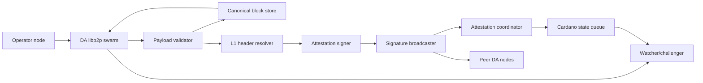
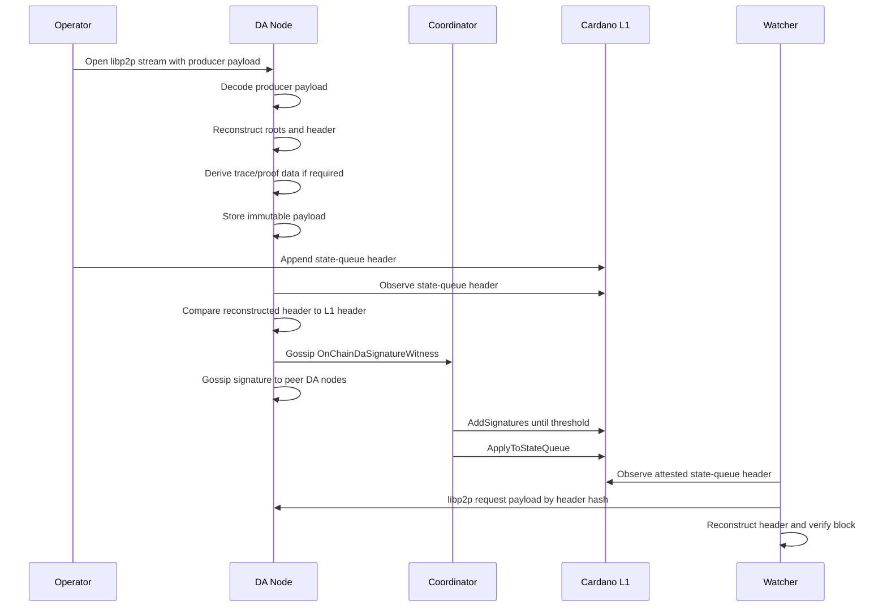

# Midgard DA Committee Node Architecture

Status: Implemented architecture reference for `demo/da-committee-node`, not a
claim of permissionless or trustless data availability.

Last reviewed: 2026-07-22

The committee is a deployment trust assumption until independent retrieval,
retention through the full challenge/recovery horizon, committee governance and
accountability, and an on-chain remedy for unavailable data are accepted end to
end. See `../../../docs/fault-proofs/` and
`../../../public_testnet_readiness.md` for current blockers.

This document defines Midgard's current committee data-availability mechanism for deployments that cannot use Cardano Leios blobs.
The mechanism is a threshold committee of DA nodes that independently store, verify, sign, broadcast, and publicly serve Midgard block payloads.

The on-chain `da_attestation.ak` design provides the attestation control plane.
It records that a threshold of configured committee keys attested to a Midgard
block header. The companion implementation under `demo/da-committee-node`
provides the current data plane: manifest-bound libp2p retrieval, canonical
payload validation, durable storage, committee signing and exchange, and an
optional L1 attestation coordinator.

## Current Contract Boundary

This document is intentionally stronger than the contracts in one dimension: it defines the public data-plane obligations that make a DA signature meaningful.
The current Midgard contracts only verify the attestation control plane.

As implemented in this repository:

- The DA params governor owns a `MIDGARD_DA_PARAMS` NFT whose datum contains `committee`, `committee_signers_hash`, `da_threshold`, governance `owners`, and `update_threshold`.
- `committee` is the sorted unique packed byte string of 32-byte Ed25519 verification keys.
- `committee_signers_hash` is `blake2b_256(committee)`.
- `da_threshold` must be greater than zero and no larger than the committee length.
- Per block, the DA attestation policy mints a `DAAT || header_hash` token into an attestation UTxO.
- The attestation datum carries `header_hash`, `da_threshold`, `committee_signers_hash`, a 256-bit MSB-first signer bitmap, and `attestation_count`.
- `AddSignatures` accepts a packed byte string of `1-byte signer index || 64-byte Ed25519 signature` chunks. Indexes must be strictly ascending, and each signature is verified against the key at that index in the current DA params committee.
- `ApplyToStateQueue` requires `attestation_count >= da_threshold`, burns the `DAAT || header_hash` token, and rewrites the state-queue node from empty `da_attestation` to the DA attestation policy id.
- After attachment, the live state-queue node does not carry the signer bitmap, threshold, committee hash, or peer metadata. It only carries the DA attestation policy id marker; detailed signer evidence is in the historical attestation transactions and the attestation UTxO while it exists.
- The contracts do not verify payload bytes, libp2p retrieval readiness, retention windows, deployment manifests, peer broadcasts, or the 14-day availability promise. Those are requirements of the `threshold-mirror-v1` committee profile defined here.

The current node implementation also has a demo/default path: protocol initialization derives a one-key committee from the operator payment key with threshold `1`, and `attest-state-queue-once` creates, signs with signer index `0`, and applies attestations itself.
The public committee architecture below is the generalized profile that should replace or wrap that operator-local path for production deployments.

## Current Implementation Boundary

`demo/midgard-node` remains the block producer, not a committee signer. It
persists only canonical `DaPayloadEnvelopeV1` bytes and serves that exact
stored artifact over the manifest-bound libp2p transport. The stored/wire
SHA-256 binds the envelope; the envelope also binds the decoded V1 content
with an exact inner length and SHA-256.

`demo/da-committee-node` currently:

- fails closed on deployment-manifest and contract-deployment identity drift;
- scans finalized state-queue headers through the configured Cardano provider;
- fetches payload, metadata, chunks, proof artifacts, and attestations over
  allowlisted libp2p V1 protocols;
- unwraps V1 with a dual compressed/decoded size cap, canonical-decodes
  the inner `DaPayloadV1`, recomputes all eight roots and the committed
  counts, and compares the embedded header and header hash with L1;
- stores deployment, header, payload, signature, peer, and L1 submission state
  in a JSON-file or PostgreSQL store;
- signs `MidgardDAAttestationV1 || header_hash` only after the payload is
  verified and the signer belongs to the configured committee;
- exchanges signatures with committee peers and, when L1 submission is
  enabled, reconciles the `Init`, `AddSignatures`, and `ApplyToStateQueue`
  lifecycle; and
- exposes only `/healthz`, `/readyz`, and `/v1/manifest` over HTTP. DA payload
  and attestation transport has no HTTP fallback.

The remaining production boundary is broader than transport implementation:
signed deployment-manifest distribution, independently exercised multi-member
operations, retention enforcement/monitoring, public runbooks, and autonomous
challenger integration are still launch work. A threshold signature is an
availability trust statement; it is not full optimistic-rollup verification.

## Security Claim

For a deployment using `threshold-mirror-v1` DA:

- A block is DA-acceptable only if a threshold of configured DA committee nodes have independently verified, stored, and made the canonical block payload retrievable over the DA libp2p network for at least 14 days.
- A DA committee signature over `header_hash` means: "I have the public payload needed to reconstruct this exact state-queue header and I will keep it available for 14 days."
- Watchers retrieve the payload from DA committee peers over libp2p, reconstruct the state-queue header from that payload, compare it to Cardano L1, and then run normal Midgard block verification.
- Operator databases, MPF stores, and admin endpoints are not security-critical DA sources.
- The DA committee is trusted for availability until a stronger L1-secured DA layer exists.

This is weaker than Leios because availability is backed by a configured committee, not Cardano L1 consensus.
It is still a concrete public mechanism: committee members cannot honestly sign until they can reconstruct the on-chain state commitment from locally stored payload bytes that are retrievable over libp2p.

## Attestation Semantics

The current `da_attestation.ak` message is:

```text
MidgardDAAttestationV1 || header_hash
```

By signing this message, a committee member attests that the block payload and
any derived proof artifacts required to reconstruct, verify, and challenge the
state commitment are publicly available and will remain available for 14 days.
This is the only required DA attestation in the V1 committee profile.
On chain, the signature preimage is exactly the UTF-8 bytes of `MidgardDAAttestationV1` concatenated with the 28-byte `header_hash`.

`MidgardDAAttestationV1` is the attestation profile and signing domain, not a separately served payload format.
In the current implementation, it means the signer fetched and durably stored a
canonical `DaPayloadV1`, matched its embedded header to L1, and recomputed the
UTxO, withdrawal, forced-transaction, transaction, deposit, transition-trace,
and event-to-step roots and counts. Proof bundles are served through separate
protocols and are not yet a prerequisite enforced by the signer, so the
signature must not be described as proof that every challenger witness exists.
The chain verifies only the signature over
`MidgardDAAttestationV1 || header_hash`.

The public identifier for DA retrieval is the state-queue `header_hash`.
Committee nodes and watchers validate payloads by deterministically reconstructing the full state-queue header from the payload and comparing it to the state-queue header observed on Cardano L1.

Local implementations may use private storage checksums for disk integrity.
Those checksums are not protocol commitments and are not part of watcher consensus.

Committee peer discovery is deployment-manifest-bound, not operator-supplied.
Given a signed deployment manifest and an attested state-queue header, a watcher can dial configured committee peers and retrieve the payload by `header_hash`.

## Components



### DA Libp2p Transport

Accepts and replicates canonical block payloads from operators or peer committee nodes.
The DA protocol data plane is libp2p-only; HTTP endpoints are not part of the DA
transport, including as fallback, debug, gateway, or local development transport.

Transport responsibilities:

- Accept canonical `DaPayloadEnvelopeV1` bytes from manifested producers or
  committee peers.
- Authenticate peers by deployment-manifest peer id and configured signing key.
- Reject oversized payloads before expensive validation.
- Store an immutable staging record before any signature is produced.
- Return deterministic status for duplicate submissions.
- Reject conflicting bytes for a `header_hash` that this node has already signed.
- Apply peer scoring, rate limits, and backpressure before expensive validation.

### Payload Validator

Validates that the payload is complete and reconstructs the committed block header.

Validation responsibilities:

- Decode canonical CBOR with no trailing bytes, duplicate keys, or unknown required fields.
- Verify deployment fingerprint and peer identity through the runtime manifest
  and transport envelope; verify payload version and the protocol version in
  the embedded header.
- Recompute the seven committed roots and all header counts from the payload.
- Validate transition-trace and event-to-step coverage carried by the payload.
- Decode the exact Midgard `Header` value embedded in the payload.
- Compute `header_hash = blake2b_224(serialise_data(reconstructed_header))`.
- Resolve the matching state-queue node from Cardano L1 before signing.
- Verify the reconstructed header equals the state-queue header datum observed on L1.
- Verify the reconstructed `header_hash` equals the state-queue linked-list key and block asset suffix.
- Require the configured transport retention to be at least 15 days. Automated
  per-payload retention expiry enforcement remains production work.

The validator may store a payload before the L1 header exists, but it must not sign until the L1 header is observed and matched.

### Canonical Block Store

Stores immutable payload bytes and metadata by `header_hash`.

Conceptual retrieval keys:

```text
payload:{deployment_fingerprint}:{header_hash}
metadata:{deployment_fingerprint}:{header_hash}
proof_bundle:{deployment_fingerprint}:{header_hash}
trace_step:{deployment_fingerprint}:{header_hash}:{step_index}
event_to_step:{deployment_fingerprint}:{header_hash}:{event_key}
attestations:{deployment_fingerprint}:{header_hash}
```

The current JSON/PostgreSQL store models these as deployment, header, payload,
signature, peer, attestation-candidate, and L1-submission records. The libp2p
protocols expose header-, step-, and event-keyed retrieval without requiring a
particular storage-engine key syntax. Payload conflict checks prevent replacing
verified bytes for a header hash.

Store requirements:

- Atomic write before publish.
- Immutable storage keyed by deployment fingerprint and `header_hash`.
- Conflict detection for different payload bytes under one `header_hash`.
- Durable local disk persistence.
- Chunked reads for large payloads over libp2p streams.
- Retention sweeper that refuses deletion before the 14-day promise plus configured safety margin.

### L1 Header Resolver

Follows Cardano L1 enough to confirm that the target header exists in the Midgard state queue.

The resolver should use the same deployment manifest fields as watchers:

- Network id.
- Hub oracle.
- State queue policy and address.
- DA attestation policy.
- Protocol version.
- Finality and rollback policy.

The committee node can validate a staged payload before the header is on L1, but it signs only after the header is present at the configured confidence threshold.

### Attestation Signer

Owns one DA committee signing key and signs only after durable storage, libp2p retrieval readiness, and header reconstruction validation succeed.

Signer inputs:

- Canonical payload bytes.
- Reconstructed header.
- L1-observed state-queue header.
- Local libp2p retrieval readiness.
- 14-day retention eligibility.
- Deployment manifest.

Signer output:

```text
OnChainDaSignatureWitness =
  signer_index_u8 || ed25519_sign("MidgardDAAttestationV1" || header_hash)

AddSignatures.signatures =
  OnChainDaSignatureWitness*
```

Each witness is 65 bytes.
Witnesses in one `AddSignatures` redeemer must be sorted by strictly increasing signer index.
The signer index selects the 32-byte verification key slot in the packed on-chain DA params committee.

The signer may provide unsigned metadata such as payload byte length, schema version, reconstructed root summary, local retention expiry, and local storage status through `metadata-by-header`.
That metadata helps watchers and operators inspect retrieval, but the DA promise is the threshold on-chain signature over `header_hash`.

The signing key should live behind a local signer process, HSM, KMS, or strict filesystem permissions.
No service should log private keys, signing payload preimages that include secrets, or raw operator credentials.

### Signature Broadcaster

Broadcasts `OnChainDaSignatureWitness` after signing.

Broadcast targets:

- Attestation coordinator peer.
- Peer DA committee nodes.
- Optional operator peer.
- Local `attestations-by-header` request-response service.

Broadcast responsibilities:

- Retry with backoff until the signature is accepted or the block is no longer relevant.
- Deduplicate signatures by signer index and `header_hash`.
- Never broadcast a signature before the local payload is durably stored and retrievable over libp2p.
- Continue making payload retrievable even if no coordinator accepts the signature.

### Attestation Coordinator

Collects committee signatures and submits the on-chain DA attestation transactions.
This role can be run by the operator, a DA committee member, or a separate relayer.

Coordinator responsibilities:

- Create the initial DA attestation UTxO for an unattested state-queue header.
- Collect `AddSignatures` witnesses from committee nodes.
- Submit one or more `AddSignatures` transactions until the datum's `attestation_count` reaches the threshold.
- Submit `ApplyToStateQueue` to burn the `DAAT || header_hash` token and mark the state-queue node with the DA attestation policy id.
- Gossip the final attestation transaction references through the DA libp2p network.

The coordinator is not trusted for data availability.
It only transports signatures and submits L1 transactions.
The attestation policy is stateless and does not prove global uniqueness of `DAAT || header_hash`, so coordinators and watchers must resolve the valid attestation UTxO by datum, asset, and lifecycle evidence rather than assuming token supply uniqueness alone.

### Libp2p Protocol API

DA payload, metadata, and attestation exchange use stable libp2p protocol ids.
Every watcher should be able to start from a deployment manifest and Cardano L1
state, discover committee peers, and fetch payloads without operator assistance.

Required GossipSub topics:

```text
/midgard/{deployment_fingerprint}/da/payload-announcements/1
/midgard/{deployment_fingerprint}/da/attestations/1
/midgard/{deployment_fingerprint}/da/conflicts/1
```

Required request-response protocols:

```text
/midgard/{deployment_fingerprint}/da/payload-submit/1
/midgard/{deployment_fingerprint}/da/payload-by-header/1
/midgard/{deployment_fingerprint}/da/payload-chunk/1
/midgard/{deployment_fingerprint}/da/metadata-by-header/1
/midgard/{deployment_fingerprint}/da/proof-bundle-by-header/1
/midgard/{deployment_fingerprint}/da/trace-step-by-index/1
/midgard/{deployment_fingerprint}/da/event-to-step-by-event/1
/midgard/{deployment_fingerprint}/da/attestations-by-header/1
```

`payload-submit` is the producer-to-committee write path. It can carry inline
payload bytes or a chunk manifest for large payloads. `payload-by-header` returns
canonical CBOR bytes, or a chunk manifest when the payload exceeds the
single-response limit. `payload-chunk` returns byte ranges or content-addressed
chunks from that manifest. Metadata, proof bundle, and attestation payloads use
canonical CBOR, not JSON.

## Deployment Manifest Fields

Watchers and committee nodes need the same DA discovery data in the signed deployment manifest.

Example:

```json
{
  "da": {
    "mode": "threshold-mirror-v1",
    "schemaVersion": 1,
    "committeeSignersHash": "...",
    "threshold": 5,
    "retentionSlots": 1209600,
    "payloadEncoding": "canonical-cbor",
    "members": [
      {
        "index": 0,
        "vkey": "...",
        "peerId": "12D3KooW...",
        "multiaddrs": [
          "/dns4/da-0.example.org/tcp/30333/noise/yamux/p2p/12D3KooW..."
        ]
      },
      {
        "index": 1,
        "vkey": "...",
        "peerId": "12D3KooW...",
        "multiaddrs": [
          "/dns4/da-1.example.org/tcp/30333/noise/yamux/p2p/12D3KooW..."
        ]
      }
    ]
  }
}
```

The sorted `members[*].vkey` bytes must hash to the on-chain `committee_signers_hash`.
More precisely, the on-chain committee is the concatenation of sorted unique 32-byte verification keys, and `committeeSignersHash` must equal `blake2b_256` of that packed byte string.
Peer identity and multiaddr metadata are manifest-bound so watchers do not depend on operator-supplied transport locations.
The manifest is not currently authenticated by the DA contracts; deployments must bind it to their release/deployment process.

## Payload Schema

The inner shared payload codec is `DaPayloadV1` in
`demo/midgard-sdk/src/da-payload.ts`. Its canonical Plutus-data CBOR shape is:

```text
DaPayloadV1 {
  version,
  block_body: {
    header_hash,
    header,
    utxos,
    withdrawals,
    forced_transactions,
    transactions,
    transaction_preimages,
    forced_transaction_preimages,
    cek_program_material,
    deposits,
    transition_trace,
    event_to_step,
    validation_traces,
    counts: {
      withdrawalCount,
      forcedTransactionCount,
      l2TransactionCount,
      depositCount,
      totalEventCount,
      transitionStepCount,
      validationTraceCount
    }
  }
}
```

Each member list contains `(key_bytes, value_bytes)` tuples. The committee
validator requires a byte-for-byte canonical re-encoding, validates the
embedded header hash and header against L1, recomputes the UTxO, withdrawal,
forced-transaction, transaction, deposit, transition-trace, event-to-step, and
validation-trace roots, and checks all committed counts before signing.

Inbound payload submission is admitted through one process-wide FIFO slot
before any frame read or decompression. One absolute request deadline starts
before that queue, spans frame read, bounded unwrap/decompression, validation,
store, response backpressure, and stream close, and aborts the stream on
expiry. A timed-out waiter is removed from the queue, so a stalled manifested
peer cannot monopolize the only decode slot.

Deployment identity is bound by the libp2p runtime manifest and protocol
envelopes rather than duplicated inside `DaPayloadV1`. Proof bundles, trace
steps, and event-to-step records have separate request-response protocols; the
payload alone is not a claim that every launch-scope proof witness is available.

## Publish And Attest Workflow



The operator may submit to multiple DA nodes directly over libp2p.
DA nodes may also request missing payloads from peer committee nodes after seeing a signature for a header, but a node must never sign data it has not stored, reconstructed, matched to L1, and made retrievable over libp2p.

## Watcher Retrieval Policy

For every queued block, a watcher should:

1. Observe the state-queue header on Cardano L1.
2. Confirm the state-queue node's `da_attestation` field equals the expected DA attestation policy id.
3. Load the DA committee peer ids and multiaddrs from the signed deployment manifest.
4. Fetch `metadata` from committee peers with `metadata-by-header`.
5. Recover threshold signature evidence from the DA attestation lifecycle transactions where available, especially if checking before attachment or auditing a deployment after the attestation UTxO has been burned.
6. Fetch payload bytes by `header_hash` from committee peers with `payload-by-header` and `payload-chunk`.
7. Reconstruct the state-queue header from the payload and compare it to the L1 header.
8. Cache the payload and all proof-critical preimages locally.

If the state queue is DA-attested but the watcher cannot retrieve a valid payload from the configured committee peers before the warning deadline, the block decision is `pending_da` and should escalate.
Near maturity this is an emergency, because missing DA can prevent fault proof construction.

## Committee Node State Machine

```text
received
  -> decoded
  -> reconstructed_header
  -> stored
  -> waiting_for_l1_header
  -> l1_header_matched
  -> libp2p_retrievable
  -> signed
  -> gossiped
  -> expired
```

Failure states:

```text
rejected_malformed
rejected_wrong_deployment
rejected_header_mismatch
rejected_root_mismatch
rejected_missing_proof_data
rejected_retention_unavailable
conflicting_payload
storage_unavailable
signer_unavailable
broadcast_failed
```

Every state transition should be durable and auditable.
The node must recover after restart without signing a payload whose storage and libp2p retrieval status are unknown.

## Failure Handling

Malformed payload:

- Reject with a stable error code.
- Do not store as canonical.
- Do not sign.

Wrong root or header mismatch:

- Store optional forensic record.
- Do not sign.
- Expose conflict status for operators and monitors.

Duplicate payload:

- Return the existing metadata and signature if already signed.
- Do not rewrite immutable bytes.

Conflicting payload for same header:

- Mark `conflicting_payload`.
- Continue making any already signed canonical payload retrievable over libp2p.
- Do not sign a second payload for the same header.
- Alert operators and watchers.

Storage outage:

- Readiness fails.
- Signing disabled.
- Existing payloads remain retrievable over libp2p if possible.

Signer outage:

- Payload validation and storage may continue.
- Signing disabled.
- Readiness reports degraded signer state.

Broadcast outage:

- Payload retrieval continues over libp2p.
- Signature remains available from local storage and `attestations-by-header`.
- Retry broadcast to coordinator and peers with backoff.

Retention expiry:

- Delete payload bytes only after the 14-day promise plus configured safety margin.
- Keep metadata, signature witnesses, and attestation transaction references longer than payload bytes.

## Observability

Required metrics:

- `da_payloads_received_total`.
- `da_payloads_signed_total`.
- `da_payloads_rejected_total{reason}`.
- `da_payload_bytes_stored`.
- `da_header_reconstruction_seconds`.
- `da_l1_header_match_seconds`.
- `da_signature_broadcast_total{target,status}`.
- `da_libp2p_payload_requests_total{status}`.
- `da_libp2p_payload_bytes_total`.
- `da_libp2p_peers_connected`.
- `da_libp2p_gossip_messages_total{topic,status}`.
- `da_retention_expiring_payloads`.
- `da_storage_free_bytes`.
- `da_signer_available`.
- `da_ready`.

Required alerts:

- Valid payload cannot be stored.
- Payload is stored but cannot be retrieved over libp2p.
- L1 header observed but payload missing.
- Payload waits too long for L1 header.
- Reconstructed header does not match L1 header.
- Conflict for a header hash.
- Signer key unavailable.
- Signature broadcast fails repeatedly.
- Retention deadline is close while block is still in challenge window.
- Libp2p payload request error rate exceeds threshold.

## Implementation Status

The repository implements the original transport and coordinator milestones:
canonical `DaPayloadV1`, manifest-bound libp2p V1 transport, header/root/count
validation, JSON/PostgreSQL stores, signer membership checks, peer signature
exchange, and optional on-chain `Init`/`AddSignatures`/`ApplyToStateQueue`
reconciliation. The focused package checks are `pnpm build`, `pnpm typecheck`,
`pnpm test`, and `pnpm guard:no-http-da-transport` in
`demo/da-committee-node`.

Production work remains for committee accountability and operations:

- publish signed deployment manifests and committee operator runbooks;
- exercise multi-member threshold behavior, failover, rollback, restart, and
  retention in clean preprod acceptance;
- expose and alert on the operational metrics described above;
- define signed incident evidence for unavailable or conflicting data; and
- integrate a full independent watcher/challenger that consumes the proof
  protocols before the maturity deadline.

## Open Protocol Decisions

- Exact slot/deadline expression and enforcement mechanism for the 14-day
  availability promise. The runtime currently requires at least 15 configured
  retention days as a safety margin.
- How committee nodes discover coordinator peers.
- Whether committee members are bonded and slashable for false availability claims.
- Whether DA nodes should require authenticated operator payload streams or accept public payload streams with rate limits.
