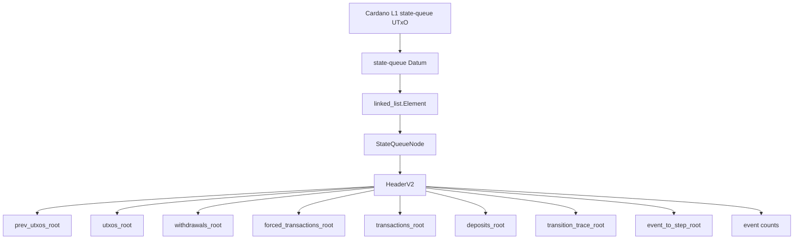
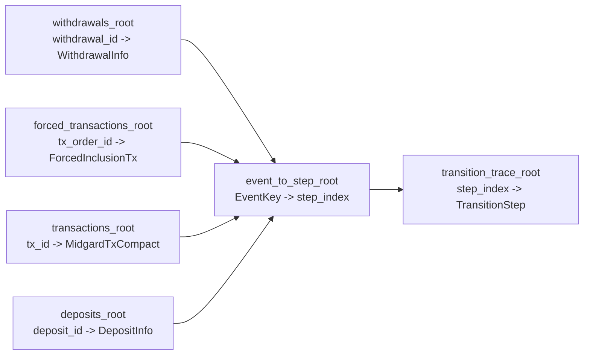
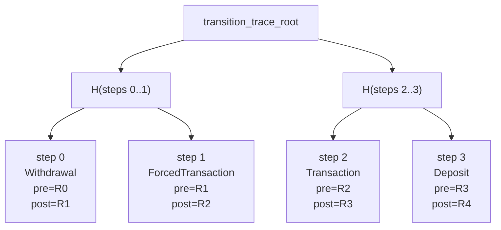
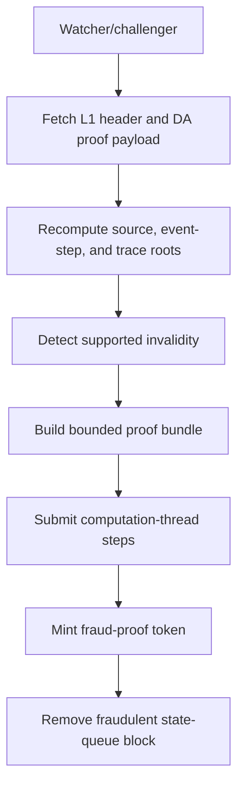

# Transition Trace Commitments Architecture

Generated: 2026-06-19

Status: draft architecture for production-grade state-transition fault proofs.

Scope: this document specifies the proposed commitments needed to prove that a
queued Midgard state commitment's `utxos_root` is the deterministic result of
applying the committed withdrawals, forced-inclusion transactions, normal L2
transactions, and deposits to `prev_utxos_root`.

This is a protocol design document, not a description of currently deployed
schemas. The current state-queue block node commits the existing `Header` fields:
`prev_utxos_root`, `utxos_root`, `transactions_root`, `deposits_root`,
`withdrawals_root`, block time bounds, predecessor hash, operator key, and
protocol version.

## Executive Summary

Midgard should freeze the canonical event model around the roots that map most
directly to the protocol's source objects:

```text
utxos_root:
  outref -> output

withdrawals_root:
  withdrawal_id -> WithdrawalInfo CBOR

forced_transactions_root:
  tx_order_id -> ForcedInclusionTx CBOR

transactions_root:
  tx_id -> MidgardTxCompact CBOR

deposits_root:
  deposit_id -> DepositInfo CBOR

transition_trace_root:
  step_index -> TransitionStep CBOR

event_to_step_root:
  EventKey -> step_index
```

The production model is:

```text
source roots + event_to_step_root -> transition trace -> final utxos_root
```

`transactions_root` remains the authoritative transaction-payload root for
normal L2 transactions:

```text
tx_id -> MidgardTxCompact CBOR
```

Forced inclusion needs its own source root because the forced-inclusion event
identity is the L1 order UTxO, not the L2 transaction id. The forced root is
therefore keyed by `tx_order_id`:

```text
tx_order_id -> ForcedInclusionTx CBOR
```

Two different L1 orders may carry the same L2 transaction. They must remain
distinct source events so challengers can prove omission, duplication, settlement,
refund, or a later no-op against the exact order UTxO.

The only event ordering enforced by the state-transition protocol is phase order:

```text
withdrawals -> forced inclusion transactions -> normal L2 transactions -> deposits
```

No source root key needs to include `inclusion_time` merely to enforce ordering.
L1 event `inclusion_time` belongs in the event value or in the opened L1 evidence
used for due-window proofs.

`transition_trace_root` is a dense ordered vector keyed by `step_index`. Each
trace step commits to the event key it applies, the pre-state root, and the
post-state root. `event_to_step_root` is the exact-once
coverage index that binds every source event to exactly one trace step.

## Current State-Queue Placement

Today, a queued block is stored in the state queue as a linked-list node whose
node data is `StateQueueNode`:

```text
StateQueueNode {
  header: Header
  da_attestation: ByteArray
}
```

The state queue node lives in the state-queue datum:

```text
Datum = linked_list.Element<ConfirmedState, StateQueueNode>
```

The proposed roots live in the queued block's state commitment, meaning the
`Header` embedded in `StateQueueNode.header`. They are not only off-chain DA
metadata and they are not stored only in the node database.

Proposed compact header shape:

```text
HeaderV2 {
  prev_utxos_root: MidgardLedgerRoot
  utxos_root: MidgardLedgerRoot

  withdrawals_root: WithdrawalEventsRoot
  forced_transactions_root: ForcedTransactionsRoot
  transactions_root: MidgardTxsRoot
  deposits_root: DepositEventsRoot

  transition_trace_root: TransitionTraceRoot
  event_to_step_root: EventToStepRoot

  withdrawal_count: UInt64
  forced_transaction_count: UInt64
  l2_transaction_count: UInt64
  deposit_count: UInt64
  total_event_count: UInt64
  transition_step_count: UInt64

  start_time: PosixTime
  end_time: PosixTime
  prev_header_hash: HeaderHash
  operator_vkey: VerificationKeyHash
  protocol_version: Int
}
```

The header hash must be computed over the full `HeaderV2`, including the new
roots and counts. A protocol deployment that adds these fields requires a clean
redeploy because all state-queue header hashes, node asset names, DA attestations,
proof inputs, settlement proofs, and downstream SDK codecs change.

Placement visualization:



## Data Availability Placement

The header carries compact roots. Public challengers still need the data those
roots authenticate.

The DA/proof-data transport is libp2p-only. Midgard nodes must not be required
to expose HTTP DA payload endpoints, and DA committee nodes must not scrape
Midgard operator HTTP services for protocol data. Payloads, transition traces,
proof witnesses, and attestations move through the deployment's DA libp2p
network.

The DA/proof-data network must publish, retain, replicate, and attest:

- full source entries for `withdrawals_root`, `forced_transactions_root`,
  `transactions_root`, and `deposits_root`;
- canonical `event_to_step_root` entries;
- canonical transition trace leaves;
- membership, non-membership, boundary, and count witnesses, or enough root
  members for public challengers to derive those witnesses;
- opened transaction field-list preimages needed by step verifiers;
- root schema versions, member counts, hash-domain tags, and verifier ABI
  versions.

This does not mean the Midgard producer must submit a single monolithic payload
containing every transition trace entry and proof witness. The data obtained
from, or produced by, Midgard nodes is source block/event data. DA committee
nodes may propagate an enriched DA payload among themselves after deriving
transition proof data.

```text
MidgardProducerPayload {
  header_hash
  source_entries {
    withdrawals
    forced_transactions
    transactions
    deposits
  }
  event_to_step_entries
  required_preimages
  previous_state_references
  no transition_proof_data
}

CommitteeDaPayload {
  header_hash
  producer_payload_hash
  producer_payload_bytes_or_chunk_manifest
  optional transition_proof_data {
    transition_trace_entries
    source_root_membership_witnesses
    event_to_step_membership_witnesses
    root_member_counts
    opened_field_preimages
    proof_bundle_index
  }
}
```

DA committee nodes can reconstruct `transition_proof_data` deterministically
from the producer payload, Cardano L1 state, previous Midgard state, and the
frozen trace schema. Committee-to-committee propagation may include the derived
`transition_proof_data` for replication efficiency, but a receiving committee
node must recompute or verify it before signing.

The payload/proof format is independent of the transport, but the production
transport is libp2p. HTTP endpoints are not part of the DA protocol, including
as fallback, debug, or gateway transport. The public rule is the important part:
the DA attestation for a state commitment must cover all proof-critical data
needed to challenge these roots, not only the final ledger root. If a committee
node cannot derive, persist, and serve the trace/proof artifacts, it must not
sign the DA attestation for that header.

The authoritative header remains on L1. Producer payloads and derived proof
artifacts are keyed by `header_hash` and must recompute to the roots in that L1
header.

Required libp2p protocol families:

```text
GossipSub:
  /midgard/{deployment_fingerprint}/da/payload-announcements/1
  /midgard/{deployment_fingerprint}/da/attestations/1
  /midgard/{deployment_fingerprint}/da/conflicts/1

Request-response:
  /midgard/{deployment_fingerprint}/da/payload-submit/1
  /midgard/{deployment_fingerprint}/da/payload-by-header/1
  /midgard/{deployment_fingerprint}/da/payload-chunk/1
  /midgard/{deployment_fingerprint}/da/metadata-by-header/1
  /midgard/{deployment_fingerprint}/da/proof-bundle-by-header/1
  /midgard/{deployment_fingerprint}/da/source-entry-by-key/1
  /midgard/{deployment_fingerprint}/da/event-step-by-key/1
  /midgard/{deployment_fingerprint}/da/trace-step-by-index/1
  /midgard/{deployment_fingerprint}/da/attestations-by-header/1
```

## Source Roots

The source roots are authenticated maps with:

- membership by source key;
- non-membership by source key;
- member count;
- canonical CBOR for keys, values, and proof witnesses.

They do not need to prove canonical ordering inside a phase. Phase order is
enforced by the trace step ranges and `event_to_step_root`.

### Withdrawal Root

```text
WithdrawalKey =
  withdrawal_id

WithdrawalRootValue =
  WithdrawalInfo CBOR

withdrawals_root =
  MerkleRoot<withdrawal_id -> WithdrawalInfo CBOR>
```

Withdrawals are obligatory L1 events. Every authenticated withdrawal whose
`inclusion_time` falls in the block event interval must appear in
`withdrawals_root`.

Invalid withdrawals appear as no-op trace steps with a challengeable validity
classification in `WithdrawalInfo`. Only `WithdrawalIsValid` deletes the targeted
L2 UTxO.

### Forced Transaction Root

```text
ForcedTransactionKey =
  tx_order_id

ForcedInclusionTx {
  tx_order_id: OutputReference
  inclusion_time: PosixTime
  tx_id: MidgardTxId
  tx_compact: MidgardTxCompact
  order_metadata_hash: H32
}

forced_transactions_root =
  MerkleRoot<tx_order_id -> ForcedInclusionTx CBOR>
```

`tx_order_id` is the L1 order identity. It must not be replaced by `tx_id`.

Forced transactions are obligatory L1 events. Every authenticated transaction
order whose `inclusion_time` falls in the block event interval must appear in
`forced_transactions_root`.

The forced transaction root is source data. It should not contain the operator's
claimed result. Whether the transaction applied effects or became a no-op is
derived by the one-step verifier from the forced transaction, the pre-state root,
and the proof witnesses.

Production forced-transaction step results should include no-op variants for at
least:

- transaction validity interval mismatch;
- missing input;
- invalid signature;
- failed script;
- fee too low;
- unbalanced transaction;
- duplicate or already-applied `tx_id` where the order cannot apply effects
  because an earlier event already consumed the necessary inputs.

### Normal L2 Transaction Root

```text
TransactionKey =
  tx_id

TransactionRootValue =
  MidgardTxCompact CBOR

transactions_root =
  MerkleRoot<tx_id -> MidgardTxCompact CBOR>
```

Normal L2 transaction requests are not obligatory L1 events. The operator chooses
which valid mempool transactions to include. Included normal L2 transactions
must appear in `transactions_root`.

Only accepted `TxIsValid` transaction requests may appear as effectful normal L2
transaction steps. Invalid L2 transaction requests are rejected before commitment
and are excluded from the canonical event list.

The trace verifier checks whether the chosen request order actually applies. If
the operator chooses an order that makes a transaction invalid, the block is
challengeable through the invalid one-step transition proof.

### Deposit Root

```text
DepositKey =
  deposit_id

DepositRootValue =
  DepositInfo CBOR

deposits_root =
  MerkleRoot<deposit_id -> DepositInfo CBOR>
```

Deposits are obligatory effectful L1 events. Every authenticated deposit whose
`inclusion_time` falls in the block event interval must appear in `deposits_root`.

Invalid or unauthenticated deposit UTxOs are not valid events. A valid deposit
step inserts the corresponding L2 UTxO. There is no invalid-deposit no-op event
in the state commitment.

## Event Keys And Exact-Once Coverage

`event_to_step_root` is an authenticated map:

```text
event_to_step_root =
  MerkleRoot<EventKey -> step_index>
```

`EventKey` is source-specific:

```text
withdrawal:<withdrawal_id>
forced_tx:<tx_order_id>
tx:<tx_id>
deposit:<deposit_id>
```

`event_to_step_root` has one entry for every committed source event. It is the
exact-once coverage commitment:

- every source-root member must have exactly one `EventKey -> step_index` entry;
- every transition trace step must refer to an event key whose mapped step index
  is that step's own `step_index`;
- the mapped step must be inside the phase range for that event key's source
  kind.

This separates identity from ordering. Source roots prove what events and
transactions the block committed. `event_to_step_root` proves where each event is
used in the trace. `transition_trace_root` proves the step-by-step state roots.

## Phase Ranges

The production ledger phase order is:

```text
withdrawals -> forced inclusion transactions -> normal L2 transactions -> deposits
```

Phase ranges are derived from header counts:

```text
withdrawals:
  [0, withdrawal_count)

forced_transactions:
  [withdrawal_count,
   withdrawal_count + forced_transaction_count)

transactions:
  [withdrawal_count + forced_transaction_count,
   withdrawal_count + forced_transaction_count + l2_transaction_count)

deposits:
  [withdrawal_count + forced_transaction_count + l2_transaction_count,
   total_event_count)
```

The following must hold:

```text
total_event_count =
  withdrawal_count
  + forced_transaction_count
  + l2_transaction_count
  + deposit_count

transition_step_count == total_event_count
event_to_step_root.count == total_event_count
```

The protocol does not need to enforce a canonical ordering within a phase unless
the spec later chooses to add that requirement. In the current model, the
contract-level ordering requirement is only that every event appears in the
correct phase range.

Same-block deposit spending is disallowed under this phase order. A transaction
cannot spend a deposit created later in the same block because deposits are
applied after withdrawals and transactions. If Midgard wants same-block deposit
spending, the protocol spec must explicitly change the phase order before code
implements it; runtime behavior must not preserve that implicitly.

Ordering visualization:



## Transition Trace Root

`transition_trace_root` is an authenticated dense vector over ordered trace
leaves:

```text
transition_trace_root =
  VectorRoot<step_index -> TransitionStep CBOR>
```

`step_index` is dense:

```text
0, 1, 2, ..., transition_step_count - 1
```

Conceptual schema:

```text
TransitionStep {
  schema_version: UInt
  step_index: UInt64
  event_key: EventKey
  phase: TransitionPhase
  pre_utxos_root: MidgardLedgerRoot
  post_utxos_root: MidgardLedgerRoot
}
```

`TransitionPhase`:

```text
Withdrawal
ForcedTransaction
Transaction
Deposit
```

The trace step's `phase` must match both:

- the event key kind; and
- the phase range containing `step_index`.

Trace tree visualization:



The vector root must support:

- membership by `step_index`;
- explicit bounds for invalid step indexes;
- stable `transition_step_count`;
- efficient first-leaf and last-leaf proofs;
- efficient adjacent-leaf proofs for `i` and `i + 1`.

## Why This Is Enough

The source roots prove the block's committed event and transaction sets:

```text
sourceEvents(header) =
  members(withdrawals_root)
  ++ members(forced_transactions_root)
  ++ members(transactions_root)
  ++ members(deposits_root)
```

`event_to_step_root` proves exact-once placement:

```text
for every event_key in sourceEvents(header):
  event_to_step_root[event_key] = step_index
  step_index is in the correct phase range
```

The trace root proves:

```text
evalTrace(prev_utxos_root, placedEvents(header)) = utxos_root
```

Together:

- a due L1 event cannot be omitted from its source root without a non-membership
  challenge;
- a source-root member cannot be omitted from the trace without an
  `event_to_step_root` challenge;
- a trace step cannot use the wrong event without an event/step mismatch
  challenge;
- an invalid local state transition can be challenged at one step.

## Required Invariants

### Header Count Invariants

- Each count equals the member count of its corresponding source root.
- `total_event_count` equals the sum of per-kind counts.
- `transition_step_count == total_event_count`.
- `event_to_step_root.count == total_event_count`.
- If `total_event_count == 0`, then `prev_utxos_root == utxos_root` and all
  source/event/trace roots are empty.

### Trace Boundary Invariants

- If `transition_step_count > 0`, the first trace leaf's `pre_utxos_root` equals
  `HeaderV2.prev_utxos_root`.
- If `transition_step_count > 0`, the last trace leaf's `post_utxos_root` equals
  `HeaderV2.utxos_root`.

### Trace Link Invariants

For every adjacent pair:

```text
trace[i].post_utxos_root == trace[i + 1].pre_utxos_root
```

### Event Binding Invariants

For every trace step:

```text
phase == phase_for_step_index(header_counts, step_index)
event_key.kind == phase
event_to_step_root[event_key] == step_index
matching source root contains event_key.source_id
```

For every L1 event root:

```text
all due authenticated L1 events in the block event interval are present
no event outside the block event interval is present
```

For `transactions_root`:

```text
every normal L2 transaction event key is tx:<tx_id>
every included normal L2 transaction has an accepted TxIsValid payload
```

### Step Validity Invariants

For every step:

```text
applyOneStep(
  phase,
  source_event,
  pre_utxos_root,
  step_witnesses
) == post_utxos_root
```

The one-step verifier must reject unauthorized deletions, missing required
deletions, fabricated outputs, invalid validity classifications, invalid
withdrawals, invalid forced transactions, invalid normal L2 transactions, and
deposit projection errors according to the phase's ledger rule.

## Fault-Proof Families

### 1. Trace Boundary Fault

Purpose: prove the trace does not start from the committed previous root or does
not end at the committed current root.

Evidence:

- state-queue reference input containing `HeaderV2`;
- trace leaf membership proof for step `0` or step `transition_step_count - 1`;
- opened trace leaf.

Checks:

```text
step0.pre_utxos_root != header.prev_utxos_root
last.post_utxos_root != header.utxos_root
```

### 2. Trace Link Fault

Purpose: prove two adjacent trace steps do not connect.

Evidence:

- state-queue reference input containing `HeaderV2`;
- trace leaf membership proof for step `i`;
- trace leaf membership proof for step `i + 1`;
- opened trace leaves.

Checks:

```text
trace[i].post_utxos_root != trace[i + 1].pre_utxos_root
```

### 3. Event-To-Step Mismatch Fault

Purpose: prove a trace step does not bind to the event mapped to that step.

Evidence:

- state-queue reference input containing `HeaderV2`;
- trace leaf membership proof for step `i`;
- `event_to_step_root` membership proof for `trace.event_key`;
- opened trace leaf and opened event-to-step leaf.

Checks:

```text
event_to_step_root[trace.event_key] != trace.step_index
  OR trace.step_index != i
  OR trace.phase != phase_for_step_index(header_counts, i)
  OR trace.event_key.kind != trace.phase
```

### 4. Source Membership Mismatch Fault

Purpose: prove a mapped event key does not exist in the matching source root.

Evidence:

- state-queue reference input containing `HeaderV2`;
- trace leaf membership proof for step `i`;
- `event_to_step_root` membership proof for `trace.event_key`;
- source-root non-membership proof for the event key's source id.

Checks:

```text
event_to_step_root[trace.event_key] == i
matching source root does not contain trace.event_key.source_id
```

### 5. Invalid One-Step Transition Fault

Purpose: prove a single claimed transition is not the correct application of its
source event to its pre-state root.

Evidence:

- state-queue reference input containing `HeaderV2`;
- trace leaf membership proof for step `i`;
- `event_to_step_root` membership proof for the trace step's event key;
- source-root membership proof for the event;
- event preimages and step-local witnesses;
- UTxO membership, non-membership, deletion, and insertion witnesses needed by
  the phase verifier.

Checks:

```text
source member binds to trace event key
applyOneStep(source_event, trace_leaf.pre_utxos_root, witnesses)
  != trace_leaf.post_utxos_root
```

Example omitted-UTxO challenge:

```text
old step pre-root contains B
step post-root omits B
the step's source event does not consume B
therefore this step illegally deleted B
```

The challenger finds the first step where `B` disappears off-chain, then submits
only that step and its witnesses on-chain.

### 6. Omitted Due L1 Event Fault

Purpose: prove an authenticated L1 user event was due in the block interval but
was omitted from its source root.

Evidence:

- state-queue reference input containing `HeaderV2`;
- L1 evidence for the deposit, withdrawal, or forced transaction order UTxO and
  datum;
- proof that the event's `inclusion_time` is in the block event interval;
- source-root non-membership proof for the event id.

Checks:

```text
event is authenticated on L1
header.start_time < event.inclusion_time <= header.end_time
event id is absent from the matching source root
```

### 7. Source Event Not Traced Fault

Purpose: prove a committed source-root member has no corresponding trace step.

Evidence:

- state-queue reference input containing `HeaderV2`;
- source-root membership proof for the event;
- `event_to_step_root` non-membership proof for the event key.

Checks:

```text
source root contains event id
event_to_step_root does not contain EventKey(event id)
```

### 8. Duplicate Trace Event Fault

Purpose: prove two trace steps use the same event key.

Evidence:

- trace leaf membership proof for step `i`;
- trace leaf membership proof for step `j`;
- opened trace leaves.

Checks:

```text
i != j
trace[i].event_key == trace[j].event_key
```

### 9. Out-Of-Window Event Fault

Purpose: prove a source root contains an L1 event outside the committed block
event interval.

Evidence:

- state-queue reference input containing `HeaderV2`;
- source-root membership proof for the event;
- opened source member or L1 event evidence.

Checks:

```text
event.inclusion_time <= header.start_time
  OR header.end_time < event.inclusion_time
```

### 10. Count Fault

Purpose: prove header counts do not match committed root counts or trace length.

Evidence:

- root metadata proof or count opening for one source root, `event_to_step_root`,
  or `transition_trace_root`;
- state-queue reference input containing `HeaderV2`.

Checks:

```text
source_root.count != matching header count
  OR event_to_step_root.count != total_event_count
  OR transition_trace_root.count != transition_step_count
  OR total_event_count != sum(per_kind_counts)
```

Fault-proof flow visualization:



## One-Step Verifier Shape

Each phase gets a small verifier whose input is one trace leaf plus the opened
source event and required witnesses.

```text
verifyWithdrawalStep(
  pre_root,
  withdrawal_info,
  witnesses
) -> expected_post_root

verifyForcedTransactionStep(
  pre_root,
  forced_inclusion_tx,
  opened_tx_preimages,
  witnesses
) -> expected_post_root

verifyTransactionStep(
  pre_root,
  tx_compact,
  opened_tx_preimages,
  witnesses
) -> expected_post_root

verifyDepositStep(
  pre_root,
  deposit_info,
  witnesses
) -> expected_post_root
```

The fault proof succeeds when:

```text
expected_post_root != trace_leaf.post_utxos_root
```

The verifier does not need to execute the whole block. It only checks one step
and relies on event-to-step binding, trace boundary/link checks, count checks,
and source membership to compose the whole block transition.

## Examples

### Fraudulent Omission From Final UTxO Root

State:

```text
prev_utxos_root represents {A, B}
transactions_root contains tx T0, where T0 spends A -> C
event_to_step_root maps tx:T0 -> step 0
utxos_root represents {C}
```

`B` was never spent and should carry forward, so the committed `utxos_root` is
fraudulent.

Challenge:

```text
1. Prove step 0 is in transition_trace_root.
2. Prove tx:T0 maps to step 0 in event_to_step_root.
3. Prove T0 is in transactions_root.
4. Prove B is in step 0 pre-root.
5. Prove B is not in step 0 post-root.
6. Open T0's spend-input list and prove B is not consumed by T0.
7. The transaction step verifier concludes that B was illegally deleted.
```

### Skipped Forced Transaction

State commitment:

```text
forced_transactions_root contains tx_order_id O0
event_to_step_root has no forced_tx:O0 entry
```

Challenge:

```text
1. Prove O0 is in forced_transactions_root.
2. Prove forced_tx:O0 is absent from event_to_step_root.
3. The block is fraudulent because the committed source event is not traced.
```

### Omitted Due Deposit

Observed L1:

```text
deposit D0 is authenticated
header.start_time < D0.inclusion_time <= header.end_time
```

Challenge:

```text
1. Prove D0 is authenticated on L1.
2. Prove D0 is due for the committed block interval.
3. Prove D0 is absent from deposits_root.
4. The block is fraudulent because a due deposit was omitted.
```

### Duplicate Forced Transaction Trace Use

Trace:

```text
transition_trace_root[1].event_key = forced_tx:O0
transition_trace_root[2].event_key = forced_tx:O0
```

Challenge:

```text
1. Prove both trace leaves are members of transition_trace_root.
2. Open both leaves.
3. Show the step indexes differ but the event key is the same.
4. The block is fraudulent because an event can be applied at most once.
```

### Same-Block Deposit Spend

Committed events:

```text
transactions_root contains T0 spending deposit output D0#0
deposits_root contains D0
event_to_step_root maps tx:T0 into the transaction phase
event_to_step_root maps deposit:D0 into the later deposit phase
```

Because deposits are applied after transactions, T0 cannot see D0#0 in its
pre-state.

Challenge:

```text
1. Prove T0 is in the transaction phase.
2. Prove D0 is in the later deposit phase.
3. Prove D0#0 is absent from T0's pre-root.
4. The transaction step verifier rejects the spend.
```

## Root Construction Rules

The root primitive must be the same authenticated-map/vector primitive that
Aiken can verify in production fault-proof validators. Do not use one root
family for off-chain speed and a different root family for on-chain proof
verification.

Every root must specify:

- hash algorithm and domain tag;
- key schema;
- value schema;
- canonical CBOR encoding;
- empty-root value;
- member-count handling;
- membership proof encoding;
- non-membership proof encoding;
- deletion/insertion update proof encoding, if used by one-step verifiers.

Recommended domain tags:

```text
MidgardWithdrawalsV1
MidgardForcedTransactionsV1
MidgardTransactionsV1
MidgardDepositsV1
MidgardEventToStepV1
MidgardTransitionTraceV1
MidgardTransitionStepV1
```

## Implementation Milestones

### M1: Freeze Protocol Schemas

- Define `HeaderV2` in Aiken, TypeScript SDK, and CDDL.
- Define `forced_transactions_root`.
- Define `event_to_step_root`.
- Define `TransitionStep` event binding fields and root proof witness encodings.
- Define forced-transaction no-op result variants.
- Keep `transactions_root` as `tx_id -> MidgardTxCompact CBOR`.

### M2: Build Source Roots And Trace Off-Chain

- Add deterministic builders for `forced_transactions_root`,
  `event_to_step_root`, and `transition_trace_root`.
- Use the production phase order: withdrawals, forced transactions, normal L2
  transactions, deposits.
- Reject same-block deposit spending under this event order.
- Persist source entries, event-to-step entries, and trace entries before block
  submission.
- Recompute all roots after restart from durable data and fail closed on
  mismatch.

### M3: Publish Proof-Critical DA Over Libp2p

- Define the committee DA payload/proof-bundle format keyed by `header_hash`.
- Keep Midgard producer payloads limited to source block/event data and required
  preimages; do not require Midgard nodes to provide `transition_proof_data`.
- Publish and replicate committee-derived trace entries, event-to-step entries,
  source-root entries, root counts, and proof witnesses over libp2p only.
- Remove Midgard-node HTTP DA payload transport from production profiles.
- Ensure DA committee validation recomputes these roots before attestation.
- Retain proof data through the whole challenge window.

### M4: Implement Aiken Fault Families

- Trace boundary proof.
- Trace link proof.
- Event-to-step mismatch proof.
- Source membership mismatch proof.
- Invalid one-step proof for each phase.
- Omitted due L1 event proof.
- Source event not traced proof.
- Duplicate trace event proof.
- Out-of-window event proof.
- Count proof.

### M5: Implement Challenger Tooling

- Fetch L1 state-queue header by `header_hash`.
- Fetch DA/proof payload from DA committee peers over libp2p.
- Recompute source roots, event-to-step root, and trace root.
- Detect supported invalidity.
- Build proof transactions from public data only.
- Resume submitted computation-thread steps safely after restart.

### M6: Conformance And Budget Gates

- Add TypeScript/Aiken/CDDL golden fixtures for all new schemas and roots.
- Add phase-boundary tests proving events map only into their allowed ranges.
- Add validity tests proving invalid withdrawals and invalid forced transactions
  are no-op trace steps, while invalid normal L2 transaction requests are
  excluded.
- Add same-block dependency tests for normal L2 transactions using committed
  step order.
- Add a regression test proving same-block deposit spending is rejected unless
  the protocol phase order is deliberately changed.
- Add valid-block negative tests proving supported proof paths cannot challenge
  correct traces.
- Add adversarial fixtures for every fault family.
- Add Aiken budget gates for worst-case proof witnesses.
- Run preprod end-to-end challenge from invalid state commitment to fraudulent
  block removal before claiming public readiness.

## Open Decisions

### Forced Transaction Value Shape

`ForcedInclusionTx CBOR` must be finalized against the tx-order datum and
settlement/refund rules. It should include enough source data to authenticate the
L1 order and recover the L2 transaction payload, but it should not include the
operator's claimed execution result.

### Event-To-Step Root Primitive

The root must support membership, non-membership, and count proofs for
`EventKey -> step_index`. It does not need ordered-rank proofs if the protocol
only enforces phase ordering.

### Step Granularity

This document treats one committed event as one transition step. If a full
transaction step is too large for one Aiken verifier, the protocol can make
transaction evaluation itself a nested trace. In that case the top-level
`TransitionStep` would commit to a transaction subtrace root, and the same event
binding rules apply recursively.

### Nested Or Split-Step Proofs

The base `TransitionStep` intentionally does not commit read-set, consumed-set,
produced-set, or claimed-result hashes. For a normal one-step challenge, the
event plus `pre_utxos_root` determines the expected post-state, and the proof
witnesses open enough inputs, outputs, insertions, and deletions to show that the
committed `post_utxos_root` is wrong.

If a full transaction step is too large for one Aiken verifier, a later design
can introduce a nested transaction subtrace or auxiliary witness commitment. That
should be a phase-specific proof optimization, not part of the first-class
top-level trace leaf.

## Non-Goals

- This design does not make all transaction features publicly challengeable by
  itself. Each admitted feature still needs a concrete one-step verifier or must
  remain disabled.
- This design does not replace DA. The source roots, event-to-step root, and
  trace root are useless to external challengers unless the source events, trace,
  and opened proof preimages are public through the challenge window.
- This design does not support compatibility with older state-queue headers. A
  header/root schema change is a clean-redeploy protocol change.
