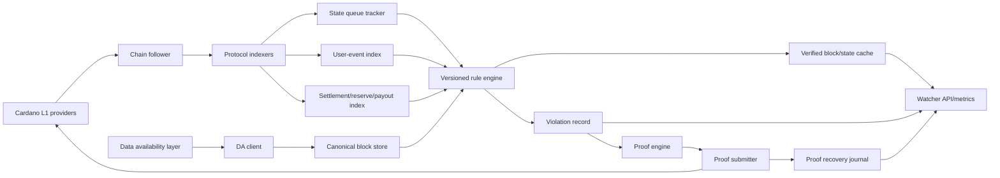

# Midgard Watcher Node Architecture

Status: Implemented fail-closed foundation; production verification,
submission, and acceptance gates remain incomplete.

Last reviewed: 2026-07-29

The independent watcher foundation is implemented in this package. The
DA-committee service remains in `demo/da-committee-node`. Proof coverage and
binding gaps are tracked in `../../docs/fault-proofs/`; this design must not be
used as evidence that independent challenges are production-ready.

## Cardano L1 Source Modes

The watcher has one explicit, mutually exclusive L1-source discriminator:
`local_node` or `external_providers`; only `external_providers` is currently
accepted by the wire configuration parser.

- `local_node` remains a pure state-machine vocabulary for a deferred native
  adapter. The retired pathname authority route cannot be instantiated; any
  future local adapter must authenticate the peer on the connected socket.
- In `external_providers`, the watcher has no local chain authority and
  requires at least two operationally independent configured providers.
  Same-network and compatible-chain-point agreement is mandatory; disagreement
  quarantines protocol decisions.

Under the prelaunch no-compatibility rule, the retired local pathname
constructor/type/export has no alias. The unwired `start` and `replay`
scaffolds still exit `78` without opening a configured transport.

W14 must consume canonical node-derived transaction, output, datum, and
rollback observations. Cardano consensus and the deployed validators
establish L1 transaction validity; the watcher indexes accepted state and
does not reimplement the state-queue validator. The current foundation proves
live configured transport capabilities and deterministic normalization, but
does not yet contain the watcher-owned Cardano/provider wire adapter that
proves each supplied observation was read from that transport. Operational
`start` and `replay` remain disabled until that provenance boundary and the
other production gates are complete.

This note summarizes what a Midgard watcher is, why it exists, and how a production watcher node should work.
It is based on a review of the Midgard protocol specification, Aiken
validators, demo node runtime, validation package, SDK, and current fault-proof
tooling in this repository.

Midgard uses the terms `fraud proof` and `fault proof` for the same broad role: an on-chain proof that a committed rollup block, settlement claim, or proof-relevant statement violates the Midgard rules.
This document uses `fault proof` when talking about the watcher product and `fraud proof` when referring to the existing contract names.

## What Midgard Is

Midgard is an optimistic rollup on Cardano.
Operators build L2 blocks off-chain, submit block data to the configured data-availability network, and commit fixed-size block headers to Cardano L1 through Midgard's state-queue contracts.
Each committed block waits for a protocol `maturity_duration` before it can be merged into the confirmed L2 state.
During that waiting period, anyone can verify the block.
If the block is invalid, a challenger submits a fault proof on L1, prevents the block from merging, removes the fraudulent header from the queue, and slashes the operator bond.

The key L1 protocol objects are:

- `hub_oracle`: deployment registry for protocol script hashes and addresses.
- `operator_directory`: registered, active, and retired operators plus their bonds.
- `scheduler`: assigns operator shifts.
- `state_queue`: FIFO queue of committed block headers and the current confirmed state.
- `settlement`: post-merge records for deposits, withdrawals, and forced transaction orders until they are processed.
- `reserve` and `payout`: custody and payout lifecycle for deposits and valid withdrawals.
- `fraud_proof_catalogue`: fixed mapping from proof-category IDs to the first validator in each proof procedure.
- `computation_thread` and `fraud_proof`: the multi-step proof state machine and permanent proof token.
- User-event scripts: deposit, withdrawal order, transaction order, and witness staking scripts.

The important design point is that Cardano L1 does not re-execute every Midgard block during normal operation.
L1 only enforces the commit, queue, merge, settlement, and proof protocols.
Independent off-chain watchers provide the continuous verification that makes the optimistic design safe.

## What A Watcher Is

A Midgard watcher is an independent verifier and challenger.
It follows Cardano L1, follows Midgard's state queue, retrieves the full block data from DA, locally evaluates every committed block under the Midgard ledger rules, and submits the corresponding fault proof if the committed header is wrong.

A watcher is not an operator.
It does not need to produce blocks, run a public mempool, or serve user transaction submission.
It may expose APIs for observability or proof bundles, but its security role is to distrust operators and independently recompute the L2 state transition from public data.

A watcher is also not merely an indexer.
It must be able to act before the maturity window closes.
The minimum useful watcher does four things:

1. Reconstruct public Midgard state from L1 plus DA.
2. Re-execute committed blocks deterministically.
3. Select the precise proof family for any violation.
4. Submit and monitor proof transactions until the bad block or bad claim is neutralized.

## Security Role

The watcher enforces the optimistic-rollup assumption that invalid blocks are detected before they merge.
Specifically, it protects these properties:

- Invalid L2 state transitions do not become confirmed.
- Deposits, withdrawal orders, and forced L2 transaction orders cannot be censored while block production continues.
- Operators cannot fabricate deposits, withdrawals, or transaction orders that do not exist on L1.
- Operators cannot include user events outside their assigned event interval.
- Operators cannot include invalid L2 transactions as valid, or mark valid forced transactions and withdrawals invalid without a provable reason.
- Operators cannot double-spend, spend missing inputs, use withdrawn reference inputs, violate validity ranges, underpay fees, omit required signatures/scripts, or otherwise violate the L2 transaction rules.
- Settlement resolution claims can be disproved if a confirmed deposit, withdrawal, or forced transaction order remains unprocessed.
- Data-availability failures are detected and, once the corresponding proof path is deployed, challenged.

Economically, a watcher is the actor that makes operator bonds meaningful.
The operator bond deters fraud only if a watcher can reliably convert an invalid block into a successful proof and claim the `fraud_prover_reward`.

## Watcher Inputs

A production watcher needs these inputs:

- Exactly one Cardano L1 source mode: the current wire path accepts at least
  two operationally independent `external_providers`, with explicit finality
  and rollback policy. `local_node` remains deferred until a peer-authenticated
  native adapter exists.
- The Midgard deployment manifest or enough data to derive and verify it: network id, hub oracle, script hashes, reference-script UTxOs, protocol parameters, fraud-proof catalogue root, compiler/artifact hashes, and genesis/one-shot identity.
- The hub oracle UTxO and all protocol addresses/policy IDs it authenticates.
- State queue, scheduler, operator-directory, settlement, deposit, withdrawal, transaction-order, reserve, payout, fraud-proof catalogue, computation-thread, and fraud-proof UTxOs.
- DA material for every committed block under challenge window: full block body, full Midgard-native transaction envelopes/preimages, transaction field preimages, event members, and any transition/proof witnesses required by the deployed proof families.
- A local rule bundle keyed by Midgard protocol version and deployment fingerprint.
- A funded prover wallet for proof-init, proof-step, proof-token mint, and fraudulent-header removal transactions.

The watcher should not depend on an operator's local Postgres tables, MPF stores, or admin endpoints for security-critical data.
Those are useful diagnostics, not trusted inputs.

## Local State

The watcher should maintain durable local state for:

- Deployment fingerprint and verified protocol parameters.
- L1 chain cursor, observed chain points, rollback depth, and provider source.
- The W03/W13 rollback bundle, authenticated with a stable external 32-byte
  HMAC key that is separate from the prover wallet, plus its atomic
  compare-and-swap revision and an independently protected monotonic trusted
  head. Missing or invalid authentication, an absent head after
  initialization, or a head/snapshot mismatch must fail closed before
  recovery state is trusted. A row in the same rollbackable database cannot
  establish freshness.
- Authenticated views of the hub oracle, state queue, scheduler, operator directory, settlement UTxOs, and user-event UTxOs.
- Full DA block material by header hash and DA commitment.
- Canonical roots and proof material: UTxO root, transactions root, deposits root, withdrawals root, PHAS/MPF membership proofs, non-membership proofs, and field-list preimages.
- Reconstructed confirmed L2 state and queued block states.
- User-event indexes by event id, inclusion time, L1 out-ref, witness credential, status, and settlement processing state.
- Fault records: detected violation, target block/claim, proof family, proof inputs, submitted tx hashes, on-chain computation-thread state, proof-token identity, and final removal/slashing status.

Every local table should be reproducible from L1 plus DA.
If it cannot be reproduced, it should be treated as a cache, not authority.

## Block Verification Pipeline

### 1. Deployment And Chain Following

At startup, the watcher verifies that local durable state belongs to the current deployment fingerprint.
If the fingerprint is missing or mismatched, it must fail closed rather than mix local state with another on-chain deployment.

The L1 follower tracks all protocol UTxOs and relevant transactions.
It should record chain point, slot, block hash, provider source, observed depth, and finality status for each observation.
Before an observation is final enough to drive irreversible local state, it should pass the configured finality threshold.
Rollbacks before threshold should rewind pending local state.
A mode-valid, agreed canonical replacement after local finalization should
create a durable incident. W13 must then automatically verify persisted W10
bytes and W11 agreement for both branches to their exact common ancestor,
atomically rewind orphan-dependent state, and resume replay when the rollback
is within Cardano's fixed `k = 2160` bound. Transient source non-agreement,
same-point content mismatch, and same-point depth regression quarantine only
the current decision while
preserving the finalized binding; neither creates a terminal incident or a
manual state-repair requirement.

The durable W03/W13 bundle is one authenticated authority: the store,
rollback state, bootstrap, and checkpoint anchor are covered by an HMAC from
an external stable key and updated by compare-and-swap. A self-hashed or
caller-supplied checkpoint digest is not authority. The operational SQLite
backend must commit both the bundle and revision in one transaction. Each
successful revision must then publish its HMAC-bound trusted head through an
expected-prior CAS to an independently protected, monotonic, non-rollbackable
authority before its protocol result is actionable. If a crash separates the
database commit from head publication, reconciliation exposes no protocol
decision and permits only epoch zero or one authenticated direct successor;
external CAS and read-back are required before load. Startup rejects older,
skipped, divergent, or tampered snapshot/head pairs. These persistence and
publication steps are required before `start` or `replay` is enabled.

The RF-051 prelaunch durable-store, finality, multi-provider, rollback, and
user-event V1 JSON integrity commitments use one strict canonical serialization:
object keys are sorted recursively, arrays retain their exact order, and only
safe JSON-shaped values are accepted. Non-plain objects, accessors, symbols,
unsupported values, and cycles fail closed. Digest, equality, HMAC, and
authority-byte paths use this canonical UTF-8 form in place, with no raw-order
fallback or compatibility alias.

### 2. State Queue Tracking

For each state-queue update, the watcher parses the linked-list node datum and distinguishes:

- The confirmed-state root node.
- Queued block-header nodes.
- Append operations.
- Merge operations.
- Fraudulent-header removal operations.

For every block header it verifies:

- Header hash is the hash of the header.
- `prev_header_hash` points to the prior block in the Midgard chain.
- `prev_utxos_root` equals the previous block's post-state root.
- `start_time` equals the previous block's `end_time`.
- Event intervals are adjacent and non-overlapping.
- `end_time` matches the commit transaction validity upper bound.
- The committing operator is the scheduled active operator for that shift.
- The operator's bond hold is extended through the maturity period.
- Any DA attestation required by the deployed protocol is present and authentic.

Cardano consensus and the deployed L1 scripts establish whether these
transactions are valid. W14 deterministically decodes and indexes the accepted
transaction/output/datum bytes and maintains the coherent rollback-safe state
model; it does not reimplement the state-queue validator as a second validity
authority. Independent reconstruction and verification of the committed L2
claims belongs to W22–W29, with fault proofs adjudicating dishonest operators.

### 3. Data Availability Fetch And Root Checking

For each queued header, the watcher fetches the corresponding DA block.
The block body must contain enough data to reconstruct:

- `transactions_root`
- `deposits_root`
- `withdrawals_root`
- `utxos_root`
- all transaction compact values
- all full transaction preimages needed for validation and proofs

The watcher recomputes every root in the header from the DA payload.
If block data is unavailable, malformed, or root-inconsistent, that is a DA or commitment fault.
The current repository notes that production-grade public DA/proof bundles are not complete yet; the watcher architecture should treat DA proof support as a first-class proof family, not as an optional convenience.

### 4. L1 User-Event Indexing

The watcher indexes deposits, withdrawal orders, and transaction orders directly from L1 user-event UTxOs.
For each event it authenticates:

- The event NFT policy and asset name.
- The event datum shape.
- The `l1_nonce` or event id derivation.
- The witness staking script hash.
- The witness registration state.
- The inclusion time calculation: L1 transaction validity upper bound plus `event_wait_duration`.
- The event address from the hub oracle.

For a block with event window `(previous_end_time, block_end_time]`, the watcher checks:

- Every due deposit is included in the deposit root.
- Every due withdrawal order is included in the withdrawal root.
- Every due transaction order, also called a forced transaction, is included in the transaction root.
- No event with an inclusion time outside the window is included.
- If a bad block and descendants are removed, replacement blocks cover the removed event intervals and re-include the events that became due in those intervals.

This is the core censorship-resistance rule.
Operators may ignore ordinary off-chain L2 transaction requests, but they cannot ignore L1 transaction orders in a valid block.

### 5. L2 Transaction Validation

The watcher should reuse the same conceptual split as the current `midgard-validation` package.

Phase A is stateless per-transaction validation:

- Strict Midgard-native transaction v1 CBOR only.
- Compact/full hash commitments match their preimages.
- Transaction id matches the canonical body hash.
- `TxIsValid` is required for accepted transactions.
- Auxiliary data is forbidden except the empty/null hash.
- Network id is either none or the expected Midgard network.
- Minimum fee formula is satisfied.
- Spend inputs decode, are non-empty, and contain no duplicates.
- Reference inputs decode, contain no duplicates, and do not overlap spend inputs.
- Outputs decode as valid Midgard outputs with no datum hashes and no invalid address/value shape.
- Validity interval is well formed.
- Required signers and observers decode correctly.
- Required signers are present in vkey witnesses.
- Vkey signatures verify over the Midgard-native body hash.
- Script witnesses decode and native scripts verify against signers/time.
- Mint preimage decodes and has valid policy/value structure.
- Redeemers decode and duplicate or unsupported encodings are rejected.
- Script-integrity and language marker rules are satisfied.

Phase B is stateful validation against the reconstructed UTxO state:

- Build dependency graph among same-block transactions.
- Reject dependency cycles.
- Resolve accepted parent transactions before children.
- Reject children of rejected parents.
- Check validity interval against the block/time semantics for the deployed protocol.
- Ensure reference inputs exist and are not spent in the same transaction.
- Ensure spend inputs exist and have not already been spent.
- Detect double-spends.
- Decode spent and referenced outputs.
- Resolve inline and reference scripts.
- Enforce payment credentials, required observers, mint policies, and receive scripts.
- Reject extraneous redeemers and unused script witnesses.
- Build PlutusV3 or MidgardV1 script contexts exactly as specified.
- Evaluate non-native scripts deterministically and enforce ex-unit budgets if enabled.
- Enforce value preservation: inputs minus fee plus minted minus burned equals outputs.
- Apply accepted transaction deletes and inserts to the candidate UTxO state.

The watcher should keep enough intermediate evidence to build the smallest proof for the first detected violation.
For example, a double-spend proof needs the two included transaction members, their spend-input preimages, the double-spent input index, and membership proofs against the block `transactions_root`.

### 6. Deposits, Withdrawals, And Forced Transactions

Deposits create L2 UTxOs from authenticated L1 deposit UTxOs.
The L2 out-ref is derived from the deposit id, and the output uses the user-specified L2 address and datum.
A confirmed deposit later authorizes spending the L1 deposit UTxO into the reserve.

Withdrawal orders are optimistic L1 requests.
The operator includes each due withdrawal with a validity classification.
The watcher independently classifies the target L2 UTxO:

- Missing L2 UTxO: `NonExistentWithdrawalUtxo`.
- Already spent: `SpentWithdrawalUtxo`.
- Owner mismatch: `IncorrectWithdrawalOwner`.
- Value mismatch: `IncorrectWithdrawalValue`.
- Signature mismatch: `IncorrectWithdrawalSignature`.
- Too many tokens: `TooManyTokensInWithdrawal`.
- Exact L1 output cannot be paid under Cardano output constraints: `UnpayableWithdrawalValue`.
- Otherwise: `WithdrawalIsValid`.

Only valid withdrawals should delete the target L2 UTxO and authorize payout initialization.
Invalid withdrawals remain invalid settlement events and follow the refund path.

Forced transactions are transaction orders submitted on L1.
They are an anti-censorship path for L2 transactions.
A due transaction order must be included in the block's transaction root and applied with the priority specified by the deployed ledger rules.
If the transaction itself is invalid, the operator may classify it as invalid only when that classification is independently correct and proof-covered.

### 7. Block Application Order

The watcher must apply the block transition exactly as the deployed protocol version defines it.
This should be a versioned rule, not hard-coded folklore.

The written technical spec currently says a block applies withdrawals first, then transactions, with transaction orders prioritized over transaction requests, and finally deposits.
The current node withdrawal design and commit worker have evolved toward a different operational ordering around deposits, mempool transactions, and valid-withdrawal deletes.
Before a production watcher is released, Midgard needs one canonical deployed rule for block application order, reflected consistently in the spec, Aiken proof categories, TypeScript validation, root construction, and proof tooling.

Until that is frozen, the watcher should model block application as a protocol-versioned rule bundle loaded from the deployment manifest.

### 8. Settlement, Reserve, And Payout Watching

When a block merges, a settlement UTxO is spawned if the block contains deposits, withdrawals, or transaction orders.
The settlement datum stores the block's deposits root, withdrawals root, transactions root, and optional resolution claim.

The watcher tracks each settlement event until it is processed:

- Deposit processed: deposit UTxO absorbed into reserve and deposit NFT burned.
- Valid withdrawal processed: withdrawal order transformed into a payout accumulator and withdrawal NFT burned.
- Invalid withdrawal processed: withdrawal order refunded according to its refund fields.
- Transaction order processed: transaction-order UTxO spent through the confirmed settlement path and refunded.

If an operator attaches a resolution claim while an event remains unprocessed, the watcher should submit the settlement disproof path before the claim matures.
This slashes the claimant and removes the false resolution claim.

Reserve and payout validators enforce much of their own L1 behavior, but the watcher should still index the lifecycle so it can detect stuck withdrawals, invalid resolution claims, and operational failures.

## Fault-Proof Flow

The watcher should treat proof submission as a state machine with durable recovery.

1. Detect a concrete violation and choose a proof family.
2. Build a proof bundle from DA, local roots, PHAS/MPF witnesses, transaction preimages, L1 UTxO references, redeemer indexes, reference-script UTxOs, and prover identity.
3. Submit computation-thread `Init`, referencing the fraud-proof catalogue entry and the target state-queue node.
4. Submit each proof step transaction, advancing the computation-thread token through the category validators.
5. On the final step, mint the permanent fraud-proof token and burn the computation-thread token through `Success`.
6. Submit `RemoveFraudulentBlockHeader` against the state queue, referencing the fraud-proof token and slashing the operator through the active or retired operator path. The bond-consuming slash is also the transaction that pays the prover: it routes exactly `env.fraud_prover_reward` to the enterprise address of the `fraud_prover` recorded in the fraud-proof token's datum, with the residual bond going to the Cardano treasury as the transaction fee, and it must carry that prover's signature (2026-08-11 owner ruling 7, D3). No other transaction shape may pay the reward — a repeat removal against an already-slashed operator carries no payout at all (D4).
7. Track descendant removal if the bad block is not the tail.
8. Verify the state queue no longer contains the fraudulent block or its invalid descendants.

For settlement claims, the analogous path is `Disprove Resolution Claim` on the settlement contract plus operator slashing.

The current repository contains useful proof infrastructure:

- Computation-thread and fraud-proof token validators.
- A fraud-proof catalogue.
- A manual `midgard-fault-proofs` package for double-spend preparation/submission.
- Aiken proof families for double-spend, zero-input, no-input, no-reference-input, withdrawn-reference-input, invalid-range, min-fee, missing-signature, invalid-signature, and missing-native-script variants.

However, the public-readiness and fault-proof gap docs explicitly say the proof system is not production complete.
Known gaps include root/schema alignment, proof-bundle persistence, public DA surfaces, full proof-family coverage, state-transition proofs, and preprod end-to-end challenge acceptance.
A production watcher must therefore be built with a proof-family coverage matrix and fail closed on claims it cannot prove within the maturity window.

## High-Level Architecture

Recommended components:

- Configuration and deployment identity verifier.
- L1 chain follower with rollback handling.
- Protocol indexers for each Midgard contract family.
- DA client and block-material verifier.
- Canonical block store and proof-preimage store.
- Versioned Midgard ledger engine.
- Phase A/B transaction verifier.
- User-event inclusion verifier.
- Withdrawal classifier.
- Settlement-resolution verifier.
- Violation classifier and proof-family selector.
- Proof builders per proof family.
- L1 proof transaction submitter with fee/input management.
- Durable proof recovery journal.
- Operator-facing observability, metrics, alerts, and optional proof-bundle export API.

## Suggested Service Boundaries

The watcher should be split around trust and determinism boundaries:

- `chain`: reads Cardano, normalizes chain events, handles rollback.
- `contracts`: decodes and authenticates Midgard UTxOs and redeemers.
- `da`: fetches and verifies block material.
- `ledger`: deterministic Midgard L2 rule engine.
- `proof-data`: stores roots, preimages, and membership/non-membership proofs.
- `detectors`: maps failed checks to canonical violation types.
- `proofs`: builds family-specific redeemers and transactions.
- `submitter`: signs/submits L1 transactions and recovers after partial progress.
- `db`: durable state and reproducible caches.
- `api`: read-only status, alerts, and proof diagnostics.

The `ledger` and `proofs` packages should be testable without a live Cardano node.
Given a deployment manifest, a prior state root, a block body, and L1 event snapshots, they should produce either a verified transition or a deterministic violation with proof inputs.

## Watcher Block Decision

For each queued block, the watcher should produce one of these decisions:

- `verified`: all roots and rules match, and the block is safe to let mature.
- `pending_da`: block cannot yet be evaluated because DA is temporarily unavailable, with a deadline before maturity.
- `unprovable_gap`: a violation may exist, but the deployed proof set cannot prove it. This is a production launch blocker for security claims.
- `fault_detected`: a concrete proof-covered violation exists and proof submission is in progress.
- `fault_proven`: a fraud-proof token exists for the target block or settlement claim.
- `removed_or_resolved`: the bad block or bad claim has been removed and slashing path completed or observed.

Only `verified` should be considered healthy.
`pending_da` close to maturity is an emergency.
`unprovable_gap` means the system is relying on trust, not full optimistic-rollup security.

## Operational Requirements

A production watcher should:

- Run continuously and start before blocks are close to maturity.
- Select exactly one L1 source mode. The current selectable mode is
  `external_providers`, requiring at least two
  operationally independent providers to agree on network and compatible
  chain point. `local_node` is deferred until a native adapter authenticates
  the connected peer; pathname checks are not an authority.
- Persist every proof-critical input before submitting proof transactions.
- Alert on DA fetch failure, root mismatch, proof submission failure, maturity deadline risk, provider disagreement, chain rollback, deployment fingerprint mismatch, and proof-family coverage gaps.
- Keep enough ADA and collateral inputs available for proof steps.
- Avoid secrets in process args and logs.
- Treat local database deletion as a forensic or redeploy event, never as a normal recovery shortcut.
- Expose explicit metrics: queued blocks by age, verification latency, DA latency, proof deadlines, proof-step status, unprocessed settlement events, event inclusion lag, and provider freshness.
- Maintain a deterministic replay command that re-verifies a block from stored/public material and reproduces the same decision.

## Implementation Roadmap

1. Read-only watcher: deployment verification, L1 follower, state queue view, user-event indexes, DA fetch stubs, and alerting.
2. Deterministic verifier: block root recomputation, transaction Phase A/B validation, event inclusion checks, withdrawal classification, and local state replay.
3. Proof-bundle store: canonical schemas for DA payloads, preimages, PHAS/MPF witnesses, and replayable proof inputs.
4. First live proof family: complete double-spend end to end from invalid fixture to fraud-proof token to state-queue removal.
5. Coverage expansion: no-input, no-reference-input, invalid range, missing/invalid signature, missing scripts, fee, withdrawal validity, transaction-order inclusion/classification, deposit/withdrawal fabrication/omission, DA mismatch, and state-transition proofs.
6. Autonomous challenger: fee management, proof retries, rollback-safe journals, deadline escalation, and slashing/removal completion.
7. Public readiness: signed deployment manifest, public DA/proof-bundle exports, reproducible tests, clean preprod acceptance, and documented security claims tied to the actual proof matrix.

## Key Repo Anchors

- Protocol overview: `technical-spec/0-frontmatter/4-introduction.tex`
- Ledger state and block rules: `technical-spec/1-ledger-state`
- User events: `technical-spec/2-user-event-protocol`
- State queue, settlement, reserve/payout: `technical-spec/3-consensus-protocol`
- Fraud-proof protocol: `technical-spec/4-proof-protocol`
- DA model: `technical-spec/6-offchain-data-architecture`
- Phase-two validation concept: `technical-spec/7-phase-two-validation`
- Current L2 validation implementation: `demo/midgard-validation/src`
- Current node transaction evaluation notes: `demo/midgard-node/docs/L2_TX_EVALUATION_CURRENT.md`
- Current commit/root construction: `demo/midgard-node/src/workers/utils/mpf.ts`
- Aiken ledger/proof types: `onchain/aiken/lib/midgard`
- Fault-proof tooling: `demo/midgard-fault-proofs/src`
- Public readiness and proof gaps: `docs/public_testnet_readiness.md` and `demo/midgard-node/docs/PREPROD_DOUBLE_SPEND_FAULT_PROOF_GAP_REPORT.md`
