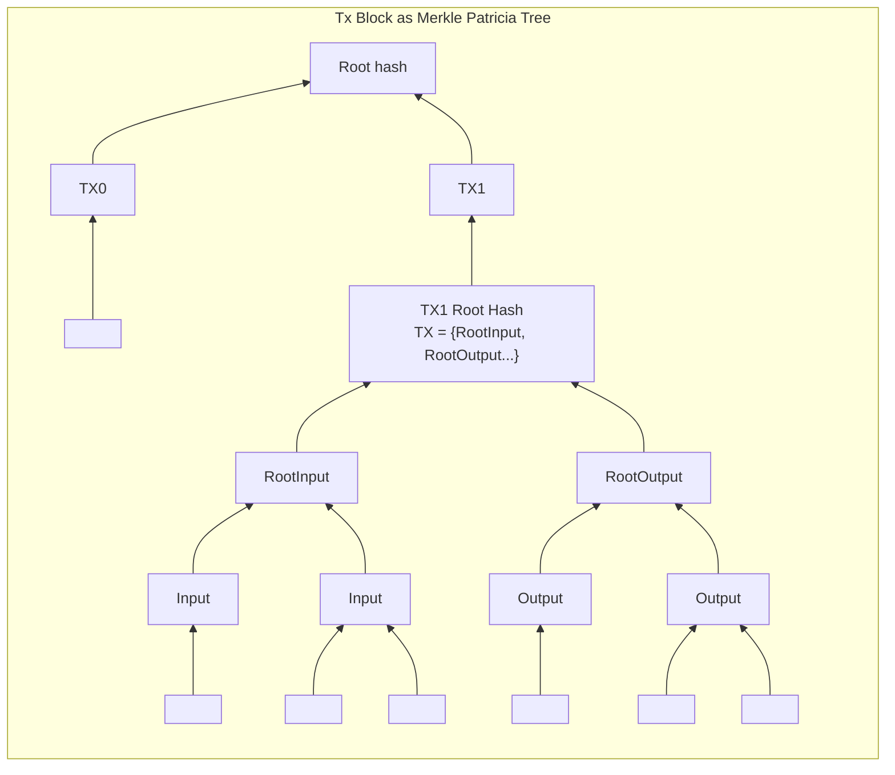

```mermaid

flowchart TB

subgraph MercleTreeScheme[Tx Block as Merkle Patricia Tree]
    direction BT
    MTSRootHash[Root hash]
    MTSTx0[TX0]
    MTSTx0RH[" "]
    MTSTx1[TX1]
    MTSTx1RH["TX1 Root Hash<br>TX = {RootInput, RootOutput...}"]
    MTSRootInput[RootInput]
    MTSRootOutput[RootOutput]
    MTSInput1[Input]
    MTSInput2[Input]
    MTSOutput1[Output]
    MTSOutput2[Output]
    MTSInput1Blank[" "]
    MTSInput2Blank1[" "]
    MTSInput2Blank2[" "]
    MTSOutput1Blank[" "]
    MTSOutput2Blank1[" "]
    MTSOutput2Blank2[" "]

    MTSTx0 & MTSTx1 --> MTSRootHash
    MTSTx0RH --> MTSTx0
    MTSTx1RH --> MTSTx1
    MTSRootInput & MTSRootOutput --> MTSTx1RH
    MTSInput1 & MTSInput2 --> MTSRootInput
    MTSOutput1 & MTSOutput2 --> MTSRootOutput
    MTSInput1Blank --> MTSInput1
    MTSInput2Blank1 & MTSInput2Blank2 --> MTSInput2
    MTSOutput1Blank --> MTSOutput1
    MTSOutput2Blank1 & MTSOutput2Blank2 --> MTSOutput2
end

```