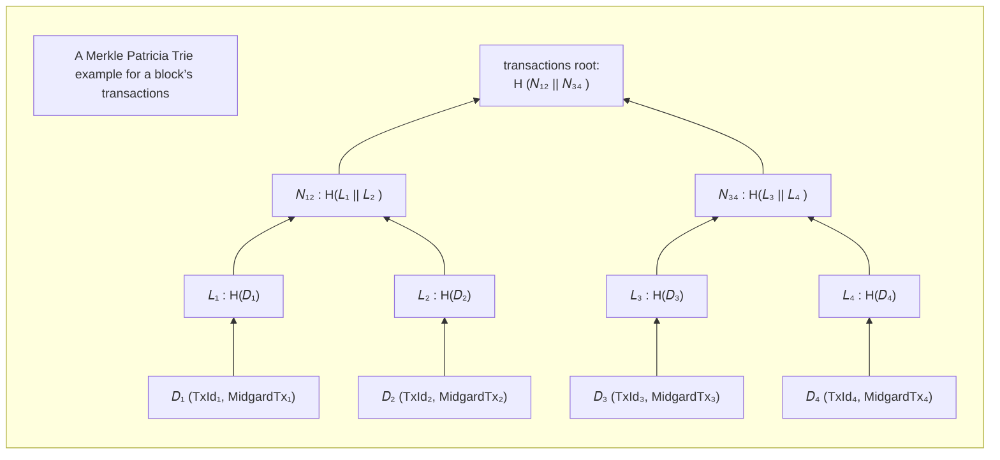

```mermaid

flowchart TB

subgraph MercleTreeScheme[" "]
    direction BT
    Description[A Merkle Patricia Trie example for a block’s transactions]
    TxRoot["`transactions root:<br>H (𝑁₁₂ || 𝑁₃₄ )`"]
    N12["𝑁₁₂ : H(𝐿₁ || 𝐿₂ )"]
    N34["𝑁₃₄ : H(𝐿₃ || 𝐿₄ )"]
    L1["𝐿₁ : H(𝐷₁)"]
    L2["𝐿₂ : H(𝐷₂)"]
    L3["𝐿₃ : H(𝐷₃)"]
    L4["𝐿₄ : H(𝐷₄)"]
    D1["𝐷₁ (TxId₁, MidgardTx₁)"]
    D2["𝐷₂ (TxId₂, MidgardTx₂)"]
    D3["𝐷₃ (TxId₃, MidgardTx₃)"]
    D4["𝐷₄ (TxId₄, MidgardTx₄)"]

    N12 & N34 --> TxRoot
    L1 & L2 --> N12
    L3 & L4 --> N34
    D1 --> L1
    D2 --> L2
    D3 --> L3
    D4 --> L4

end
```