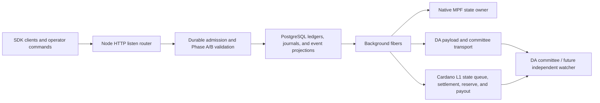

# Midgard Runtime Structure

Status: Current high-level orientation. The Excalidraw files beside this page
are design/transaction diagrams and may describe target flows; verify them
against the technical specification, Aiken validators, and current builders.

Last reviewed: 2026-07-22

The node is not organized around the former `GET /reset`, `GET /tx`, or
`GET /block` sketch. Current route and command references live in the
documentation site:

- `docs-site/content/docs/operators/node/server-http-api.mdx`
- `docs-site/content/docs/operators/node/cli-reference.mdx`
- `docs-site/content/docs/operators/node/background-fibers.mdx`
- `docs-site/content/docs/validation/overview.mdx`
- `docs-site/content/docs/watchers/da-committee-node.mdx`

Operationally, PostgreSQL is durable authority for node journals and projected
state; in-memory structures and MPF process state must be rebuildable or
reconciled. Cardano L1 remains the authority for protocol state, identified by
chain point and interpreted under the deployment's finality/rollback policy.
Local reset is never a substitute for an on-chain reset or a fresh deployment.
