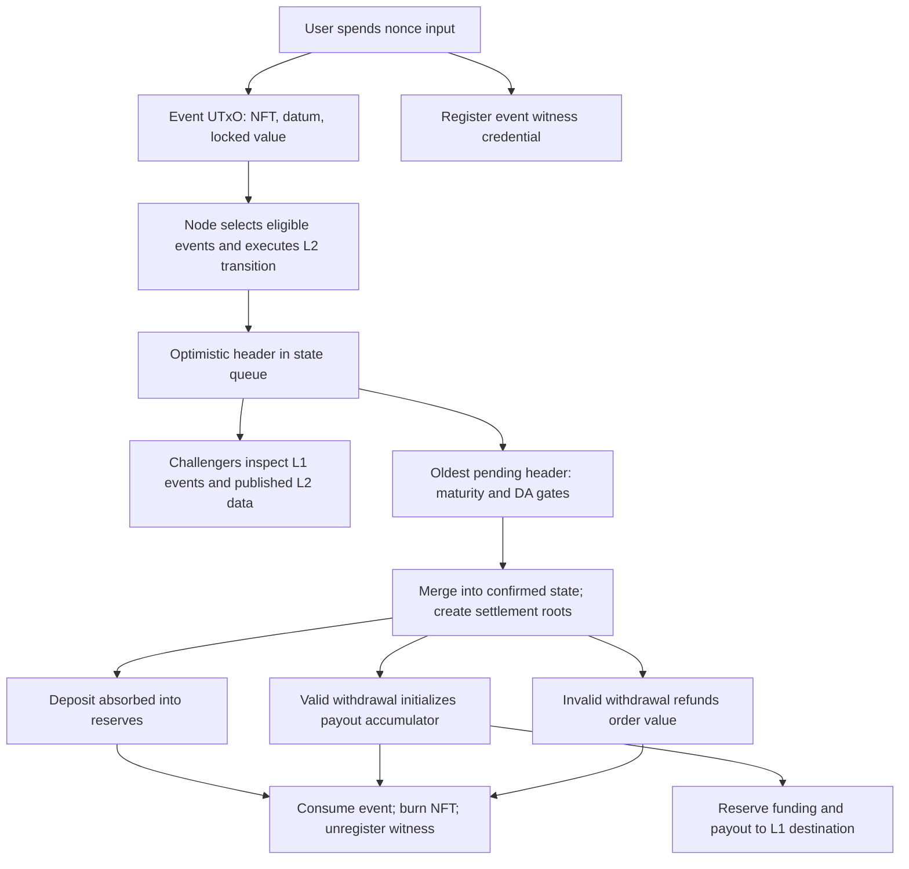
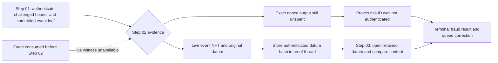

# Authenticated deposit and withdrawal history

Status: Proposed

Last reviewed: 2026-09-22 (registration replacement and output ownership rules;
selected design and implementation handoff; current-flow
research inspected at `6e375aa0b`; not deployment verification).

Implementation boundary: L1 event authentication, ordered lists, filler replacement,
evidence retention/retirement, both fabricated-event families, and every affected
deposit/withdrawal transition-trace path, including staged proofs and off-chain
consumers. This proposal targets [NIFP-01/02 and the deposit/withdrawal portion of
NIFP-03](remaining-gaps.md). Forced-order evidence lifetime remains separate;
this work alone cannot close all of NIFP-03. Existing code is described separately
below; the selected architecture is not an implementation or acceptance claim.

Non-goals: changing L2 transaction execution, accelerating withdrawal finality,
resetting deployments, adding early cancellation/refund, redesigning forced-order
history, or claiming closure of fabricated forced-transaction and malformed
raw-leaf gaps. Shared code changes must preserve existing forced-order behavior.

Dependencies and decisions: event-selection timing, proof completion versus merge
deadlines, authenticated-list invariants and measured limits, admission
capacity, L1 rollback policy, public witness availability, and deployment identity.
Acceptance criteria are listed at the end.

## Agreed design

Build **two sorted authenticated UTxO lists**, one for deposits and one for
withdrawals. Event creation atomically inserts its record. Preserve original
content and Value through the relevant challenge period, then permit retirement
under authenticated finalization rules. Permissionlessly funded filler nodes
can divide the key space into more independently writable insertion gaps.
An authentic order whose key matches a filler replaces that filler at the same
key and preserves its successor. Fillers do not reserve keys against real events.
Keep linked-list outputs small: use bounded inline event data for small orders
and a separately retained data UTxO for larger orders. The large payload does not
have to be reproduced when its list node's successor changes.
External data uses a content hash of a prepublished data UTxO's complete datum;
order admission must reference and validate an actual unspent output containing
that data at the retention script. A bare hash or promise of future publication
cannot substitute for it. Separate data outputs created alongside the order are
not an admission path in this proposal.

Permanent receipts are not inherently required: the necessary proof is
that an event cannot legitimately belong to a still-challengeable header, not
that it never existed. Proving this distinction through every retirement and
refund path is an implementation prerequisite, not an existing guarantee.

Benchmark local insertion contention, transaction rebuilding, maximum order
shapes, and retention before fixing filler density. This document specifies one
selected architecture; it does not authorize building an alternative registry.

### Remove per-order stake registration

The new deposit/withdrawal design removes the per-event witness stake-credential
registration at admission and deregistration at settlement/refund. Authenticated
list insertion, presence/absence and authorized retirement replace that evidence
mechanism. Do not keep both systems for these event kinds.

Remove the deposit/withdrawal witness-credential datum fields, registration and
unregistration redeemer indexes, certificate construction, per-order witness
script application and certificate-related funding/refund accounting. Update
builders, proof consumers, schemas, fixtures and protocol documentation together.
The nonce-derived event ID and authentication tokens remain required; removing
registration does not permit unauthenticated orders or arbitrary NFT burns.

The current deposit and withdrawal spending validators explicitly rely on witness
unregistration in their double-satisfaction rationale. Replace that dependency
with the complete input accounting and exclusive output claims specified below.

The shared witness machinery still has forced-order consumers. Preserve their
behavior and remove shared helpers/deployment artifacts only when no remaining
consumer requires them. This change concerns per-deposit/per-withdrawal event
registration, not rewarding-script execution in general: script-based external
data reclamation still requires its exact zero withdrawal, and shared proof
validators may still use rewarding scripts with deployment-time registration.

### Replacement: complete input accounting and exclusive output claims

Every list operation identifies the actual inputs it handles and the output
indexes that discharge its obligations. The validators verify the complete set
of relevant consumed inputs and require each obligation to have its own output.
This is transaction-local validation; it requires no per-order registration,
new persistent record, shared state UTxO, or user signature for pointer changes.

For example, retiring two deposits of 100 ADA each cannot point both orders at
one 100 ADA reserve output. Each retirement must identify a distinct reserve
output carrying its own required value. Ledger balance alone is insufficient:
the other 100 ADA could otherwise be sent to an attacker as change.

The following rules define the replacement; freeze their exact redeemer encoding
with the list ABI:

1. **Account for every consumed node.** Discover affected nodes from actual
   transaction inputs using the deployed policies/validators. Match them exactly
   to the operation's declared input set; reject missing, duplicate or extra
   consumed nodes. Each spending invocation binds its input index to its actual
   `own_ref`. Decode its action from the redeemer for that exact input or from
   the authenticated transaction-level validator it invokes. A caller-supplied
   subset or unrelated redeemer is not authority for the other inputs.
2. **Give every node one disposition.** Each consumed authenticated node is
   continued, promoted, or removed by exactly one supported list operation.
   Verify its key, role, links, immutable facts and expected token continuation,
   mint or burn. In settlement, the predecessor's continuation and the retiring
   order's fund release are different obligations. A predecessor order is not
   itself settled merely because it is consumed to update `next`.
3. **Derive the required output claims.** Include node continuations/new nodes,
   deposit reserve outputs, withdrawal payout initialization or invalid-order
   refund outputs, and required filler/structural funding refunds. Derive which
   claims are required from the validated action; redeemers may select indexes
   but cannot omit obligations. Check each output's full address, required datum,
   assets and token conditions against its source input and action.
4. **Require distinct claimed output indexes.** No two obligations may use the
   same transaction output, even if their addresses, datums and amounts match.
   Check disjointness across all participating deposit and withdrawal operations,
   not just within one policy or one validator invocation. Treat an operation's
   complete claims as one record when several spending invocations authenticate
   that same operation; do not mistake those repeated checks for new claims.
   Unclaimed wallet change is allowed but cannot satisfy a required output.
5. **Enforce the checks on chain.** Each affected spending/minting path must run
   these checks or bind to the exact transaction-level validator that does so.
   If split across per-kind observers, each must authenticate the other kind's
   operation claims and enforce cross-kind disjointness. A zero withdrawal can
   invoke such validation using a deployment-level credential; it does not
   restore per-event stake registration. Reuse an existing invocation where
   possible rather than adding a separate registration lifecycle.

For the baseline, distinct outputs are required even when refunds share an
address. Aggregating several obligations into one output would need explicit
summed-value accounting and is deferred. These rules do not require adding a
multi-order batch API: a supported single-operation transaction rejects extra
same-list inputs, and any combination that is supported must validate its
complete claims. No output-order restriction is required beyond index validity
and uniqueness; a sorted index set can make the uniqueness check efficient.

The existing `singular_utxo_indexer.one_to_one` helper binds `own_ref` but does
not establish output uniqueness: its `double_satisfaction_prevented` Boolean
is a caller obligation. Passing `True` is acceptable only after the concrete
checks above establish it. The available multi-UTxO indexer checks ordered
one-to-one mappings for one spending credential, but does not alone cover
multi-output operations or deposit/withdrawal cross-kind claims. Measure the
complete check under transaction limits; avoid repeating a full transaction
scan in every input validator when an authenticated shared invocation suffices.

### Deferred features

Do not add early consumption/refund, receipt nodes, order-to-filler recycling,
combined order retirement and external-data reclamation, or a new batched
admission lifecycle as part of this baseline. Settlement/unlink follows the
existing deposit absorption, valid withdrawal payout initialization, and invalid
withdrawal refund entry points. External data is reclaimed separately afterward.
If the readiness work shows that a deferred feature is necessary for safety or
liveness, document the failed invariant and the required design change before
expanding the implementation. Do not add unused receipt constructors or branches
to the baseline ABI.

## Decisions required before broad integration

The architecture is selected, but some rules still require specification and
measurement. Resolve these gates in the order below, using a small end-to-end
implementation slice before migrating all proof families and off-chain consumers.
Record the concrete rules and evidence here as they are resolved; this document
does not claim that the gates have passed.

1. **Exact eligibility, retirement and deadline predicates.** Specify the
   authenticated finalized frontier/ancestry witness, when an order may be
   removed, and which proof steps must finish before merge. Preserve the current
   absence of a proof-initiation merge freeze. Specify validity bounds that make
   current-list absence authoritative for the challenged interval and prevent
   backdated admission. Show that every eligible event survives while needed and
   that a retired ID reused by a later header remains rejectable. Preserve the
   existing settlement/refund entry points; elapsed time or payment alone is not
   retirement authority.
2. **Evidence availability during list mutation.** Permissionless pointer updates
   can spend event or predecessor UTxOs that a challenger references. Specify how
   initial evidence is captured, which inclusion/economic assumptions permit it
   to land before the deadline, and how later proof stages use retained facts.
   Exercise repeated targeted mutation near the deadline. Fillers and repeated
   retries alone are not a liveness argument. If the chosen mechanism cannot
   meet the required challenge availability, resolve that design issue before
   expanding the proof migration.
3. **Token, encoding, and money rules.** Specify root/node authentication, full
   32-byte keys, canonical payload/admission field separation, mint/burn
   transitions, and deposit asset accounting. Specify bounded filler refunds
   and reclamation so promotion needs no owner approval. Use one schema across
   the small validator, builder and proof slice. Replace every safety dependency
   on per-order stake registration using complete input accounting and exclusive
   output claims, including cross-kind transactions;
   freeze the schema only after fit checks.
4. **Maximum transaction fit.** Bound inline payloads and store larger payloads
   separately. Measure the whole predecessor/new-node outputs, their Values,
   settlement/unlink, external-data reclamation, and filler replacement with its
   refund before fixing the inline bound. External data is published first in a
   separate transaction, separating publication and insertion costs. Referencing
   a large datum avoids republishing its bytes, but still incurs script-context
   and verification work. No maximum-fit result is claimed.

The first implementation slice should cover insertion, exact-key replacement,
gap/filler absence evidence, staged content authentication, and finalized
settlement/removal with success and refusal cases. Measure large orders and
deliberate predecessor churn during this slice. Passing it is a prerequisite to
broad integration, not a replacement for full installed-family, rollback and
live acceptance. Do not rewrite every consumer around an unmeasured ABI first.

## Existing design work

[Remaining gaps](remaining-gaps.md) already identifies incomplete nonexistent-ID
proofs and loss of live evidence. [Watcher persistence](../midgard/decisions/watcher-persistence.md)
requires retained original bytes, spent UTxOs, and challenge dependencies.
[The witness specification](../../technical-spec/2-user-event-protocol/5-witness-staking-script.tex)
explicitly says an unregistered credential does not establish that an event never
existed. These are requirements and partial mechanisms; this proposal specifies
the selected list architecture and its remaining implementation decisions.

[Source research](event-history-research.md) supplies the supporting off-chain
flow and source references. Revalidate source assumptions when implementing;
neither the research nor this proposal is deployment evidence.

## Current implementation

### Creation and L2 inclusion

The [shared event mint logic](../../onchain/aiken/lib/midgard/user-events.ak)
spends a user-selected nonce input. The event ID is **that consumed input's output
reference**, not the newly created order UTxO's output reference. The event NFT
name hashes the nonce reference. Creation binds the event ID, event address,
witness staking script, and `inclusion_time = transaction valid-to + event_wait_duration`.
This is an eligibility timestamp, not the observed block arrival time.
The checked-in [default](../../onchain/aiken/env/default.ak) and
[testnet](../../onchain/aiken/env/testnet.ak) event-wait constants are 60 seconds.

A deposit locks the user's assets in an authenticated deposit UTxO. Its datum
contains the event information; the UTxO's actual Value supplies the deposited
assets used by L2 projection. A withdrawal request locks ADA and its event NFT;
the requested L2 assets and destination are in its datum. Those requested assets
are paid later from reserves. See the [deposit validator](../../onchain/aiken/validators/user-events/deposit.ak)
and [withdrawal validator](../../onchain/aiken/validators/user-events/withdrawal.ak).

The node selects events, derives the L2 transition, and commits event roots and
trace roots in an optimistic header. Consecutive headers use contiguous event
intervals. The [queue validator](../../onchain/aiken/validators/state-queue.ak)
binds the header's end time to its commit transaction's validity upper bound.
The [transition proof](../../onchain/aiken/lib/midgard/fraud-proofs/transition-trace/proof.ak)
uses `(start_time, end_time]` for ordinary deposit/withdrawal eligibility.



### Finality, settlement, and refunds

The confirmed state is the queue's root anchor. The oldest pending header is
folded into it after the maturity gate and required DA state, while the correction
lock permits merge. Merely occupying the head position does not make a header
finalized. Merge spawns an authenticated settlement object carrying that header's
event roots. See `merge_to_confirmed_state` in the
[queue validator](../../onchain/aiken/validators/state-queue.ak) and `Spawn` in the
[settlement validator](../../onchain/aiken/validators/settlement.ak).
The checked-in [V1 block maturity constant](../../onchain/aiken/lib/midgard/ledger-state.ak)
is seven days. These are source values, not a verification of a running deployment.

Normal deposit absorption already requires membership in a settlement deposit
root. Withdrawal payout initialization and invalid-withdrawal refund likewise
require membership in a settlement withdrawal root. These operations burn the
event NFT and unregister its witness. Thus, normal consumption is already gated
on finalization of an including block. This is not a claim that every dependent
proof or later malicious reference is protected.

The current deposit spending entry point has an absorption path, not a general
user-cancellation/refund endpoint. Invalid withdrawal refund returns the order's
locked value to its recorded refund target; it is distinct from a successful
withdrawal payout. Any new pre-finality refund must also define its effect on L2
eligibility and prevent refund-plus-credit. A history record alone does not
provide that conservation rule.

### Current fraud-proof authentication



The [deposit](../../onchain/aiken/lib/midgard/fraud-proofs/fabricated-deposit/step-02.ak)
and [withdrawal](../../onchain/aiken/lib/midgard/fraud-proofs/fabricated-withdrawal/step-02.ak)
families have two sound but incomplete evidence choices:

| Committed identity / timing                    | Current evidence                                                    |
| ---------------------------------------------- | ------------------------------------------------------------------- |
| Exact nonce UTxO still exists                  | Absence arm works: authentic creation would have spent it.          |
| Nonce spent by an unrelated transaction        | Neither absence nor live-event evidence necessarily exists.         |
| Transaction hash or output index never existed | A nonexistent UTxO cannot be referenced.                            |
| Authentic event remains live                   | NFT authenticates its datum for comparison.                         |
| Authentic event consumed before Step 02        | Archived datum has no supported independent L1 authentication path. |
| Event consumed after Step 02                   | Fabricated-event thread can reopen its retained datum hash.         |

[CIP-31](https://cips.cardano.org/cip/CIP-0031) requires reference inputs to exist
in the current UTxO set. Retaining transaction bytes in a database does not make
a spent output usable as a reference input.

The [witness validator](../../onchain/aiken/validators/user-events/witness.ak)
also has a register/unregister probe for current non-registration. Settlement
unregisters the witness, so this is not historical nonmembership. Its current
nonce-only parameter and caller-selected mint policy are not the event-kind and
deployment binding required by a redesigned historical authority.

### Transition traces and rollback

History affects more than fabricated-event Step 02:

- `OmittedDueDeposit` and `OmittedDueWithdrawal`: authentic historical presence
  plus nonmembership in the challenged header's event root.
- `OutOfWindowDeposit` and `OutOfWindowWithdrawal`: authentic eligibility time
  plus a committed source leaf. L1 history roots and challenged L2 event roots
  are different authorities; both are needed.
- `ValidDepositTransition`: authenticate the original deposit **Value**, then
  derive the projected L2 output and verify the transition. Datum hash alone is
  insufficient.
- Staged deposit value/summaries/yield checks: [deposit-source.open](../../onchain/aiken/lib/midgard/fraud-proofs/transition-trace/deposit-source.ak)
  presently reopens a specific live event reference. The replacement must retain
  authenticated commitments across stages, not simply change the first read.
- The shared omission/window family also has forced-order branches. Preserve
  those branches and run their regression checks when changing shared helpers.
  This scope does not redesign their evidence authority or lifetime; track that
  remaining portion of NIFP-03 separately from deposit/withdrawal acceptance.

L2 correction removes an invalid queue suffix; it does not erase authentic L1
events. They must remain available when deriving a replacement suffix. Cardano
rollback is different: event creation and list updates on the abandoned L1
branch cease to be canonical together. Watchers must roll back observations,
list indexes, storage references, and proof plans to a common chain point.
Retained abandoned bytes are recovery material, not authority for the new
canonical branch.

## Required security properties

1. **Complete authority:** every authentic event enters history; no unauthenticated
   event can enter it. A root published by an operator or attester alone does not
   meet this property.
2. **Identity:** bind deployment, event kind, event policy, and nonce reference.
   Keys and encodings have explicit domains. A deposit cannot impersonate a
   withdrawal or an event from another deployment.
3. **Content:** bind original datum, eligibility time, and original event output
   Value. Bind any additional field consumed by a proof. The authoritative record
   distinguishes submitted withdrawal content from the operator's validity tag.
4. **Temporal completeness:** absence evidence must establish ineligibility for
   the challenged header. List retirement must not remove a legitimately eligible
   event while its interval remains challengeable. Evidence is captured after
   the challenged event interval, and later admissions cannot backdate eligibility.
5. **Persistence:** settling, refunding, consuming, or correcting L2 state cannot
   delete evidence still needed for a permitted challenge. Historical presence
   does not itself authorize payout.
6. **Availability:** public original bytes and required witnesses remain retrievable
   for all supported proof paths. Authentication is not a data-availability remedy.
7. **Proof continuity:** every later proof step can use authenticated retained
   commitments, including after the authenticated list node is spent and recreated.
8. **Retention closure:** expiry depends on on-chain finality/dependencies and
   recovery policy, not merely elapsed time since event creation.

## List design and filler nodes

Each logical event ID remains the consumed nonce input's `OutputReference`.
The existing event token name is `blake2b_256(cbor.serialise(eventId))`. Using
that hash as the event's ordering position gives a fixed-width coordinate;
retain the original ID and verify its binding to the coordinate.

A real event must be created through an authenticated insertion or replacement
of a filler at exactly its key. Every mutation preserves sorted adjacency, unique
keys, and original event facts. Pointers use stable logical keys rather than UTxO
references, so recreating one node does not force updates to all its predecessors.

### Node structure

Conceptually each list has one authenticated root, with a pointer to the first
node, and nodes shaped as follows. This is a logical schema, not a frozen ABI:

```text
Node {
  key: 32-byte position,
  next: optional successor key,
  payload:
    Filler { funding/refund terms }
    | Order { original event ID, eligibility time, event data location }
}
```

The list/deployment authority authenticates the node and allowed payload type.
An event data location is either bounded inline data or an authenticated reference
to data held separately, as specified below. Orders also hold the relevant locked
funds. The baseline has only Filler and Order nodes; receipts are deferred.

Changing `next` never changes an event's identity, original eligibility time,
original payload, or original deposited value. Hash the immutable event material
separately from the mutable list wrapper. Structural authentication tokens and
filler funding must not become user-deposited assets in L2 projection. Finalize
the exact token policies and encoding with the builders: the existing helper's
prefixed asset-name scheme cannot simply add a prefix to a full 32-byte key.

### Large event data in separate UTxOs

Use bounded inline data for small orders and a separate retention script for
large payloads. A conceptual storage datum is:

```text
EventData {
  eventKey: ByteArray,
  eventDatum: Data,
  reclaimAuth: Credential
}

EventDataLocation = Inline(Data) | External(dataHash: ByteArray)
```

Here `eventDatum` means the immutable **event payload**, not the complete current
order datum. Use the same payload encoding for inline and external carriage:

| Material | Location and authentication |
| --- | --- |
| Original nonce-derived ID and submitted deposit information or withdrawal information | Inline payload or prepublished `eventDatum`; the ID must match the node and hash to `eventKey`. Preserve the submitted withdrawal body/signature and any required initial marker; an operator's later validity classification is a separate fact. |
| Eligibility time and admission metadata | Authenticated Order fields, computed/validated at admission. Eligibility remains admission transaction valid-to plus the configured event wait. There is no per-order witness stake credential. |
| Original deposited assets | Validated from the actual admitted order Value; preserve them through pointer updates and authenticate them when a proof captures event facts. A user-supplied payload hash cannot establish this Value. |
| `next` pointer and storage/filler funding | Structural state and separately accounted funds, never part of the immutable L2 event content. |

Do not put the admission timestamp, admission transaction ID/output reference, or
mutable list wrapper inside the prepublished payload. Publishing data is not
admitting an event and starts no eligibility interval. The SDK selects an already
known nonce input for the future order and does not spend it during publication.
The prepublished data cannot contain its own future output reference as the ID.
Admission retries can update their validity range and eligibility time without
republishing unchanged payload data, provided the selected nonce remains unspent.
If that nonce is consumed elsewhere, admission must fail; replacing the ID
requires new matching data, and the unused old storage remains reclaimable.

Define separate canonical commitments for stored `EventData` and authenticated
event facts. The former includes reclaim metadata; the latter binds deployment,
kind, ID, submitted payload, admission time and original assets as required by
the proof. Neither is automatically the L2 event-leaf encoding. Proofs must use
the appropriate typed openings rather than compare unrelated wrapper hashes.

Bind deployment and event kind to the correct list through the storage script's
parameters, or explicit authenticated fields if one script serves several lists.
`eventKey` is the hashed ordering key; the original OutputReference ID remains in
the event data and must hash to that key. The exact ABI is still to be fixed.

List authentication is what admits event data as genuine: anyone can create a
UTxO at a script address. On admission, require a live reference input at the
designated retention script. Verify its inline storage datum, key and event kind,
and require the hash of the complete serialized `EventData` datum (including
`eventKey` and `reclaimAuth`) to equal `dataHash`. Fix the hash and serialization
encoding in the ABI. Validate the event using that data and the actual order
Value. Explicitly reject consuming that data output in the admitting transaction.
A bare hash, raw redeemer datum, missing/unspent-status claim from a provider, or
newly created sibling output cannot substitute for the reference input. Keep the
external hash immutable while the event is active; pointer-only list
updates preserve it without reopening or copying the payload. Deposited assets
remain under the order's normal settlement rules. Storage ADA is separate and
must not be credited to the depositor as part of those assets.

The external path has two dependent L1 transactions:

1. Publish the data UTxO with the full inline storage datum.
2. Admit the order, referencing the existing UTxO and recording its datum hash.

The hash binds the content; the mandatory reference input proves that the content
is already published, and the storage validator enforces its retention. Initial
proof authentication resolves an actual retained output at the correct script
with matching metadata and hash. An identical copy there can satisfy the
reference; the order does not pin one output reference. Once facts have been
authenticated into a proof thread, later stages may open matching retained
preimages without referencing that output again. Inline orders continue to use
one transaction. Newly created separate outputs are not an external admission
path.

Existence at admission does not alone ensure continued availability. The storage
spending rule must enforce retention independently of `reclaimAuth`:

```text
canReclaim = authorized(reclaimAuth)
             AND authenticatedAbsenceOfOrder(eventKey)
```

Absence includes the exact-key Filler case and the usual authenticated gap/root/
tail cases. It must be checked against the correct deployed list. While an Order
occupies the key, no update, owner signature, or reclaim script may spend the
storage UTxO through another branch. Baseline reclamation is a later transaction
after removal; combined retirement-and-reclaim is deferred.

Absence does not itself prove finalization: a prepublished payload's order may
never have been admitted. Reclaiming such unused storage is safe only because
later admission must authenticate an existing retained output again. Validate
the admission/reclaim race, including attempts to consume the only data copy in
the admitting transaction. For an admitted order, the list's retirement rules
preserve its data until the applicable finalization/proof obligations end.

For a key credential, require the exact hash in `extra_signatories` (the ledger's
required signers). For a script credential, require the exact zero-valued
withdrawal and successful execution for that script's rewarding purpose. Merely
including a script or a redeemer is insufficient. The chosen reclaim script must
support that purpose and its reward-account setup must permit the transaction;
a spending-only script is not automatically usable. The retention predicate
remains in the storage validator regardless of the owner's authorization logic.
See [withdraw-zero guidance](../agents/withdraw-zero-yielding.md).

Choose the inline threshold by serialized on-chain data length, not JSON/string
length. Also budget the entire node output, Value, mutable wrapper, second node,
and transaction overhead; bounding only the nested event datum is insufficient.
Fitting the initial creation transaction is not enough to qualify for inline
carriage: a later insertion must recreate this order as its predecessor while
also creating another node. A payload that fits creation but exceeds the safe
inline bound therefore still takes the prepublished external path.
Large payload publication and script execution remain subject to L1 limits.
This supports larger orders without copying their payload on every insertion;
it does not create unbounded-size L1 orders. Prepublication costs an extra
dependent L1 transaction and temporary storage ADA, while making publication
of the full data an explicit prerequisite of admission.

For users, the SDK selects inline or external carriage automatically. Ordinary
small orders retain one transaction. External data uses two dependent transactions,
additional minimum ADA, and eventual authorized cleanup. Challenge consumers
authenticate the bounded node facts and then open
the retained data without depending on a previous node output reference. This
stabilizes large-data UTxOs but does not by itself solve deliberate churn of the
list node used for initial authentication or an absence witness.

### Permitted operations

| Operation | Inputs consumed or referenced | Required result |
| --- | --- | --- |
| Insert an order in a gap | Its predecessor (root for the first gap) | Recreate predecessor pointing to the new authenticated order; new order points to old successor; consume the order's nonce and enforce event creation. |
| Insert a filler in a gap | Its predecessor | Same structural splice, with a caller-funded filler and preserved predecessor funds/data. |
| Replace an exact-key filler | The filler | Create the genuine order at the same key and with the same successor; consume its nonce and enforce event creation; settle filler funding terms. |
| Settle and unlink a finalized order | Order and its predecessor | Execute the authorized deposit absorption, withdrawal payout initialization, or invalid-order refund; predecessor points to removed order's successor. |
| Reclaim a filler | Filler and its predecessor | Enforce the specified funding/authorization terms, unlink only the filler, and preserve neighboring orders and adjacency. |
| Reclaim external data | Data UTxO; list witness is a reference input | Authenticate absence of the associated order in the correct list and require the recorded reclaim authorization. |

Root/tail and multi-node transaction cases need explicit validators and
double-satisfaction protection. No operation should require spending the root
except when modifying the first gap or performing a genuinely root-specific
operation. Specify filler reclamation's funding/authorization terms before
freezing the ABI; order-to-filler recycling is deferred.

Real orders may serve as list nodes. An insertion spends and recreates its
predecessor, changing its link while preserving its order data and funds.
Different gaps need not spend the same root UTxO. Settlement can retire an event
only when it cannot legitimately belong to any still-challengeable interval.
Contiguous intervals and ordered finalization support that rule; contracts must
authenticate the frontier and prohibit premature deletion. A later malicious
reuse of a retired ID is rejected as ineligible, without asserting it never
existed. The baseline does not authorize early consumption/refund. L2 correction
cannot retire those records. L1 rollback restores canonical list state together
with the transactions it reverses.

### Evidence and retention

An authenticated Order for key X supplies original event authority;
a Filler at X does not. Event timing and withdrawal validity remain separate
checks: historical presence alone does not mean an event is due or valid.

There are two absence witnesses:

- An authenticated predecessor whose strict successor gap contains X, with
  explicit root/tail handling.
- An authenticated Filler at exactly X. Unique list keys and the required
  filler-to-order replacement rule establish that no real order also
  occupies X.

The proof must bind the target to the challenged header's committed ID and the
correct deployed deposit/withdrawal list. For absence checks, bind the evidence
transaction to a time after the challenged event interval, and prohibit newly
created events from backdating eligibility. Root/filler nodes cannot supply
event content or contribute to L2 event counts.

The critical retention invariant is: every authentic event that could legitimately
belong to any still-challengeable interval remains represented with its required
evidence. Retirement uses authenticated ordered finalization, not elapsed time
or the fact that a particular user has been paid. Opening a proof does not
automatically stop merge; deadline and cleanup rules must agree on which proofs
are still permitted. Subject to those invariants, current-list absence proves
ineligibility for a still-challengeable block without deciding whether an ID
never existed or existed and was properly retired. No permanent history list or
permanent per-ID tombstone is required for this route.

Bind event facts once into staged proofs so pointer-only updates cannot strand
them. Deposit projection authenticates original assets/value as well as original
datum. Cover omission, event-window, content substitution and staged deposit
Value/summaries paths. Watcher indexing must treat pointer-only spends as
continuations of the same logical event, not settlement or new event creation.

### Fillers divide insertion ranges

Fillers contain no user event. They provide additional predecessor UTxOs when
the list is empty, sparse, or has lost many orders to settlement. For example,
boundaries at roughly 25%, 50%, and 75% of the key range let orders at 30% and 65%
spend different predecessors. More nodes help only when their positions split
the ranges receiving traffic; clustered fillers offer little improvement.

Use an authenticated node kind rather than assuming an unused hash cannot be a
legitimate event ID. Fillers and orders share the same ordering-key space:

```text
Filler(boundary) -> key = boundary
Order(eventId)   -> key = hash(eventId)
```

At an exact key match, promote the filler into the genuine order:

```text
Before: A -> Filler(key=X, next=B) -> B
After:  A -> Order(key=X, next=B)  -> B
```

The transaction spends the filler and the order's nonce input, validates normal
event creation and `hash(eventId) == X`, and preserves `next=B`. It need not spend
A, because A still points to X. The new output reference changes; the key does
not. Existing Order nodes cannot be overwritten through this operation.
Authentication-token mint/burn or continuation must match the chosen policies;
merely changing an unauthenticated datum tag cannot create an event.

Record filler funding terms on creation. A proposed default is an enforced refund
of filler funding to its recorded target, with the new order funding itself.
This refund must not require the filler owner's signature or approval. It must
fit ledger output requirements, and it cannot deduct fees from the predecessor
or count filler ADA as the user's deposit. Exact refund fields and standalone
filler-reclamation rules remain implementation decisions. They must not let a
filler creator impose additional promotion conditions or block a valid order.

Filler insertion can be permissionless, provided the transaction pays its fees
and funds the new UTxO while preserving the predecessor's funds and event data.
Authenticate the node kind in the minting and spending rules; a redeemer cannot
reinterpret a filler as a deposit or withdrawal. Fillers never count as
L2 events or authorize credit/payout, but may serve as authenticated predecessors
for gap proofs. Apply the same adjacency and uniqueness rules to all insertions.

Prepopulate a measured number of well-spaced fillers and allow funded additions.
Creating a filler itself competes for its current predecessor; a filler is not a
free reservation or guaranteed exclusive lane. Same-gap orders still contend,
and adversaries can target a gap or churn a predecessor referenced by a proof.
Evaluate ordinary retries and deliberate interference separately. More fillers
do not bypass total L1 transaction capacity.

Filler state and minimum ADA remain real costs even after event records retire.
Define who funds them, whether/how their ADA can be reclaimed, and the permitted
removal operation. Any removal must preserve authenticated adjacency and cannot
remove real event evidence or divert a neighboring order's funds. Keep filler
payloads fixed and small; bounded event retention does not itself bound
permissionlessly created filler state.

## Components that must be integrated

Trace the actual call graph when implementing; this table is a minimum scope,
not permission to leave other affected consumers on the old representation.

| Component | Required result |
| --- | --- |
| Aiken event/list/storage validators and policies | Authenticated initialization, insertion, continuation, promotion, settlement/unlink, filler reclamation and retained external data, with conserved funds. Replace deposit/withdrawal witness registration and its safety dependencies. |
| State queue and settlement | Exact eligibility, challenge deadline and finalization/retirement rules; existing payout and invalid-withdrawal refund semantics remain intact. |
| Fabricated-deposit and fabricated-withdrawal | List membership/absence and typed content authentication replace the incomplete evidence model across the entire proof workflow. |
| Transition traces and staged proof helpers | Deposit/withdrawal omission, window, projection, original Value, summaries and staged reopening use the new authority; shared forced-order branches keep working. |
| SDK and transaction preparation | Matching schemas and applied parameters, automatic inline/external selection, publication/admission recovery, predecessor discovery, bounded transaction construction, retry and cleanup flows; no per-deposit/per-withdrawal witness certificates or associated fields/accounting. |
| Watcher and node | Canonical ordered-list index, pointer-continuation recognition, external-payload resolution, event selection/projection, proof planning/submission, persistence, restart and rollback. |
| Public evidence retrieval | Independent challengers can find current authenticated nodes and payloads and retain original bytes for staged proofs without trusting the operator's database as authority. |
| Deployment and verification | Updated generated blueprint, parameter application, manifest/catalogue identity, fixtures, positive/negative emulator paths, installed replay/fit evidence and live acceptance. |
| Documentation and status | Matching protocol/schema references and truthful coverage/readiness claims; no closure of the forced-order portion of NIFP-03 from this work alone. |

## Implementation sequence

1. Resolve the decisions above in dependency order and record the exact
   predicates, field encodings, funding rules and testable liveness assumptions.
   Preserve existing deployed state; any fresh development deployment is a
   separate operation subject to repository deployment guidance.
2. Build a small complete admission-to-proof-to-finalized-retirement slice,
   including external data and filler promotion. Exercise maximum shapes and
   targeted witness churn before freezing the ABI. Demonstrate that disjoint
   gaps do not require a shared root spend. Do not treat ordinary retry success
   as adversarial challenge-availability evidence.
3. Extend the proven primitives to both event kinds and all affected proof
   stages, then integrate all components in the table. A working first slice is
   an intermediate milestone, not task completion.
4. Run full affected suites, installed-family replay/fit checks, independent
   retrieval, recovery/rollback and live acceptance against the resulting
   identity. Update the gap tracker only for the scope actually verified.

## Acceptance

Extend the existing fabricated-deposit/withdrawal emulator tests, transition-trace
L1-evidence and installed-lifecycle tests, watcher history tests, and state-queue
merge/removal tests. Add deployed-parameter success and refusal scenarios for
each new contract. All cases below concern the selected lists.

### List authentication and money

- Initialization authenticates exactly one root per deployed event list. All
  mutations preserve strict ordering, unique keys, complete connectivity and
  the correct root/node authority, including empty, first-gap and tail cases.
- Wrong deployment, kind, policy, node role, ID/key binding, successor, or token
  mint/burn rejects. Detached nodes, duplicate keys, overwritten real orders,
  omitted insertions, double satisfaction and unauthorized unlinking reject.
- Deposit/withdrawal admission, pointer updates, settlement and refund succeed
  without per-event witness registration/deregistration. Multiple order inputs
  cannot reuse a single settlement/refund output or continuation to discharge
  their obligations. Preserve forced-order registration behavior and unrelated
  rewarding-script authorization paths in regression tests.
- Equal-value orders with identical destinations still require distinct claimed
  outputs. Reject duplicate indexes within an operation and across supported
  deposit/withdrawal combinations, including reserve/refund destination overlap,
  filler refund reuse and continuation-versus-payment reuse. Reject omitted
  input claims, wrong `own_ref`, substituted action redeemers and extra consumed
  nodes hidden from a single-operation validator. Positive cases use distinct
  outputs and conserve each input's funds. Unrelated wallet change remains valid.
- Exact-key filler replacement preserves its successor, authenticates a genuine
  new event, and requires neither a predecessor spend nor filler-owner approval.
  Gap and exact-filler absence witnesses both work; neither a filler nor root
  authenticates event content or contributes to L2 event counts.
- Filler promotion/refunds and reclamation conserve funds and fit ledger output
  requirements. Filler ADA, storage ADA and structural tokens never become L2
  deposits. Pointer-only changes preserve original ID, time, payload and assets.

### Inline and external data

- Inline/external parity holds at the byte threshold. Oversized inline data
  rejects even when the initial creation transaction alone fits.
- Admission rejects missing/spent data, wrong script/deployment/kind/key/hash,
  raw redeemer preimages without a reference input, and separate data outputs
  created by the admitting transaction. Identical retained data at the correct
  script can satisfy the reference; pointer updates preserve the external hash.
- Publication alone does not create an eligible event. Delayed admission and
  validity-range retries reuse the same published payload with a newly validated
  admission time. Wrong IDs, a previously spent nonce, backdated times and
  attempts to substitute storage metadata reject.
- Owner-authorized reclamation while the Order remains rejects. After genuine
  absence, correct key and rewarding-script authorization succeed; fake absence,
  missing signer, wrong/nonzero withdrawal and another-purpose script invocation
  reject. Unadmitted storage cleanup and admission/reclaim races cannot create
  an order whose backing data has disappeared.
- Original deposit Value is independently authenticated. A correct payload hash
  paired with incorrect assets cannot validate the L2 projection.

### Proof behavior at each lifecycle stage

These cases distinguish spending a node to update its pointer from retiring an
order after finalization. Each fixture identifies the challenged header, its
eligibility interval, the finalized frontier, and whether challenge completion
is still permitted.

| State at proof initiation | Required behavior |
| --- | --- |
| ID never created, nonexistent transaction/index, or nonce spent for another purpose | Authenticated gap or exact-key filler establishes ineligibility for the challenged interval after its horizon; arbitrary IDs need no exact unspent nonce witness. |
| Genuine eligible Order exists | Correct inclusion/content refuses fraud; substituted content, omission, wrong window or incorrect deposit projection is provable by the appropriate family. |
| Order node spent and recreated by a pointer update | A new proof can authenticate the current node; an already staged proof uses its retained facts instead of reopening the spent output reference. |
| Genuine Order exists but is outside the challenged interval | Authenticated timing supports rejection of its inclusion, including when the malicious header also changes its claimed content. |
| Order retired through authorized finalized settlement/refund; later pending header reuses the ID | Current-list absence proves ineligibility for the later header with either unchanged or changed claimed content; old payload retention is not required solely for that later reuse. |
| Order's own including header has finalized and its challenge deadline has ended | New challenges to that finalized header are not enabled by this work. Do not require historical content recovery for an expired proof opportunity. |
| An order is still needed by a permitted challenge | Settlement/removal/data cleanup cannot delete required evidence. Exercise the exact retirement predicate, including already-open proof stages. |

- Bind all evidence to the challenged header/source leaf and deployed event
  kind. Test start/end boundaries, capture before/after the horizon, and later
  admissions that attempt to backdate eligibility.
- Keep submitted withdrawal body/signature authentication separate from the
  operator's validity classification. Cover honest refusal and malicious success
  through complete fabricated and affected transition-trace workflows.
- Test the last permitted challenge completion against merge and retirement,
  stalled queues and pending proofs. Retaining data does not create a merge
  freeze or authorize a challenge to complete after its deadline. Show legitimate
  release without allowing a stale computation thread to impose an indefinite lock.
- Existing deposit absorption, valid withdrawal payout initialization and invalid
  withdrawal refund preserve their respective fund flows. No new early refund
  endpoint is required. Regress shared forced-order paths without claiming their
  separate evidence-lifetime gap is fixed.

### Availability, recovery and capacity

- Independent challengers reconstruct bytes and authenticated witnesses through
  public paths while the producing operator is unavailable. Staged proof data
  remains retrievable for every permitted continuation.
- Test disjoint-gap concurrency, same-gap retries, filler insertion/removal races
  and targeted changes to a proof's reference node near its deadline. Record
  the inclusion/economic assumptions and demonstrate the chosen evidence-capture
  mechanism; successful benign retries alone do not pass this gate.
- L2 suffix correction preserves canonical L1 orders for replacement derivation.
  Native L1 rollback at publication, admission, pointer update, settlement,
  reclamation and challenge rewinds indexes and plans to the same chain point.
  Restart/provider disagreement cannot authenticate abandoned-branch data.
- Maximum inline predecessors with inline/external new orders, payload
  publication, dependent admission, filler promotion/refund, settlement/unlink,
  reclamation and full proofs fit actual transaction/execution budgets. Measure
  bytes, CPU, memory, fees, locked ADA, admission p50/p95, contention/retries,
  retained-state growth and impact on ordinary L2 block production. Do not raise
  production limits to obtain a passing fit result.

Run the pinned Aiken build/tests and affected deployed-parameter emulator paths
under [contract guidance](../agents/contracts.md), installed-family replay/fit
checks and affected package suites in [testing status](testing-status.md), and
live acceptance under the repository's e2e skill. Bind retained results to source,
compiler, environment, parameters and deployment identity, with reproduction
commands and actual outcomes. Passing source tests alone is not closure.

NIFP-01/02 and the deposit/withdrawal lifetime work can be marked complete only
with their required evidence. NIFP-03 stays open while its forced-order lifetime
work remains unresolved. This document edit implements no validators and claims
none of those lifecycle checks have passed. For documentation edits, run
`pnpm --dir docs-site run check:links` from the repository root.
