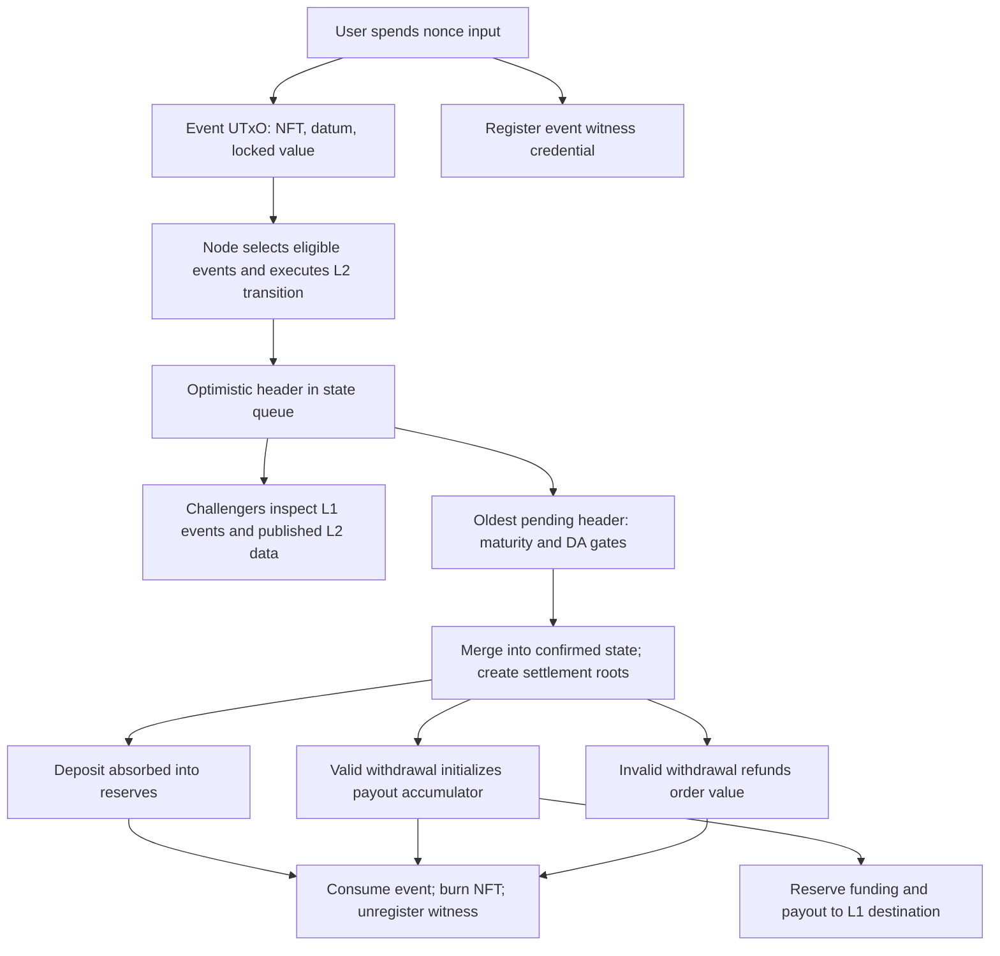
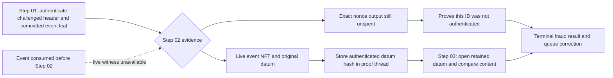
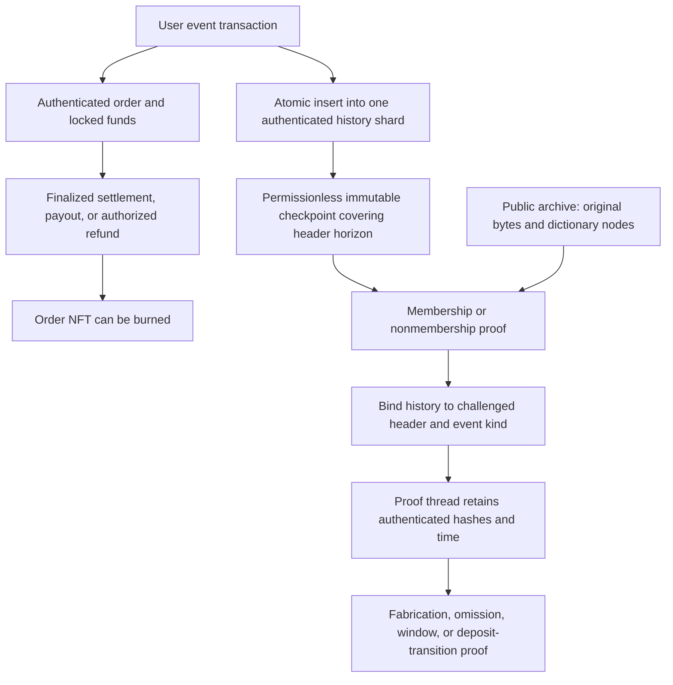

# Authenticated deposit and withdrawal history

Status: Proposed

Last reviewed: 2026-09-21 (source inspection at `6e375aa0b`; not deployment verification).

Implementation boundary: L1 event authentication, historical evidence, checkpoint
retention, fabricated-event proofs, and affected transition-trace paths. This is
an architecture proposal for [NIFP-01–03](remaining-gaps.md), not an implementation
or acceptance claim. Existing code is described separately below.

Non-goals: changing L2 transaction execution, accelerating withdrawal finality,
resetting deployments, or claiming closure of the separate fabricated forced
transaction and malformed raw-leaf gaps.

Dependencies and decisions: event-selection timing, proof completion versus merge
deadlines, the authenticated-map implementation and measured limits, admission
capacity, L1 rollback policy, public witness availability, and deployment identity.
Acceptance criteria are listed at the end.

## Recommendation

Build a **cumulative authenticated event dictionary**, updated atomically with
event authentication, with deterministic shards and immutable checkpoints.
Keep monetary settlement separate from historical evidence. Reuse the current
live-event and unspent-nonce witnesses as optional fast paths.

The dictionary proves whether an identity existed by a particular event horizon
and authenticates its original content. A checkpoint is not merely an
operator-published root: L1 scripts must enforce every insertion and the closure
of its event horizon. Initially retain all dictionary entries. Pruning snapshots
and payloads is a separate, proved optimization; deleting historical entries is
not required to settle funds.

Benchmark atomic admission before choosing shard count. If contention makes
user submission unreliable at the required load, the second choice is pending
request receipts followed by permissionless batched admission into that same
dictionary. That changes when a request becomes an eligible event and requires
a bounded cancellation/refund path.

## Existing design work

[Remaining gaps](remaining-gaps.md) already identifies incomplete nonexistent-ID
proofs, loss of live evidence, and an event-kind-aware authenticated history root
as a recommended fix. [Watcher persistence](../midgard/decisions/watcher-persistence.md)
requires retained original bytes, spent UTxOs, and challenge dependencies.
[The witness specification](../../technical-spec/2-user-event-protocol/5-witness-staking-script.tex)
explicitly says an unregistered credential does not establish that an event never
existed. These are requirements and partial mechanisms; they do not specify a
complete root-update, checkpoint-completeness, retention, and pruning protocol.

[Source research](event-history-research.md) supplies the supporting off-chain
flow and source references. The recommendation below remains proposed.

## Current implementation

### Creation and L2 inclusion

The [shared event mint logic](../../onchain/aiken/lib/midgard/user-events.ak)
spends a user-selected nonce input. The event ID is **that consumed input's output
reference**, not the newly created order UTxO's output reference. The event NFT
name hashes the nonce reference. Creation binds the event ID, event address,
witness staking script, and `inclusion_time = transaction valid-to + event_wait_duration`.
This is an eligibility timestamp, not the observed block arrival time.
The checked-in [default](../../onchain/aiken/env/default.ak) and
[testnet](../../onchain/aiken/env/testnet.ak) event-wait constants are 60 seconds.

A deposit locks the user's assets in an authenticated deposit UTxO. Its datum
contains the event information; the UTxO's actual Value supplies the deposited
assets used by L2 projection. A withdrawal request locks ADA and its event NFT;
the requested L2 assets and destination are in its datum. Those requested assets
are paid later from reserves. See the [deposit validator](../../onchain/aiken/validators/user-events/deposit.ak)
and [withdrawal validator](../../onchain/aiken/validators/user-events/withdrawal.ak).

The node selects events, derives the L2 transition, and commits event roots and
trace roots in an optimistic header. Consecutive headers use contiguous event
intervals. The [queue validator](../../onchain/aiken/validators/state-queue.ak)
binds the header's end time to its commit transaction's validity upper bound.
The [transition proof](../../onchain/aiken/lib/midgard/fraud-proofs/transition-trace/proof.ak)
uses `(start_time, end_time]` for ordinary deposit/withdrawal eligibility.



### Finality, settlement, and refunds

The confirmed state is the queue's root anchor. The oldest pending header is
folded into it after the maturity gate and required DA state, while the correction
lock permits merge. Merely occupying the head position does not make a header
finalized. Merge spawns an authenticated settlement object carrying that header's
event roots. See `merge_to_confirmed_state` in the
[queue validator](../../onchain/aiken/validators/state-queue.ak) and `Spawn` in the
[settlement validator](../../onchain/aiken/validators/settlement.ak).
The checked-in [V1 block maturity constant](../../onchain/aiken/lib/midgard/ledger-state.ak)
is seven days. These are source values, not a verification of a running deployment.

Normal deposit absorption already requires membership in a settlement deposit
root. Withdrawal payout initialization and invalid-withdrawal refund likewise
require membership in a settlement withdrawal root. These operations burn the
event NFT and unregister its witness. Thus, normal consumption is already gated
on finalization of an including block. This is not a claim that every dependent
proof or later malicious reference is protected.

The current deposit spending entry point has an absorption path, not a general
user-cancellation/refund endpoint. Invalid withdrawal refund returns the order's
locked value to its recorded refund target; it is distinct from a successful
withdrawal payout. Any new pre-finality refund must also define its effect on L2
eligibility and prevent refund-plus-credit. A history record alone does not
provide that conservation rule.

### Current fraud-proof authentication



The [deposit](../../onchain/aiken/lib/midgard/fraud-proofs/fabricated-deposit/step-02.ak)
and [withdrawal](../../onchain/aiken/lib/midgard/fraud-proofs/fabricated-withdrawal/step-02.ak)
families have two sound but incomplete evidence choices:

| Committed identity / timing                    | Current evidence                                                    |
| ---------------------------------------------- | ------------------------------------------------------------------- |
| Exact nonce UTxO still exists                  | Absence arm works: authentic creation would have spent it.          |
| Nonce spent by an unrelated transaction        | Neither absence nor live-event evidence necessarily exists.         |
| Transaction hash or output index never existed | A nonexistent UTxO cannot be referenced.                            |
| Authentic event remains live                   | NFT authenticates its datum for comparison.                         |
| Authentic event consumed before Step 02        | Archived datum has no supported independent L1 authentication path. |
| Event consumed after Step 02                   | Fabricated-event thread can reopen its retained datum hash.         |

[CIP-31](https://cips.cardano.org/cip/CIP-0031) requires reference inputs to exist
in the current UTxO set. Retaining transaction bytes in a database does not make
a spent output usable as a reference input.

The [witness validator](../../onchain/aiken/validators/user-events/witness.ak)
also has a register/unregister probe for current non-registration. Settlement
unregisters the witness, so this is not historical nonmembership. Its current
nonce-only parameter and caller-selected mint policy are not the event-kind and
deployment binding required by a redesigned historical authority.

### Transition traces and rollback

History affects more than fabricated-event Step 02:

- `OmittedDueDeposit` and `OmittedDueWithdrawal`: authentic historical presence
  plus nonmembership in the challenged header's event root.
- `OutOfWindowDeposit` and `OutOfWindowWithdrawal`: authentic eligibility time
  plus a committed source leaf. L1 history roots and challenged L2 event roots
  are different authorities; both are needed.
- `ValidDepositTransition`: authenticate the original deposit **Value**, then
  derive the projected L2 output and verify the transition. Datum hash alone is
  insufficient.
- Staged deposit value/summaries/yield checks: [deposit-source.open](../../onchain/aiken/lib/midgard/fraud-proofs/transition-trace/deposit-source.ak)
  presently reopens a specific live event reference. The replacement must retain
  authenticated commitments across stages, not simply change the first read.
- The shared omission/window family also has forced-order branches. Give those
  branches the same historical evidence lifetime when closing NIFP-03; that does
  not independently close NIFP-04's fabricated forced-source semantics.

L2 correction removes an invalid queue suffix; it does not erase authentic L1
events. They must remain available when deriving a replacement suffix. Cardano
rollback is different: event creation and registry updates on the abandoned L1
branch cease to be canonical together. Watchers must roll back observations,
roots, checkpoints, and proof plans to a common chain point. Retained abandoned
bytes are recovery material, not authority for the new canonical branch.

## Required security properties

1. **Complete authority:** every authentic event enters history; no unauthenticated
   event can enter it. A root published by an operator or attester alone does not
   meet this property.
2. **Identity:** bind deployment, event kind, event policy, and nonce reference.
   Keys and encodings have explicit domains. A deposit cannot impersonate a
   withdrawal or an event from another deployment.
3. **Content:** bind original datum, eligibility time, and original event output
   Value. Bind any additional field consumed by a proof. The authoritative record
   distinguishes submitted withdrawal content from the operator's validity tag.
4. **Temporal completeness:** nonmembership means absent through the challenged
   header's event horizon. An old root's valid nonmembership proof is not enough.
5. **Persistence:** settling, refunding, consuming, or correcting L2 state cannot
   delete the evidence. Historical presence does not itself authorize payout.
6. **Availability:** public original bytes and map witnesses remain retrievable
   for all supported proof paths. Authentication is not a data-availability remedy.
7. **Proof continuity:** every later proof step can use authenticated retained
   commitments, including after a checkpoint or event UTxO changes.
8. **Retention closure:** expiry depends on on-chain finality/dependencies and
   recovery policy, not merely elapsed time since event creation.

## Alternatives

These cost judgments are architectural estimates, not measured TPS claims.

| Approach                                                 | What it buys                                                                       | Main costs and limitations                                                                                                                            | Assessment                                            |
| -------------------------------------------------------- | ---------------------------------------------------------------------------------- | ----------------------------------------------------------------------------------------------------------------------------------------------------- | ----------------------------------------------------- |
| Keep original order UTxOs until their block finalizes    | Simple live membership; original datum and assets available                        | Mostly existing normal settlement behavior; cannot prove arbitrary absence or protect later references                                                | Necessary baseline, incomplete fix                    |
| Separate authenticated receipt/tombstone UTxOs           | Funds can move while compact evidence stays; independent event creation            | Per-event minimum ADA and cleanup; unordered receipts still cannot prove arbitrary absence                                                            | Useful component, incomplete alone                    |
| Receipts plus redesigned staking witnesses               | Ledger registration probe can supply negative evidence without a shared write UTxO | Bind kind/deployment/policy; prevent unauthorized registration; retain content separately; permanent registration costs or a rigorous expiry protocol | Conditional alternative, not first choice             |
| One cumulative authenticated-map UTxO                    | Universal membership/nonmembership and compact L1 state                            | Every admission writes the same UTxO; construction retries and root-update contention                                                                 | Good correctness prototype; capacity-gated deployment |
| Deterministically sharded cumulative maps                | Same authority with independent admission lanes                                    | Per-shard contention; proof service, snapshots, and hot-shard handling                                                                                | Recommended baseline                                  |
| Pending requests, then batched map admission             | Independent wallet submissions; amortized registry updates                         | Extra admission latency, keeper incentives, pending cancellation and censorship handling                                                              | Recommended scaling alternative                       |
| Ordered authenticated UTxO dictionary                    | Neighbor/range records prove absence without a single root update                  | Per-entry ADA and pointer maintenance; boundary contention; all topology mutations must be authenticated                                              | Benchmark alternative if map contention dominates     |
| Append-only sequence/MMR without an ID dictionary        | Efficient append and inclusion proofs                                              | Arbitrary nonce-ID nonmembership needs another index, or a redesign of IDs and range rules                                                            | Not a complete drop-in solution                       |
| Attester-signed history root / general L1 history bridge | Potentially cheap ingress / broad history functionality                            | First changes the content trust model; second requires authenticated chain history, completeness and expensive new machinery                          | Exclude from this P0 baseline                         |

Keeping full order funds locked longer than required is not necessary for history.
A receipt can hold minimum ADA while a root commits many receipts. Root updates,
however, must be causally tied to event authentication; asynchronously indexing
already-eligible events permits false absence proofs while the index lags.

### Staking-witness variant in more detail

A redesigned witness must accept registration only for the correct deployed
event policy and identity, with no caller-selected-policy escape. Permanent
registration can preserve an existence marker, but not the original content or
time. Pair it with permanent receipts or an authenticated content archive.
Deregistering at the first including block's finality loses historical meaning
again: a later malicious block can mention that ID. A bounded version therefore
needs authenticated epoch/domain exclusion or a retained tombstone dictionary.
This largely recreates the history problem while retaining credential deposits
and certificate processing. Benchmark it only if avoiding admission-root writes
outweighs the persistent per-event capital and state costs.

## Proposed dictionary and checkpoint protocol

### Record and update rules

Conceptual schema; settle the exact canonical encoding in implementation:

```text
key = H(domain, deployment, eventKind, eventPolicy, nonceOutputReference)
record = {
  inclusionTime,
  originalDatumHash,
  originalValueHash
}
shard = deterministicPrefix(key)
shardState = { deployment, shard, root, count, closedThrough }
checkpoint = { deployment, shard, root, count, completeThrough }
```

Freeze the key encoding and shard mapping in the deployment identity. Changing
the prefix width or hash domain must not silently move existing keys into empty
shards. Any future repartitioning needs an authenticated continuity/migration
protocol and cannot invalidate old checkpoints or active proofs.

Original datum/Value preimages are public proof data. History verification
authenticates the hashes and typed field openings. For deposit projection,
reconstruct the original output Value, remove precisely the event NFT, and apply
the existing projection semantics. Do not substitute the current reserve value
or the value of a small receipt.

Avoid committing the newly created event UTxO's own transaction ID inside a root
created by that same transaction: that creates a transaction-hash circularity.
The existing nonce-derived ID is available before construction and sufficient
for identity. An output index can be checked locally if needed. The historical
proof interface should not demand the old event output reference just because
the current live-only interface does.

An admission transaction atomically:

1. validates existing event creation and consumes the nonce;
2. spends exactly the deterministically selected authenticated shard state;
3. proves the key absent and inserts the record computed from the actual output;
4. recreates the shard state with the proved root/count and preserved authority;
5. enforces `inclusionTime > closedThrough` and produces the event NFT/output.

Validate both directions: minting cannot skip insertion, and insertion cannot
invent an event. Reject changed old leaves, duplicate keys, wrong shards, extra
unauthenticated inserts, omitted inserts in a batch, root substitution, and
double satisfaction. Settlement does not update or delete these records.

Use a dictionary supporting membership and nonmembership, not just an append
log. The [Aiken MPF project](https://github.com/aiken-lang/merkle-patricia-forestry)
is a candidate primitive; reuse repository proof machinery where its semantics
and worst-case fit are suitable. A naive 256-level binary sparse proof alone
contains 8 KiB of sibling hashes before encoding; maximum-shape measurement is
essential. Do not introduce a new generic proof framework without that evidence.

### Complete horizons and stable snapshots

Permissionless checkpoint creation spends a shard state, preserves its root, and
issues an immutable authenticated snapshot while advancing `closedThrough`.
Require monotonic closure and a transaction validity lower bound at or after the
claimed cutoff; prohibit later admissions at or below it. Integrate this with the
existing valid-to-plus-wait inclusion rule so closure cannot invalidate otherwise
eligible pending submissions by arbitrarily jumping into the future.

For header `H`, a history proof uses the correct shard's checkpoint with
`completeThrough >= H.end_time`, on the canonical deployment. It may include later
events: membership exposes their authenticated times, and those outside
`(H.start_time, H.end_time]` are not due in H. Nonmembership establishes absence
through H's horizon, not an assertion that the ID can never exist in the future.

The checkpoint certificate must be minted by the shard transition, with bound
root, shard, domain and cutoff. A redeemer-supplied timestamp or block hash is
not a certified chain point. L1 authenticates the live checkpoint UTxO; native
block ancestry/confirmation policy belongs in watcher admission and rollback
handling unless an explicit on-chain chain-history verifier is introduced.

Shards can close a common cutoff independently. Proofs ordinarily reference one
shard snapshot; a complete epoch bundle can name all shard certificates without
forcing every user transaction to read or update every shard. Multiple headers
can share snapshots. Snapshot production must be permissionless and funded.

Because current header end time is commit-bound, a snapshot covering that time
can be created after commitment. The protocol needs a bounded publication period
and sufficient remaining proof time. Define a merge gate and timeout/removal
remedy if the required checkpoints are unavailable; merely promising a keeper
will publish them is insufficient. This timing change must be specified with
the queue's existing maturity and DA gates before implementation is accepted.



### Retention and pruning

The first complete implementation retains cumulative leaves and immutable
checkpoints. This simplifies correctness but is not free: archive state grows
with admitted events and checkpoint UTxOs grow with checkpoint frequency.
Measure that cost and automate checkpoint production; do not present it as a
finished bounded-storage architecture.

Later snapshot pruning may replace an old checkpoint with a newer authenticated
complete checkpoint only if no supported proof is stranded. Authenticate evidence
once into the proof thread wherever possible, so later steps need original bytes
matching retained hashes rather than a particular UTxO. Any step still requiring
a checkpoint must pin it through an authenticated on-chain dependency or have a
proved substitution path. Off-chain reference counts are not pruning authority.

Original content may be pruned only after the eligible interval is irreversibly
past the finalized frontier under the configured L1 recovery policy, every
dependent proof has released it, and public retrieval obligations have ended.
Pending or stalled intervals can require retention longer than a nominal window.

**Later malicious references require special care.** A header years later can
still name an old nonce ID. Retain the dictionary's identity/time/hash record.
Add an authenticated time-first rejection path for old IDs that does not require
opening the old datum or matching its content. Current out-of-window helpers
perform content equality checks; they do not supply that optimization as-is.
Until this path is implemented and verified, retain the preimages it would
replace. An authenticated old identity with modified claimed content must also
remain challengeable. Never interpret pruning an old entry as proving it never
existed in a historical interval.

For an open proof, evidence retention does not itself suspend finalization. The
current correction lock is acquired by queue correction; opening an arbitrary
computation thread is not a documented merge freeze. Specify whether a proof
must complete before merge or whether bounded, bonded initiation delays merge.
The latter requires timeout and anti-griefing rules. Test the exact boundary;
do not advertise “start at the deadline and finish later” from retention alone.

### Batched admission alternative

To remove shared registry writes from wallet submission, let users create
independent pending request UTxOs. A permissionless keeper admits a bounded batch
to a history shard, computing each record from authenticated pending inputs and
producing live events. **Eligibility begins at admission**, with its own validated
time rule, not at the earlier pending request. Otherwise the map's absence proofs
could contradict authentic-but-unindexed events.

Users should sign once, see pending/admitted/included/finalized states, and obtain
a cancellation path if admission stalls. Admission and cancellation compete for
the same pending UTxO, preventing both from succeeding. Withdrawals additionally
need authorization/expiry semantics; pending cancellation must not be confused
with the existing finalized invalid-order refund. Keepers need a fee mechanism,
public proof data, and self-admission fallback. This is a larger lifecycle change
than atomic admission, justified only by measured capacity or UX benefits.

## UX, capacity, and operational cost

- **Users:** atomic admission adds no extra signature or deliberate eligibility
  delay, but root contention can invalidate prepared wallet transactions.
  SDK retries and batching services must be measured; do not hide re-signing costs.
  Batched admission avoids that wallet contention but adds keeper latency.
- **Funds:** history does not require keeping deposited principal or withdrawal
  proceeds locked past their normal settlement rules. Fund compact checkpoints
  from protocol/admission fees; automate maintenance and charge for storage.
- **Operators:** reuse the existing canonical L1 index and immutable archive;
  add an incremental dictionary/proof service and checkpoint worker. Make both
  permissionless so the sequencer is not the only possible witness provider.
- **L2 throughput:** ordinary L2 transactions do not write the event dictionary.
  Added work scales with L1 user events and checkpoints; checkpoint availability
  can still delay safe finalization and therefore withdrawal UX.
- **Admission throughput:** shard writes serialize within each shard. Batching
  amortizes transactions but not arbitrary verification work. Shards and batches
  remain bounded by L1 bytes, execution budget and block capacity; dependent
  transaction chaining must be measured rather than assuming one write per block.
- **Adversarial load:** nonce-derived shard keys can be ground toward a hot shard.
  Assess isolation, fees, retry fairness and worst-case concentration, not merely
  uniform random traffic.

Useful capacity model, with measured inputs rather than invented throughput:

```text
receipt capital approximately eventRate * retainedSeconds * minAdaPerReceipt
checkpoint count approximately shards * retainedSeconds / checkpointPeriod
admission capacity at most shards * eventsPerBatch / successfulBatchInterval
cumulative dictionary/archive growth is O(total admitted events)
```

The retention formulas describe a rolling window only when safe pruning exists.
For the initial design's unpruned checkpoints, retained seconds means deployment
age; storage and locked checkpoint capital continue growing.

For scale intuition only, ten events/second retained for 24 hours means 864,000
individual receipts. Multiply by the measured minimum ADA for the chosen shape;
this is not a deployment rate, price estimate, or protocol constant.

## Implementation sequence and acceptance

1. Specify the record, horizon certificate, shard mapping, public availability,
   refund eligibility and deadline/merge semantics. Preserve existing deployed
   state; a fresh development deployment is a separate operation.
2. Implement one complete admission-to-history-to-proof lifecycle. Exercise the
   exact chosen map primitive and largest event shapes before selecting shard
   count, batch size or proof staging. Do not ship a single-root bottleneck merely
   because it passes small fixtures.
3. Add historical membership/nonmembership to both fabricated families and
   integrate all affected transition-trace reads, including deposit Value and
   staged reopening. Preserve withdrawal validity/body separation.
4. Integrate public archives, proofs, snapshots, rollback and restart into the
   SDK/watcher/node. Update schemas, parameter application, blueprint, catalogue
   identity, builders and deployed-path fixtures together.
5. Deliver the first release with explicit conservative retention. Add pruning
   only after its on-chain authorization and replacement-evidence paths pass
   adversarial lifecycles. Rebuild transaction-fit and installed proof evidence.

Acceptance extends existing fabricated-deposit/withdrawal emulator tests,
transition-trace L1-evidence and installed-lifecycle tests, watcher history tests,
and state-queue merge/removal tests. It also adds registry/checkpoint validators
with deployed-path success and refusal scenarios:

- Arbitrary nonexistent transaction hash, nonexistent output index, unrelated
  nonce spend, empty dictionary, absent neighbor and deepest supported paths.
- Honest live/settled/refunded events refuse fraud; mismatched original content
  succeeds after consumption; wrong original Value refuses deposit projection.
- Wrong deployment/kind/policy/shard/root/count; duplicate, missing, unauthorized
  or overwritten entries; valid proof against an incomplete/too-old checkpoint.
- Boundary times at start/end/closure; future event created after checkpoint;
  delayed sealing; checkpoint unavailability and its finality remedy.
- Event and checkpoint spent between stages; post-consumption proof initiation;
  old event reused with both matching and modified content; unauthorized pruning.
- Invalid withdrawal refund versus valid payout; any introduced cancellation
  versus simultaneous admission; no refund-plus-L2-credit.
- L2 suffix correction/re-inclusion; native L1 rollback at admission, checkpoint,
  settlement and challenge; restart and provider disagreement without trusting
  abandoned-branch evidence.
- Last admitted challenge, final proof, merge and pruning race; stalled queue and
  unresolved proof retention; legitimate release without an indefinite grief lock.
- Independent challenger reconstructs bytes and witnesses through public paths
  while the producing operator is unavailable.
- Maximum canonical datum/Value and dictionary proofs fit actual L1 transactions;
  measure fees, CPU, memory, bytes, admission p50/p95, contention/retries, checkpoint
  lag, archive growth and impact on ordinary L2 block production.

Run the pinned Aiken build/tests and affected deployed-parameter emulator paths
under [contract guidance](../agents/contracts.md), installed-family replay/fit
checks in [testing status](testing-status.md), and live acceptance under the
repository's e2e skill before closing NIFP-01–03. Passing source tests alone is
not closure. This documentation change does not run or claim those lifecycles.
