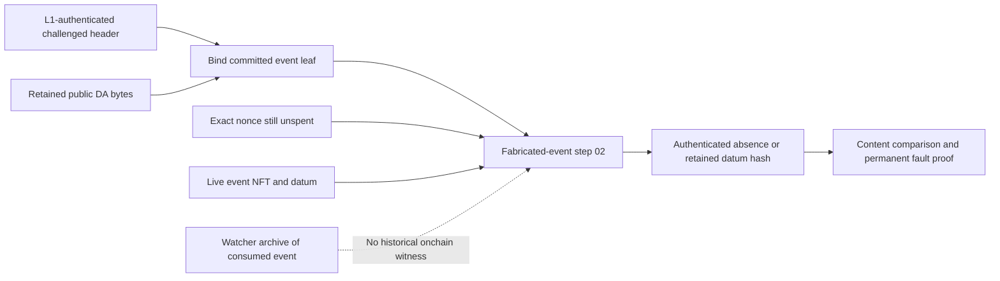

# Current event-history evidence boundaries

Research date: 2026-09-21. Source inspection only; no runtime or validator
acceptance claim. This note records existing behavior for the event-history
architecture discussion.
Current implementation and existing proposed fixes are distinguished below; this
note does not adopt a new protocol decision.

## Existing plan and requirements

The recommended-fix sections of
[NIFP-01, NIFP-02, and NIFP-03](remaining-gaps.md#nifp-01--fabricated-withdrawal-nonexistence-is-not-universal)
now point to the selected [deposit/withdrawal list proposal](event-history-design.md).
Read that proposal for agreed behavior, deferred features, remaining decisions
and lifecycle-specific acceptance. This note supplies source research, not an
additional implementation plan. The proposal covers the deposit/withdrawal
portion of NIFP-03; forced-order evidence lifetime remains separate. Neither
document supplies implementation or deployment acceptance evidence.

[GOAL_SPEC Q39–Q42 and Q47](../exec-plans/GOAL_SPEC.md#L948-L956) require fabricated
deposit/withdrawal fidelity, duplicate-event proofs that survive NFT consumption,
and omitted/out-of-window variants. These are requirements, not evidence that all
identities or all historical evidence lifetimes are covered.

The [witness-staking specification](../../technical-spec/2-user-event-protocol/5-witness-staking-script.tex#L8-L45)
defines registration at event creation, deregistration at conclusion, and a
register/unregister pair testing current nonregistration. It explicitly cautions
that nonregistration establishes absence of a **live** witness, not that the
event never existed.

## Fabricated-event workflow today

The deposit evidence builder reconstructs the exact deposit tree and counted root
from retained public DA bytes and checks them against the authenticated header.
The L1 side then has only two evidence shapes: a live nonce output or an observed
event NFT and datum. See the builder's
[authority contract](../../demo/midgard-fault-proofs/src/prepare-fabricated-deposit.ts#L1-L42)
and [witness type](../../demo/midgard-fault-proofs/src/prepare-fabricated-deposit.ts#L166-L205).
The withdrawal builder documents the
[same evidence boundary](../../demo/midgard-fault-proofs/src/prepare-fabricated-withdrawal.ts#L1-L58).

For absence, the committed ID must exactly match an output in the authenticated
live set. The builder explicitly refuses a consumed/non-live nonce rather than
interpreting it as absent. For content substitution, it derives the event token
name from the ID, decodes the original datum, checks identity, compares content
commitments, and checks the event time against the challenged block's window.
See [classification](../../demo/midgard-fault-proofs/src/prepare-fabricated-deposit.ts#L240-L344).

The submission boundary makes the live dependency concrete: step 02 fetches
either that exact unspent nonce or the event output and hub oracle, and places
them in the transaction's reference inputs. Retaining their bytes locally cannot
make a spent output usable here. See
[deposit step-02 construction](../../demo/midgard-fault-proofs/src/submit-fabricated-deposit-step-02.ts#L240-L298)
and [withdrawal step-02 construction](../../demo/midgard-fault-proofs/src/submit-fabricated-withdrawal-step-02.ts#L243-L299).

Once step 02 authenticates a live event, later steps can open its retained datum
hash. That protects an already-advanced proof, but supplies no route to initiate
step 02 after consumption. This distinction is recorded in
[NIFP-03](remaining-gaps.md#nifp-03--event-proof-lifetime-is-not-closed).

## What the watcher already retains

The watcher stores both active events and terminal events. An indexed event
includes event kind, identity, nonce out-ref, policy/address, event/datum/output
CBOR, content digests, original chain point, and finality. A terminal event adds
the consuming transaction and point, finality, and a status such as absorbed,
payout-initialized, refunded, or processed. See
[record definitions](../../demo/midgard-watcher/src/indexers/user-event-indexer.ts#L224-L328).

The persistence decision requires spent UTxOs and original immutable bytes to
survive while rollback, outstanding events, or challenges depend on them. Pruning
requires both no live references and expiry of the applicable recovery/challenge
requirement; unknown consumers or deadlines fail closed. See
[record inventory](../midgard/decisions/watcher-persistence.md#L13-L25) and
[deletion rule](../midgard/decisions/watcher-persistence.md#L45-L49).

Publication writes and verifies archive objects before advancing the protected
checkpoint, and rechecks concurrency before doing so. See
[archive-before-checkpoint publication](../../demo/midgard-watcher/src/indexers/user-event-history.ts#L177-L218).
The [archive index implementation](../../demo/midgard-watcher/src/indexers/user-event-history-archive.ts#L1-L4)
expressly says these indexes grant no indexing, publication, or dispatch authority.
They are navigation over evidence, with semantic admission owned elsewhere.

Consequently the archive provides recoverability, discovery, and preimages. It
does not give an Aiken validator an authenticated historical root or a reference
input that can stand in for a consumed NFT-bearing event.

Rollback restores the target event snapshot only after checking its retained
ancestry, removed records, restored event UTxOs, and resulting topology; see
[rollback derivation](../../demo/midgard-watcher/src/indexers/user-event-indexer.ts#L3914-L4048).
Suspension revokes issued capabilities before asynchronous recovery, and same-process
resume requires fresh native evidence matching the protected publication; see
[capability lifecycle](../../demo/midgard-watcher/src/indexers/user-event-indexer.ts#L5790-L5856).

## Transition-trace scope

The installed transition-trace event capture reads the authenticated hub, derives
the deployment's event addresses/policies, discovers events in current address
coverage, and requests complete histories of the discovered NFTs. It checks the
hub again to avoid mixing observations. See
[capture and discovery](../../demo/midgard-fault-proofs/src/transition-trace/l1-events.ts#L88-L225).
These are off-chain admission checks; complete raw history is not a new on-chain
historical witness.

Replay and resume reopen their retained corpus and current raw L1 authority. When
a selected proof depends on an event, the workflow still binds its event UTxO as
a final reference input and records its out-ref in the artifact. See
[workflow preparation](../../demo/midgard-fault-proofs/src/transition-trace/workflow.ts#L470-L533)
and the [installed replay description](transition-trace-installed-replay.md#replay-authority).

Three classes need historical authentication:

1. Omitted due deposit, withdrawal, and forced-transaction witnesses use live
   event inputs, then prove absence in the corresponding committed event root.
   See [omission verifier](../../onchain/aiken/lib/midgard/fraud-proofs/transition-trace/proof.ak#L1580-L1657).
2. Out-of-window deposit, withdrawal, and forced-transaction witnesses likewise
   obtain their timing/content from live event inputs. See
   [window verifier](../../onchain/aiken/lib/midgard/fraud-proofs/transition-trace/proof.ak#L1661-L1764).
3. Valid-deposit transition checking reads both the authentic event **and the
   actual L1 output Value** to construct the expected L2 output. A historical
   commitment authenticating only event datum bytes would not replace this
   dependency. See
   [deposit transition](../../onchain/aiken/lib/midgard/fraud-proofs/transition-trace/proof.ak#L1116-L1174)
   and [authenticated deposit reference](../../onchain/aiken/lib/midgard/fraud-proofs/transition-trace/proof.ak#L1501-L1529).

The separate cross-block-duplicate-event family compares authenticated event
leaves in a live challenged header and a confirmed settlement block. It already
has a different evidence route from live-event authentication; replacing it is
not implied merely by fixing the history gap. See
[family semantics](family-reference.md#cross-block-duplicate-event-fault).

## Verification performed

Read the named documentation, watcher records/archive publication, fabricated-event
builders/submitters, and transition-trace capture/workflow/verifier code. No code
or deployment changed, and no tests were run for this research note. Existing
uncommitted application changes were left untouched.
